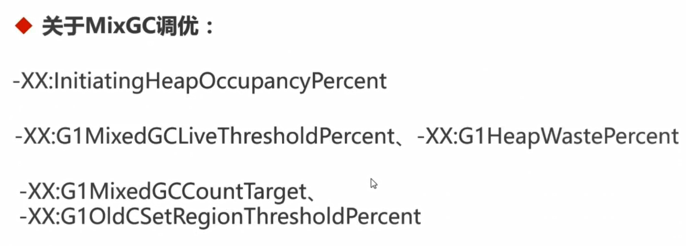
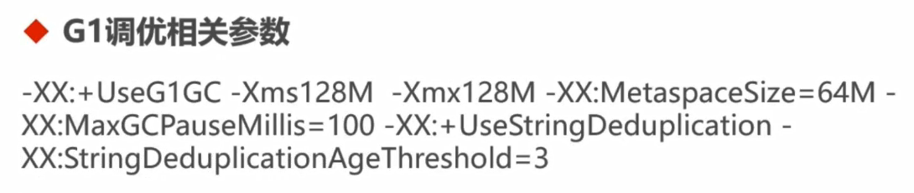
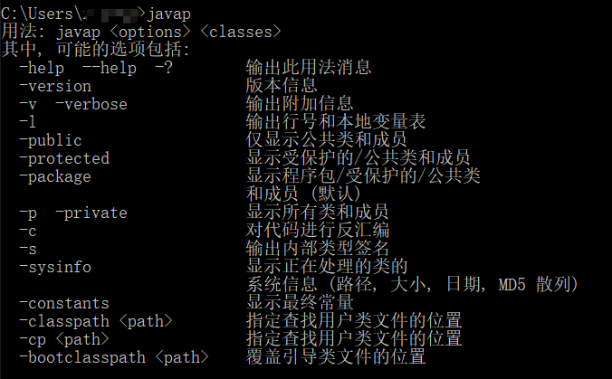
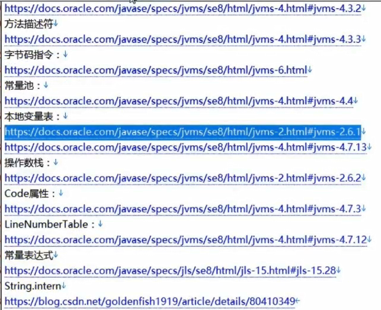
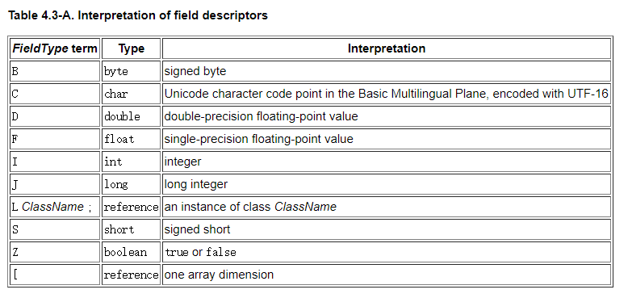
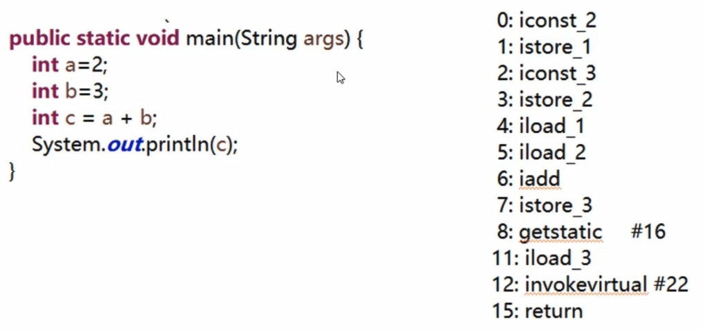

# Java生产环境下性能监控与调优详解
## 第1章 课程介绍（提供问答区答疑解惑）
本章为大家介绍生产环境可能存在的问题和常用的性能监控工具，以及课程能学到什么，课程内容如何安排等，让大家对课程有个全貌的认识，从而更好的学习这门课程。
###  1-1 课前必读（不看会错过一个亿）
###  1-2 为什么学习这门课程？ 试看
## 第2章 基于JDK命令行工具的监控
本章带大家学习JDK的命令行监控工具的使用，包括jps、jinfo、jstat、jmap、jstack， 并结合MAT实战如何定位内存溢出，实战如何定位死循环和死锁。

###  2-1 JVM的参数类型
###  2-2 查看JVM运行时参数
###  2-3 jstat查看JVM统计信息
###  2-4 演示内存溢出
###  2-5 导出内存映像文件
###  2-6 MAT分析内存溢出
###  2-7 jstack与线程的状态
###  2-8 jstack实战死循环与死锁
## 第3章 基于JVisualVM的可视化监控
 本章带大家学习可视化的监控工具JVisualVM的使用，学习如何用它来监控本地和远程的JAVA进程，包括监控内存、线程、方法执行时间等等。

###  3-1 监控本地java进程
###  3-2 监控远程的java进程

## 第4章 基于Btrace的监控调试
本章带大家学习如何安装btrace、如何编写btrace脚本来对生产环境下的代码进行监控调试，比如获取生产环境下某个方法的参数、返回值、异常、执行的行号等等。

###  4-1 btrace入门
###  4-2 拦截构造函数、同名函数
###  4-3 拦截返回值、异常、行号
###  4-4 拦截复杂参数、坏境变量、正则匹配拦截
###  4-5 注意事项
## 第5章 Tomcat性能监控与调优
本章带大家学习如何在本地来远程调试tomcat和对tomcat服务器的内存、线程等做监控，会介绍两款监控工具---tomcat自带的manager和开源的psi-probe，然后会讲解常用的tomcat的调优的方法。

###  5-1 tomcat远程debug
###  5-2 tomcat-manager监控
###  5-3 psi-probe监控
###  5-4 tomcat优化 试看
## 第6章 Nginx性能监控与调优
本章带大家学习如何来安装nginx，并监控nginx的连接信息和请求信息，会介绍两款命令行工具ngx_http_stub_status和ngxtop，还有一款可视化工具nginx-rrd，然后会讲解常用的nginx的调优的方法。

###  6-1 nginx安装
###  6-2 ngx_http_stub_status监控连接信息
###  6-3 ngxtop监控请求信息
###  6-4 nginx-rrd图形化监控
###  6-5 nginx优化 试看
## 第7章 JVM层GC调优
 本章带大家学习JVM的内存结构，常见的垃圾回收算法和垃圾收集器，不同垃圾收集器的日志结构，然后介绍两款可视化的日志分析工具，通过分析日志得到GC的性能指标和出现GC的原因，最后带大家实战GC垃圾回收调优。

###  7-1 JVM的内存结构
###  7-2 常见的垃圾回收算法
###  7-3 垃圾收集器-1
###  7-4 垃圾收集器-2
###  7-5 GC日志格式详解
###  7-6 可视化工具分析GC日志
###  7-7 ParallelGC调优
#### Parallel GC调优的指导原则
除非确定，否则不要设置最大堆内存
优先设置吞吐量目标
如果吞吐量目标达不到，调大最大内存，不能让OS使用Swap, 如果仍然达不到，降低目标
吞吐量能达到，GC时间太长，设置停顿时间的目标

#### Ergonomics
Java Platform, Standard Edition HotSpot Virtual Machine Garbage Collection Tuning Guide
[ Ergonomics](https://docs.oracle.com/javase/8/docs/technotes/guides/vm/gctuning/ergonomics.html)
###  7-8 G1调优
年轻代大小：避免使用 -Xmn、-XX:NewRatio等显示设置Youngz区大小，会覆盖暂停时间目标；
暂停时间目标：暂停时间不要太严苛，其吞吐量目标是90%的应用程序时间和10%的垃圾回收时间，太严苛会直接影响到吞吐量；

#### 关于MixGC调优


测试示例

###  7-9 本章小结
## 第8章 JVM字节码与Java代码层调优
本章带大家学习JVM的字节码指令，从字节码层面讲解一些常见问题的底层原理（面试能回答上的话， 绝对加分），比如：i++和++i哪一种效率高？循环体中做字符串+拼接为什么效率低？然后会重点对String做讲解，包括String常量池的变化、String字面常量、String.intern等，最后分享老师在开发中积累的常用的JAVA代码优化的20多

###  8-1 jvm字节码指令-1
#### jvm字节码指令与javap


```
public class Test1 {
	public static void main(String args) {
		int a=2;
		int b=3;
		int c = a + b;
		System.out.println(c);
	}
}

```
编译后的代码，找到对应的字节码文件，然后执行如下命令` G:\github\learning\Java生产环境下性能监控与调优详解\code\target\classes\com\imooc\monitor_tuning\chapter8> javap -verbose .\Test1.class >Test1.text`

Test1.text文件内容如下
```
Classfile /G:/github/learning/Java生产环境下性能监控与调优详解/code/target/classes/com/imooc/monitor_tuning/chapter8/Test1.class
  Last modified 2019-7-23; size 645 bytes
  MD5 checksum 3b001c578567f87495dea0980aed624a
  Compiled from "Test1.java"
public class com.imooc.monitor_tuning.chapter8.Test1
  minor version: 0
  major version: 52
  flags: ACC_PUBLIC, ACC_SUPER
Constant pool:
   #1 = Methodref          #5.#24         // java/lang/Object."<init>":()V
   #2 = Fieldref           #25.#26        // java/lang/System.out:Ljava/io/PrintStream;
   #3 = Methodref          #27.#28        // java/io/PrintStream.println:(I)V
   #4 = Class              #29            // com/imooc/monitor_tuning/chapter8/Test1
   #5 = Class              #30            // java/lang/Object
   #6 = Utf8               <init>
   #7 = Utf8               ()V
   #8 = Utf8               Code
   #9 = Utf8               LineNumberTable
  #10 = Utf8               LocalVariableTable
  #11 = Utf8               this
  #12 = Utf8               Lcom/imooc/monitor_tuning/chapter8/Test1;
  #13 = Utf8               main
  #14 = Utf8               (Ljava/lang/String;)V
  #15 = Utf8               args
  #16 = Utf8               Ljava/lang/String;
  #17 = Utf8               a
  #18 = Utf8               I
  #19 = Utf8               b
  #20 = Utf8               c
  #21 = Utf8               MethodParameters
  #22 = Utf8               SourceFile
  #23 = Utf8               Test1.java
  #24 = NameAndType        #6:#7          // "<init>":()V
  #25 = Class              #31            // java/lang/System
  #26 = NameAndType        #32:#33        // out:Ljava/io/PrintStream;
  #27 = Class              #34            // java/io/PrintStream
  #28 = NameAndType        #35:#36        // println:(I)V
  #29 = Utf8               com/imooc/monitor_tuning/chapter8/Test1
  #30 = Utf8               java/lang/Object
  #31 = Utf8               java/lang/System
  #32 = Utf8               out
  #33 = Utf8               Ljava/io/PrintStream;
  #34 = Utf8               java/io/PrintStream
  #35 = Utf8               println
  #36 = Utf8               (I)V
{
  public com.imooc.monitor_tuning.chapter8.Test1();
    descriptor: ()V
    flags: ACC_PUBLIC
    Code:
      stack=1, locals=1, args_size=1
         0: aload_0
         1: invokespecial #1                  // Method java/lang/Object."<init>":()V
         4: return
      LineNumberTable:
        line 3: 0
      LocalVariableTable:
        Start  Length  Slot  Name   Signature
            0       5     0  this   Lcom/imooc/monitor_tuning/chapter8/Test1;

  public static void main(java.lang.String);
    descriptor: (Ljava/lang/String;)V
    flags: ACC_PUBLIC, ACC_STATIC
    Code:
      stack=2, locals=4, args_size=1
         0: iconst_2
         1: istore_1
         2: iconst_3
         3: istore_2
         4: iload_1
         5: iload_2
         6: iadd
         7: istore_3
         8: getstatic     #2                  // Field java/lang/System.out:Ljava/io/PrintStream;
        11: iload_3
        12: invokevirtual #3                  // Method java/io/PrintStream.println:(I)V
        15: return
      LineNumberTable:
        line 5: 0
        line 6: 2
        line 7: 4
        line 8: 8
        line 9: 15
      LocalVariableTable:
        Start  Length  Slot  Name   Signature
            0      16     0  args   Ljava/lang/String;
            2      14     1     a   I
            4      12     2     b   I
            8       8     3     c   I
    MethodParameters:
      Name                           Flags
      args
}
SourceFile: "Test1.java"
```
部分内容解释
```
/***
	 public static void main(java.lang.String);
    descriptor: (Ljava/lang/String;)V
    flags: ACC_PUBLIC, ACC_STATIC
    Code:
      # 操作数栈的深度2
      # 本地变量表最大长度（slot为单位），64位的是2，其他是1，索引从0开始，如果是非static方法索引0代表this，后面是入参，后面是本地变量
      # 1个参数，实例方法多一个this参数
      stack=2, locals=4, args_size=1
         0: iconst_2  #常量2压栈
         1: istore_1  #出栈保存到本地变量1里面
         2: iconst_3  #常量3压栈
         3: istore_2  #出栈保存到本地变量2里面
         4: iload_1    #局部变量1压栈
         5: iload_2    #局部变量2压栈
         6: iadd        # 栈顶两个元素相加，计算结果压栈
         7: istore_3  # 出栈保存到局部变量3里面
         8: getstatic     #16                 // Field java/lang/System.out:Ljava/io/PrintStream;
        11: iload_3
        12: invokevirtual #22                 // Method java/io/PrintStream.println:(I)V
        15: return
      LineNumberTable:
        line 5: 0
        line 6: 2
        line 7: 4
        line 8: 8
        line 9: 15
      LocalVariableTable:
        Start  Length  Slot  Name   Signature
            0      16     0  args   Ljava/lang/String;
            2      14     1     a   I
            4      12     2     b   I
            8       8     3     c   I
	 **/
```
被编译过后的字节码文件是有规则的，可以根据官方文档结合起来看
[Chapter 4. The class File Format](https://docs.oracle.com/javase/specs/jvms/se8/html/jvms-4.html)


字节码文件类型描述

i++与++i, 字符串拼接+原理
其他代码优化方法


###  8-2 jvm字节码指令-2
#### 基于栈的架构

###  8-3 i++与++i
###  8-4 字符串+拼接
###  8-5 Try-Finally字节码
###  8-6 String Constant Variable
###  8-7 常用代码优化方法-1
###  8-8 常用代码优化方法-2
### 第9章 课程总结
本章带大家总结回顾本课程的重难点知识点，同时也希望大家能手动梳理出本门课程的知识架构脑图，方面大家以后建立知识体系以及深入的学习和解决更难的问题。

##  9-1 课程总结
### 本课程已完结