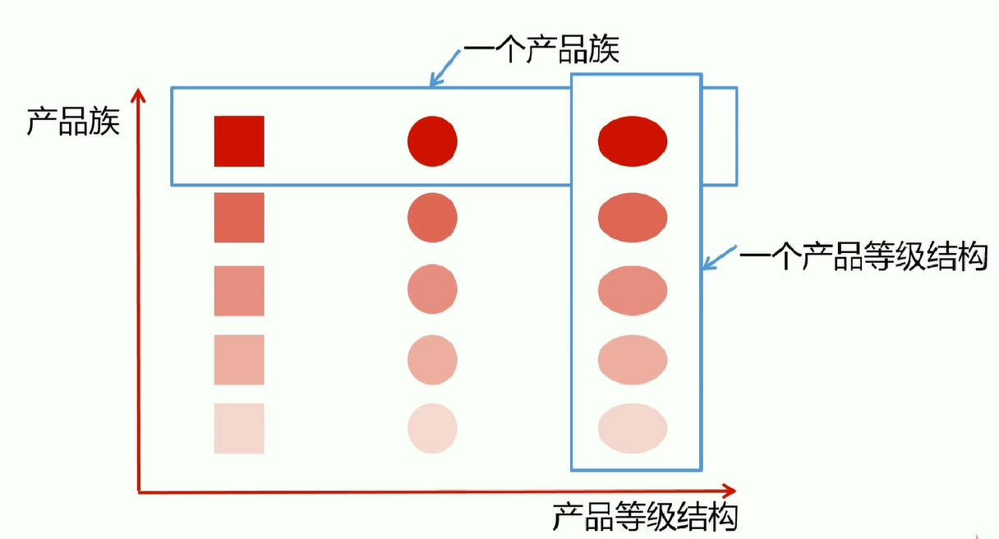
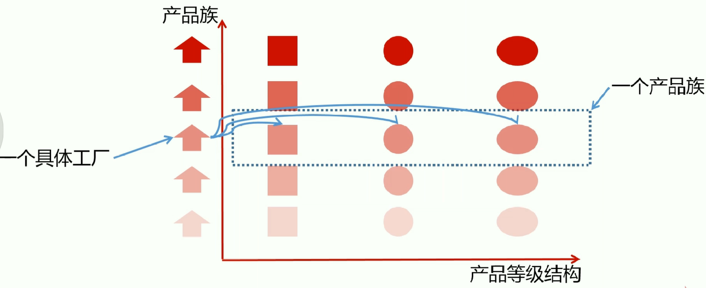

# Java设计模式精讲 Debug方式+内存分析


## 第1章 课程导学
本章节主要讲解大家能收获什么，课程具体包含哪些内容，通过哪些方式来学习设计模式，以及怎么讲，怎么安排，通过本章的学习，让大家为整个课程高效的学习打下基础。

 1-1 课前必读（不看会错过一个亿）
 1-2 课程导学 试看

## 第2章 UML急速入门
本章节主要讲解UML基础、UML类图、UML类关系、UML时序图、UML类关系记忆技巧等，让大家急速入门UML，从而为后面设计模式的学习做好准备。

 2-1 本章导航
 2-2 UML类图讲解
 2-3 UML类图讲解-自上而下
 2-4 UML类图讲解-对比讲解联想记忆

 ## 第3章 软件设计七大原则
本章节主要讲解软件设计七大原则，同时结合业务场景及演进手把手coding，让大家更好的理解软件设计原则。

 3-1 本章导航
 3-2 开闭原则讲解
 3-3 开闭原则coding
 3-4 依赖倒置原则讲解+coding
 3-5 单一职责原则讲解
 3-6 单一职责原则coding
 3-7 接口隔离原则讲解+coding
 3-8 迪米特法则讲解+coding
 3-9 里氏替换原则讲解
 3-10 里氏替换原则coding
 3-11 合成复用原则讲解+coding
## 第4章 简单工厂讲解+Coding+源码解析
本章节主要讲解简单工厂定义及理解，适用场景，优缺点及扩展。并引入业务场景，一边coding一边讲解，最后对简单工厂在框架(jdk+slf4j等)源码中的应用进行解析，让大家领略简单工厂的妙用技巧。

 ### 4-1 简单工厂讲解
 工厂中已经定义好了具体的实现类，要用的时候直接根据指定条件去工厂取，不需要和具体的上层进行交互，工厂已经有具体的实现了

 4-2 简单工厂coding


 4-3 简单工厂JDK源码解析
 java.util.Calendar--> getInstance(TimeZone zone, Locale aLocale)
 日历中通过传递进来的参数，可以得到对应的子类
 ```
  public static Calendar getInstance(TimeZone zone,
                                       Locale aLocale)
    {
        return createCalendar(zone, aLocale);
    }

    private static Calendar createCalendar(TimeZone zone,
                                           Locale aLocale)
    {
        CalendarProvider provider =
            LocaleProviderAdapter.getAdapter(CalendarProvider.class, aLocale)
                                 .getCalendarProvider();
        if (provider != null) {
            try {
                return provider.getInstance(zone, aLocale);
            } catch (IllegalArgumentException iae) {
                // fall back to the default instantiation
            }
        }

        Calendar cal = null;

        if (aLocale.hasExtensions()) {
            String caltype = aLocale.getUnicodeLocaleType("ca");
            if (caltype != null) {
                switch (caltype) {
                case "buddhist":
                cal = new BuddhistCalendar(zone, aLocale);
                    break;
                case "japanese":
                    cal = new JapaneseImperialCalendar(zone, aLocale);
                    break;
                case "gregory":
                    cal = new GregorianCalendar(zone, aLocale);
                    break;
                }
            }
        }
        if (cal == null) {
            if (aLocale.getLanguage() == "th" && aLocale.getCountry() == "TH") {
                cal = new BuddhistCalendar(zone, aLocale);
            } else if (aLocale.getVariant() == "JP" && aLocale.getLanguage() == "ja"
                       && aLocale.getCountry() == "JP") {
                cal = new JapaneseImperialCalendar(zone, aLocale);
            } else {
                cal = new GregorianCalendar(zone, aLocale);
            }
        }
        return cal;
    }
 ```

 java.sql.DriverManager -->registerDriver(java.sql.Driver driver)
 根据子类的Driver(myql, oracle等)注册到工程中去，例如mysql的jar对应的代码
 ```
   <dependency>
       <groupId>mysql</groupId>
       <artifactId>mysql-connector-java</artifactId>
       <version>5.1.6</version>
   </dependency>
 
 package com.mysql.jdbc;

import java.sql.DriverManager;
import java.sql.SQLException;

public class Driver extends NonRegisteringDriver implements java.sql.Driver {
    public Driver() throws SQLException {
    }

    static {
        try {
            DriverManager.registerDriver(new Driver());
        } catch (SQLException var1) {
            throw new RuntimeException("Can't register driver!");
        }
    }
}
 ```


## 第5章 工厂方法模式讲解+Coding+源码解析
本章节主要讲解工厂方法模式定义及理解，适用场景，优缺点及扩展。并引入业务场景，一边coding一边讲解，最后对工厂方法模式在框架(jdk+slf4j等)源码中的应用进行解析，让大家领略工厂方法模式的妙用技巧。

### 5-1 工厂方法讲解
定义： 定义一个创建对象的接口，但让实现这个接口的类来决定实例化哪个类工厂方法让类的实例化推迟到子类中进行

类型： 创建型

适用场景： 
1.创建对象需要大量重复代码；
2.客户端（应用层）不依赖于产品类实例如何被创建、实现等细节
3.一个类通过其子类来指定创建哪个对象

优点：
用户只需要关心所需产品对应的工厂，无须关心细节
加入新产品符合开闭原则，提高可扩展性

缺点：
类的个数容易过多，增加复杂度
增加了系统的抽象性和理解难度

### 5-2 工厂方法coding
总工厂（定义规范以及一些公用的实现方法） -->子工厂（根据总工厂的规范来具体实现自己需要的产品） --> 产品（继承或者实现产品族特性） <---产品族（产品的通用特性，抽象类或接口） 
### 5-3 工厂方法源码解析(jdk+logback)
## 第6章 抽象工厂模式讲解+Coding+源码解析
本章节主要讲解抽象工厂模式定义及理解，适用场景，优缺点及扩展。并引入业务场景，一边coding一边讲解，最后对抽象工厂模式在框架(jdk+mybatis等)源码中的应用进行解析，让大家领略抽象工厂模式的妙用技巧。

### 6-1 抽象工厂讲解
定义：抽象工厂模式提供一个创建创建一系列相关或互相依赖对象的接口
无须指定它们具体的类
类型： 创建型
适用场景：
1.客户端不依赖于产品类实例如何被创建、实现等细节
2.强调一系列相关的产品对象（属于同一产品族）一起使用创建对象需要大量重复的代码
3.提供一个产品的库类，所有的产品以同样的接口出现，从而使客户端不同于依赖于具体实现；

优点：
1.具体产品在应用层代码隔离，无须关心创建细节；
2.将一个系列的产品族统一到一起创建；

缺点：
1.规定了所有可能被创建的产品集合，产品族中扩展新的产品困难，需要修改抽象工厂的接口；
2.增加了系统的抽象性和理解难度


(1) 产品等级结构：产品等级结构即产品的继承结构，如一个抽象类是电视机，其子类有海尔电视机、海信电视机、TCL电视机，则抽象电视机与具体品牌的电视机之间构成了一个产品等级结构，抽象电视机是父类，而具体品牌的电视机是其子类。

(2) 产品族：在抽象工厂模式中，产品族是指由同一个工厂生产的，位于不同产品等级结构中的一组产品，如海尔电器工厂生产的海尔电视机、海尔电冰箱、海尔洗衣机，海尔电视机位于电视机产品等级结构中，海尔电冰箱位于电冰箱产品等级结构中，海尔洗衣机位于电冰箱产品等级结构中，海尔电视机、海尔电冰箱构成了一个产品族。



参考：[抽象工厂模式：产品等级结构与产品族](https://blog.csdn.net/w405722907/article/details/87798453)

抽象工厂和工厂模式的区别？

 6-2 抽象工厂coding
 6-3 抽象工厂源码解析
## 第7章 建造者模式讲解+Coding+源码解析
本章节主要讲解建造者模式定义及理解，适用场景，优缺点及扩展。并引入业务场景，手一边coding一边讲解，最后对建造者模式在框架(jdk+guava等)源码中的应用进行解析，让大家领略建造者模式的妙用技巧。

 7-1 建造者模式讲解
 7-2 建造者模式coding
 7-3 建造者模式源码解析(jdk+guava+spring+mybatis)
## 第8章 单例模式讲解+Coding+源码解析
本章节为面试高频环节，所以讲的比较深入，主要讲解单例模式定义及理解，适用场景，优缺点及扩展。并引入业务场景，一边coding一边讲解，最后对单例模式在框架(jdk，mybatis等)源码中的应用进行解析，让大家领略单例模式的妙用技巧。...

 8-1 单例模式讲解
 8-2 单例设计模式-懒汉式及多线程Debug实战 试看
 8-3 单例设计模式-DoubleCheck双重检查实战及原理解析
 8-4 单例设计模式-静态内部类-基于类初始化的延迟加载解决方案及原理解析
 8-5 单例设计模式-饿汉式
 8-6 单例设计模式-序列化破坏单例模式原理解析及解决方案
 8-7 单例设计模式-反射攻击解决方案及原理分析 试看
 8-8 单例设计模式-Enum枚举单例、原理源码解析以及反编译实战
 8-9 单例设计模式-容器单例
 8-10 单例设计模式-ThreadLocal线程单例
 8-11 单例模式源码分析(jdk+spring+mybatis)
## 第9章 原型模式讲解+Coding+源码解析
本章节主要讲解原型模式定义及理解，适用场景，优缺点及扩展。并引入业务场景，一边coding一边讲解，同时讲解原型模式在框架(jdk+mybatis)源码中的应用进行解析，让大家领略原型模式的妙用技巧。课程中还会向前呼应讲解单例模式中的克隆破坏问题。让大家理解更深刻。...

 9-1 原型模式讲解
 9-2 原型模式coding
 9-3 原型模式coding-克隆破坏单例
 9-4 原型模式源码解析
## 第10章 外观模式讲解+Coding+源码解析
本章节主要讲解外观模式定义及理解，适用场景，优缺点及扩展。并引入业务场景，一边coding一边讲解，最后对外观模式在框架(springjdbc+servlet等)源码中的应用进行解析，让大家领略外观模式的妙用技巧。

 10-1 外观模式讲解
 10-2 外观模式coding
 10-3 外观模式源码解析(springjdbc+myabtis+tomcat)
## 第11章 装饰者模式讲解+Coding+源码解析
本章节主要讲解装饰者模式定义及理解，适用场景，优缺点及扩展。并引入业务场景，一边coding一边讲解，最后对装饰者模式在框架(jdk+spring等)源码中应用进行解析，，让大家领略装饰者模式的妙用技巧。

 11-1 装饰者模式讲解
 11-2 装饰者模式coding
 11-3 装饰者模式源码解析(spring-session mybatis jdk servlet)

## 第12章 适配器模式讲解+Coding+源码解析
本章节主要讲解适配器模式定义及理解，适用场景，优缺点及扩展。并引入业务场景，一边coding一边讲解，最后对适配器模式在框架(jdk+spring等)源码中的应用进行解析，，让大家领略适配器模式的妙用技巧。

 12-1 适配器模式讲解
 12-2 适配器模式coding
 12-3 适配器模式源码解析(jdk+spring+springjpa+springmvc)

## 第13章 享元模式讲解+Coding+源码解析
本章节主要讲解享元模式定义及理解，适用场景，优缺点及扩展。并引入业务场景，一边coding一边讲解，最后对享元模式在框架(jdk+apache-common-pool)源码中的应用进行解析，让大家领略享元模式的妙用技巧。

 13-1 享元模式讲解
 13-2 享元设计模式coding
 13-3 享元模式源码解析(jdk+tomcat)
第14章 组合模式讲解+Coding+源码解析
本章节主要讲解组合模式定义及理解，适用场景，优缺点及扩展。并引入业务场景，一边coding一边讲解，最后对组合模式在框架(jdk+mybatis)源码中的应用进行解析，让大家领略组合模式的妙用技巧。

 14-1 组合模式讲解
 14-2 组合模式coding
 14-3 组合模式源码解析(jdk+mybatis)
第15章 桥接模式讲解+Coding+源码解析
本章节主要讲解桥接模式定义及理解，适用场景，优缺点及扩展。并引入业务场景，一边coding一边讲解，最后对桥接模式在框架源码中的应用进行解析，让大家领略桥接模式的妙用技巧。

 15-1 桥接模式讲解
 15-2 桥接模式coding
 15-3 桥接模式源码解析(jdk)
第16章 代理模式讲解+Coding+源码解析
本章节主要讲解代理模式定义及理解，适用场景，优缺点及扩展。并引入业务场景，一边coding一边讲解，最后对代理模式在框架源码中的应用进行解析，让大家领略代理模式的妙用技巧。

 16-1 代理模式讲解
 16-2 代理模式coding-静态代理-1
 16-3 代理模式coding-静态代理-2
 16-4 代理模式coding-动态代理
 16-5 代理模式源码解析(jdk+spring+mybatis)
第17章 模板方法模式讲解+Coding+源码解析
本章节主要讲解模板方法模式定义及理解，适用场景，优缺点及扩展。并引入业务场景，一边coding一边讲解，最后对模板方法模式在框架源码中的应用进行解析，让大家领略模板方法模式的妙用技巧。

 17-1 模板方法模式讲解
 17-2 模板方法模式coding
 17-3 模板方法源码解析(jdk+servlet+mybatis)
第18章 迭代器模式讲解+源码解析
迭代器模式在实际工作中使用率很低，但为了大家学习的完整性，对迭代器模式定义，使用场景，优缺点等进行讲解后，直接给出案例代码进行讲解，最后并对迭代器模式在框架源中的应用进行解析，让大家领略迭代器模式的妙用技巧。...

 18-1 迭代器模式讲解
 18-2 迭代器模式coding
 18-3 迭代器模式源码解析(jdk+mybatis)
第19章 策略模式讲解+Coding+源码解析
本章节主要讲解策略模式定义及理解，适用场景，优缺点及扩展。并引入业务场景，一边coding一边讲解，最后对策略模式在框架源码中的应用进行解析，让大家领略策略模式的妙用技巧。

 19-1 策略模式讲解
 19-2 策略模式coding
 19-3 策略模式源码解析(jdk+spring)
第20章 解释器模式讲解+源码解析
解释器模式在实际工作中使用率很低，但为了大家学习的完整性，对解释器模式定义，使用场景，优缺点等进行讲解后，直接给出案例代码进行讲解，最后并对解释器模式在框架源中的应用进行解析，让大家领略解释器模式的妙用技巧。...

 20-1 解释器模式讲解
 20-2 解释器模式coding
 20-3 解释器源码解析-jdk+spring
第21章 观察者模式讲解+Coding+源码解析
本章节主要讲解观察者模式定义及理解，适用场景，优缺点及扩展。并引入业务场景，一边coding一边讲解，最后对观察者模式在框架源码中的应用进行解析，让大家领略观察者模式的妙用技巧。

 21-1 观察者模式讲解
 21-2 观察者模式coding
 21-3 观察者模式源码解析-jdk-guava
第22章 备忘录模式讲解+源码解析
备忘录模式在实际工作中使用率很低，但为了大家学习的完整性，对备忘录模式定义，使用场景，优缺点等进行讲解后，直接给出案例代码进行讲解，最后并对备忘录模式在框架源中的应用进行解析，让大家领略备忘录模式的妙用技巧。...

 22-1 备忘录模式讲解
 22-2 备忘录模式coding
 22-3 备忘录模式源码解析-spring
第23章 命令模式讲解+Coding+源码解析
本章节主要讲解命令模式定义及理解，适用场景，优缺点及扩展。并引入业务场景，一边coding一边讲解，最后对命令模式在框架源码中的应用进行解析，让大家领略命令模式的妙用技巧。

 23-1 命令模式讲解
 23-2 命令模式coding
 23-3 命令模式源码-jdk-junit
第24章 中介者模式讲解+源码解析
中介者模式在实际工作中使用率很低，但为了大家学习的完整性，对中介者模式定义，使用场景，优缺点等进行讲解后，直接给出案例代码进行讲解，最后并对中介者模式在框架源中的应用进行解析，让大家领略中介者模式的妙用技巧。...

 24-1 中介者模式讲解
 24-2 中介者模式coding
 24-3 中介者源码-jdk
第25章 责任链模式讲解+Coding+源码解析
本章节主要讲解责任链模式定义及理解，适用场景，优缺点及扩展。并引入业务场景，一边coding一边讲解，最后对责任链模式在框架源码中的应用进行解析，让大家领略责任链模式的妙用技巧。

 25-1 责任链模式讲解
 25-2 责任链模式coding
 25-3 责任链模式源码-servlet
第26章 访问者模式讲解+源码解析
访问者模式在实际工作中使用率很低，但为了大家学习的完整性，对访问者模式定义，使用场景，优缺点等进行讲解后，直接给出案例代码进行讲解，最后并对访问者模式在框架源中的应用进行解析，让大家领略访问者模式的妙用技巧。...

 26-1 访问者模式讲解
 26-2 访问者模式coding
 26-3 访问者模式源码-jdk-spring
第27章 状态模式讲解+Coding+源码解析
本章节主要讲解状态模式定义及理解，适用场景，优缺点及扩展。并引入业务场景，一边coding一边讲解，最后对状态模式在框架源码中的应用进行解析，让大家领略状态模式的妙用技巧。

 27-1 状态模式讲解
 27-2 状态模式coding
 27-3 状态模式源码-JSF
第28章 课程总结
恭喜同学们，到这里的时候，说明你们已经学完本课程了，希望大家学有所获，同时在这里和大家一起总结回顾下本课程的重难点，帮助大家巩固所学知识，同时我也期待与大家进一步交流（课程问答区里等着大家）

 28-1 课程总结