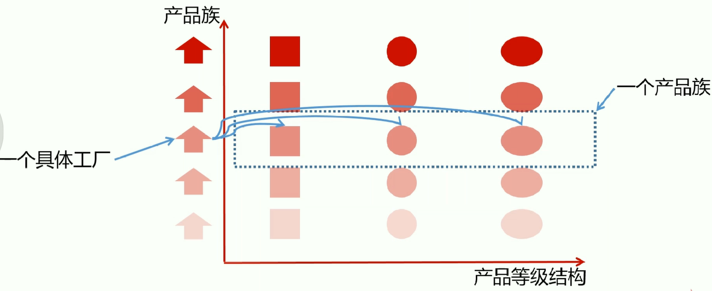

# 06抽象工厂

## 需求
课程涉及两个工厂: java , python   
每个工厂的产品族涉及：video ， article   
产品等级结构： 1. javaVideo,pythonVideo; 2. javaArticle, pythonArticle
## 基本概念

## 优势
应用层不和具体的产品发生依赖，只和对应的工厂发生关系   
从同一工厂取出的，肯定属于同一个产品族   
在扩展的时候，只需要创建对应的产品族工厂以及对应的产品，符合开闭原则

## 缺点
如果新增某个产品，比如添加新产品code， 所有的工厂都需要改变，不符合开闭原则

## 抽象工厂和工厂模式的区别

工厂模式关注的是产品等级结构（比如各个工厂的video，结合com.huangxi.pattern.creational.factorymethod来理解）， 抽象工厂关心产品族

## 总结
在创建抽象工厂的时候，一定是要创建依赖程度很高的产品    
频繁改动的不适合抽象工厂   
 
