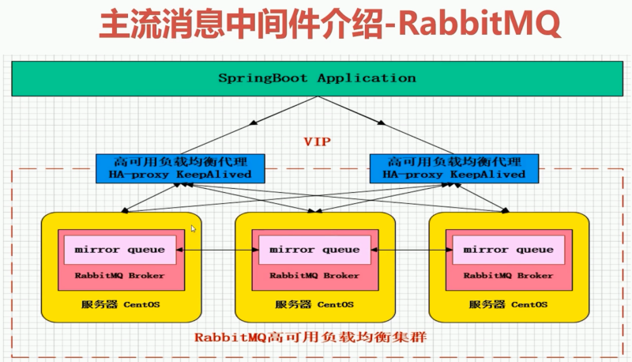
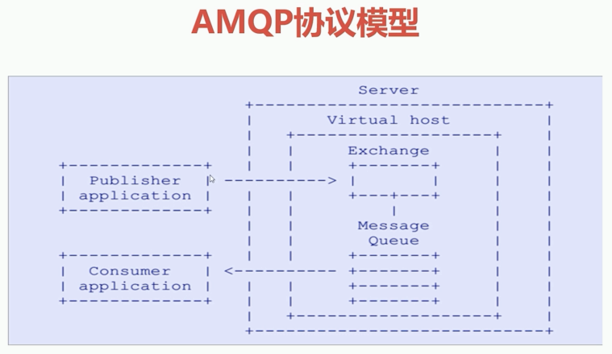
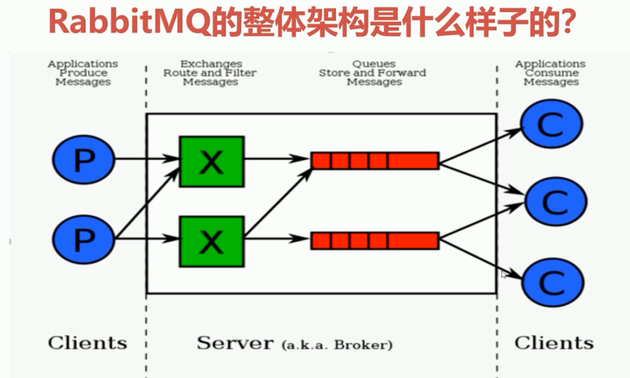
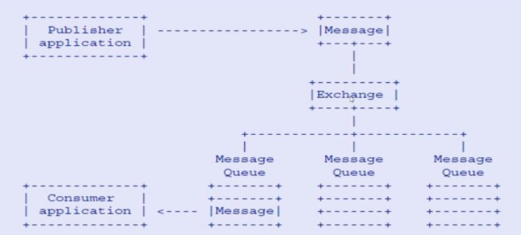

# RabbitMQ中间件技术
[TOC]

## 1.课程大纲
课程地址：`https://coding.imooc.com/class/chapter/262.html#Anchor` 

xpath语法提取课程大纲：`//ul[contains(@class,'chapter-ul')]//div[1]//text()` 


课程大纲

```	  
第1章 课程介绍
  
本章首先让大家彻底明白为什么学习RabbitMQ，通过本课程的学习具体收获有哪些？课程内容具体安排与学习建议，然后为大家简单介绍下业界主流消息中间件有哪些，各自适用场景等。（专为没有RabbitMQ基础的同学提供免费入门课程：https://www.imooc.com/learn/1042）
1-1 课前必读（不看会错过一个亿）
1-2 课程导学
1-3 业界主流消息中间件介绍

						  
第2章 低门槛，入门RabbitMQ核心概念


本章首先为大家讲解互联网大厂为什么选择RabbitMQ? RabbitMQ的高性能之道是如何做到的？什么是AMPQ高级协议？AMPQ核心概念是什么？RabbitMQ整体架构模型是什么样子的？RabbitMQ消息是如何流转的？RabbitMQ安装与使用命令行与管控台，RabbitMQ消息生产与消费，RabbitMQ交换机详解，RabbitMQ队列、绑定、虚拟主机、消息等...

2-1 本章导航
2-2 哪些互联网大厂在使用RabbitMQ,为什么？
2-3 RabbitMQ高性能的原因
2-4 AMQP高级消息队列协议与模型
2-5 AMQP核心概念讲解
2-6 RabbitMQ整体架构与消息流转
2-7 RabbitMQ环境安装-1
2-8 RabbitMQ环境安装-2
2-9 命令行与管理台结合讲解
2-10 生产者消费者模型构建-1
2-11 生产者消费者模型构建-2
2-12 交换机详解-1
2-13 交换机详解-2
2-14 交换机详解-3
2-15 绑定、队列、消息、虚拟主机详解
2-16 本章小结
 
第3章 渐进式，深入RabbitMQ高级特性

本章主要为大家讲解RabbitMQ的高级特性和实际场景应用，包括消息如何保障 100% 的投递成功 ？幂等性概念详解，在海量订单产生的业务高峰期，如何避免消息的重复消费问题？Confirm确认消息、Return返回消息，自定义消费者，消息的ACK与重回队列，消息的限流，TTL消息，死信队列等
  
3-1 本章导航
3-2 消息如何保障 100% 的投递成功方案-1
3-3 消息如何保障 100% 的投递成功方案-2
3-4 幂等性概念及业界主流解决方案
3-5 Confirm确认消息详解
3-6 Return返回消息详解
3-7 自定义消费者使用
3-8 消费端的限流策略-1
3-9 消费端的限流策略-2
3-10 消费端ACK与重回队列机制
3-11 TTL消息详解
3-12 死信队列详解-1
3-13 死信队列详解-2
3-14 本章小结

第4章 手把手，整合RabbitMQ&Spring家族

本章为大家讲解RabbitMQ如何与Spring系的框架体系进行整合（RabbitMQ整合Spring AMQP实战，RabbitMQ整合Spring Boot实战
，RabbitMQ整合Spring Cloud实战），涉及实际工作中需要注意的细节点，与最佳实战应用，通过本章的学习，学员能够掌握RabbitMQ的实战整合能力，直接应用到具体的工作中！

4-1 本章导航
4-2 SpringAMQP用户管理组件-RabbitAdmin应用-1
4-3 SpringAMQP用户管理组件-RabbitAdmin应用-2
4-4 SpringAMQP用户管理组件-RabbitAdmin源码分析
4-5 SpringAMQP-RabbitMQ声明式配置使用
4-6 SpringAMQP消息模板组件-RabbitTemplate实战
4-7 SpringAMQP消息容器-SimpleMessageListenerContainer详解
4-8 SpringAMQP消息适配器-MessageListenerAdapter使用-1
4-9 SpringAMQP消息适配器-MessageListenerAdapter使用-2
4-10 SpringAMQP消息转换器-MessageConverter讲解-1
4-11 SpringAMQP消息转换器-MessageConverter讲解-2
4-12 RabbitMQ与SpringBoot2.0整合实战-基本配置
4-13 RabbitMQ与SpringBoot2.0整合实战-1
4-14 RabbitMQ与SpringBoot2.0整合实战-2
4-15 RabbitMQ与SpringBoot2.0整合实战-3
4-16 RabbitMQ与SpringBoot2.0整合实战-4
4-17 RabbitMQ与Spring Cloud Stream整合实战-1
4-18 RabbitMQ与Spring Cloud Stream整合实战-2
4-19 本章小结

  
第5章 高可靠，构建RabbitMQ集群架构
	  
本章为大家讲解RabbitMQ集群架构的各种姿势，以及从零到一带大家构建高可靠性的RabbitMQ集群架构（Haproxy + Keepalived），并分享包括对集群的运维、故障恢复方案以及延迟队列插件应用等

5-1 本章导航
5-2 RabbitMQ集群架构模式-主备模式（Warren）
5-3 RabbitMQ集群架构模式-远程模式（Shovel）
5-4 RabbitMQ集群架构模式-镜像模式（Mirror）
5-5 RabbitMQ集群架构模式-多活模式（Federation）
5-6 RabbitMQ集群镜像队列构建实现可靠性存储
5-7 RabbitMQ集群整合负载均衡基础组件HaProxy
5-8 RabbitMQ集群整合高可用组件KeepAlived-1
5-9 RabbitMQ集群整合高可用组件KeepAlived-2
5-10 RabbitMQ集群配置文件详解
5-11 RabbitMQ集群恢复与故障转移的5种解决方案
5-12 RabbitMQ集群延迟队列插件应用
5-13 本章小结

                                         
第6章 追前沿，领略SET化架构衍化与设计

						  
本章主要为大家带来一线互联网实现消息中间件多集群的实际落地方案与架构设计思路讲解，涉及目前互联网架构里非常经典的多活，单元化的理念，更有效的提升服务的可靠性与稳定性。
  
6-1 本章导航
6-2 BAT、TMD大厂单元化架构设计衍变之路分享

6-3 SET化架构设计策略(异地多活架构)
6-4 SET化架构设计原则
6-5 SET化消息中间件架构实现-1
6-6 SET化消息中间件架构实现-2
6-7 本章小结

   
第7章 学大厂，拓展基础组件封装思路

						  
本章节，我们希望和大家分享互联网大厂的基础组件架构封装思路，其中涉及到消息发送的多模式化、消息的高性能序列化、消息的异步化、连接的缓存容器、消息的可靠性投递、补偿策略、消息的幂等解决方案        
7-1 本章导航
7-2 一线大厂的MQ组件实现思路和架构设计思路      
7-3 基础MQ消息组件设计思路-1（迅速，确认，批量，延迟）
7-4 基础MQ消息组件设计思路-2（顺序）
7-5 基础MQ消息组件设计思路-3(事务)
7-6 消息幂等性保障-消息路由规则架构设计思路                     
7-7 本章小结

第8章 课程总结

本章带大家回顾课程总体的收获，并希望大家都能来课程问答区与老师就学习过程中的问题进行进一步的交流。             
8-1 课程总结
第9章 RocketMQ核心技术精讲与高并发抗压实战试听

本章为大家开通《RocketMQ核心技术精讲与高并发抗压实战》课程的试学内容，初衷是希望能降低大家学习二期的选择风险，让大家少走冤枉路，少花冤枉钱，祝大家学习愉快！

9-1 课程导学                             
9-2 本章导航
9-3 RocketMQ整体认知
9-4 RocketMQ概念模型
9-5 RocketMQ源码包编译
9-6 RocketMQ源码包结构说明
9-7 RocketMQ环境搭建-1
9-8 RocketMQ环境搭建-2
9-9 RocketMQ控制台使用介绍
9-10 本章小结
```

## 2.课程内容

### 1.主流中间件介绍

#### ActiveMQ
1.ActiveMQ是Apache出品

#### Kafka

#### RocketMQ

#### RabbitMQ
是使用Erlang语言开发的开源消息队列系统，基于AMQP协议来实现。
完全开源，主要特征是：面向消息、队里、路由（包括点对点和发布/订阅）、可靠性、安全。 
AMQP协议更多是用在企业系统内，对数据的一致性、稳定性和可靠性要求很高的场景，对性能和吞吐量的要求还在其次。  

  


### 2.RabbitMQ核心概念及AMQP协议

#### 2-1 本章导航
1.互联网大厂为什么选择RabbitMQ？
2.RabbitMQ的高性能之道是如何做到的？
3.什么是AMQP高级协议？
4.AMQP核心概念是什么?
5.RabbitMQ整体结构模型是什么样子的？
6.RabbitMQ消息是如何流转的？
7.RabbitMQ安装与使用？
8.命令行与管控台
9.RabbitMQ消息生产与消费
10.RabbitMQ交换机详解
11.RabbitMQ队列、绑定、虚拟主机、消息


#### 2-2 哪些互联网大厂在使用RabbitMQ,为什么？
滴滴、美团、头条、去哪儿、艺龙....

理由：开源、性能优秀，稳定性保障；提供可靠性消息投递模式（conform）、返回模式（return）；与springAMQP完美的整合、API丰富；集群模式丰富，表达式配置，HA模式，镜像队列模式；保证数据不丢失的前提做到高可靠性、可用性；

#### 2-3 RabbitMQ高性能的原因
Erlang语言最初在于交换机领域的架构模式，这样使得RabbitMQ在Broker之间进行数据交互的性能是非常优秀的

Erlang的有点：Erlang有着和原生Socket一样的延迟

#### 2-4 AMQP高级消息队列协议与模型
AMQP定义：是具有现代特征的二进制协议。是一个提供统一消息服务的应用层标准高级消息队列协议，是应用层协议的一个开放标准，为面向消息的中间件设计。

AMQP协议模型


#### 2-5 AMQP核心概念讲解
Server: 又称为Broker，接受客户端的连接，实现AMQP实体服务；
Connection: 连接，应用程序与Broker的网络连接；
Channel: 网络信道，几乎所有的操作都在Channel中进行，Channel是进行消息读写的通道。客户端可建立多个Channel，每个Channel代表一个会话任务。
Message: 消息，服务器和应用程序之间传递的数据，由Properties和Body组成。Properties可以对消息进行修饰，比如消息的优先级、延迟等高级特性；Body则就是消息体内容。
Virtual Host: 虚拟地址，用于进行逻辑隔离，最上层的消息路由。一个Virtual Host里面可以有若干个Exchange和Queue，同一个VirtualHost里面不能有相同名称的Exchange或Queue。
Exchange：交换机，接收消息，根据路由键转发消息到绑定的队列。
Binding：Exchange和Queue之间的虚拟连接，binding中可以包含routing key。
Routing key：一个路由规则，虚拟机可用它来确定如何路由一个特定消息。
Queue: 也成为Message Queue，消息队列，保存消息并将它们转发给消费者。


#### 2-6 RabbitMQ整体架构与消息流转
RabbitMQ的整体架构



RabbitMQ消息是如何流转的？

Message要发送到MessageQueue，需要指定两个关键点：1.指定的Exchange，2.带上routing key。

#### 2-7 RabbitMQ环境安装-1
#### 2-8 RabbitMQ环境安装-2
#### 2-9 命令行与管理台结合讲解
#### 2-10 生产者消费者模型构建-1
#### 2-11 生产者消费者模型构建-2
#### 2-12 交换机详解-1
#### 2-13 交换机详解-2
#### 2-14 交换机详解-3
#### 2-15 绑定、队列、消息、虚拟主机详解
#### 2-16 本章小结


