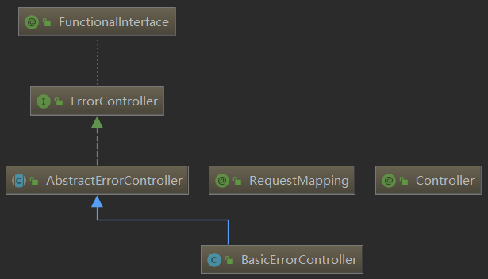

# Spring Boot2.0深度实践之核心技术篇
## 第1章 系列总览
 总览 Spring Boot 2.0 深度实践系列课程的整体议程，包括 Spring Boot 三大核心特性（组件自动装配、嵌入式Web容器、生产准备特性）、Web 应用（传统 Servlet、Spring Web MVC、Spring WebFlux）、数据相关（JDBC、JPA、事务）、功能扩展（SpringApplication、Spring Boot 配置、Spring Boot Starter）以及...
### 1-1 -课程导学


**课程收获**
	Spring全栈技术和实现原理
	Springboot核心技术
	BAT大规模微服务基础设施开发与生产实施经验

**适合人群**
	1-5年Java开发经验
	Java中间件研发人员
	系统架构师

**技术储备要求**
	语音：Java 8 Lambda
	框架：Spring Framework基础较熟练
	运用：Spring Boot基础
	
**运行环境**
	Java版本：8
	IDE环境：IDEA 2018

### 1-2 为什么说Spring Boot 2.0 易学难精？
**Spring Boot易学**
	组件自动装配：规约大于配置，专注核心业务
	外部化配置：一次构建、按需调配，到处运行
	嵌入式容器：内置容器、无需部署、独立运行
	Spring Boot Starter：简化依赖、按需装配、自我包含
	Production-Ready：一站式运维、生态无缝整合

**Spring Boot 难精**
	组件自动转配：模式注解、@Enable模块、条件装配、加载机制
	外部化配置：Enviroment抽象、生命周期、破坏性更变
	嵌入式容器：Servlet Web容器、Reactive Web容器
	Spring Boot Starter：依赖管理、装配条件、装配顺序
	Production-Ready：健康检查、数据指标、@Endpoint管控
	
**Spring Boot与Java EE规范**
	Web: Servlet(JSR-315、JSR-340)
	SQL：JDBC（JSR-221）
	数据校验：Bean Validation（JSR303、JSR-349）
	缓存：Java Caching API（JSR-107）
	WebSocket:Java API for WebSOcket(JSR-356)
	WebServices:JAX-WS(JSR-224)
	Java管理：JMX（JSR3）
	消息：JMS（JSR-914）
	
### 1-3 开场白：系列总览
**课程内容**
	核心特性
	Web应用
	数据相关
	功能扩展
	运维管理
	
### 1-4 核心特性介绍
**Spring Boot三大特性**
	组件自动装配：Web MVC、Web Flux、JDBC等
	嵌入式Web容器：Tomcat、Jetty以及Undertow
	生产准备特性：指标、健康检查、外部化配置等
	
### 1-5 核心特性之组件自动装配工程部分
**组件自动装配**
	激活：@EnableAutoConfiguration
	配置：/META-INF/spring.factories
	实现：XXXAutoConfiguration
	
**嵌入式Web容器**
	Web Servlet: Tomcat、Jetty和Undertow
	Web Reactive: Netty Web Server
	生产准备特性:指标（/actuator/metrics）、健康检查(/actuator/health)、外部化配置(/actuator/configprops)
	
### 1-6 Web应用介绍
**传统Servlet应用**
	Servlet组件：Servlet、Filter、Listener
	Servlet注册：Servlet注解、Spring Bean、Registration
	异步非阻塞：异步Servlet、非阻塞Servlet
	
### 1-7 传统 Servelt 应用
项目中引入依赖
```
<dependency>
	<groupId>org.springframework.boot</groupId>
	<artifactId>spring-boot-starter-web</artifactId>
</dependency>
```
**Servlet组件**：
	* Servlet
		* 实现
			@WebServlet
			HttpServlet
			注册
		* URL映射
			@WebServlet(urlPatterns="/my/servlet")
		* 注册
			@ServletComponentScan(basePackages = {"com.huangxi.springboot.web.servlet"})


目录结构

```
import javax.servlet.ServletException;
import javax.servlet.annotation.WebServlet;
import javax.servlet.http.HttpServlet;
import javax.servlet.http.HttpServletRequest;
import javax.servlet.http.HttpServletResponse;
import java.io.IOException;

@WebServlet(urlPatterns = "/my/servlet")
public class MyServlet extends HttpServlet {
    protected void doGet(HttpServletRequest req, HttpServletResponse resp)
            throws ServletException, IOException {
        resp.getWriter().print("hello, my servlet test!");
    }
}


##########################################
import org.springframework.boot.SpringApplication;
import org.springframework.boot.autoconfigure.SpringBootApplication;
import org.springframework.boot.web.servlet.ServletComponentScan;

@SpringBootApplication
@ServletComponentScan(basePackages = {"com.huangxi.springboot.web.servlet"})
public class SpringbootApplication {

    public static void main(String[] args) {
        SpringApplication.run(SpringbootApplication.class, args);
    }

}
```
	类似的组件还有 Filter、Listener

**Servlet注册**
	* Servlet注解
		@ServletComponentScan
			@WebServlet、@WebFilter、@WebListener
	* Spring Bean
		@Bean
			Servlet、Filter、Listener
	* Registration
		ServletRegistration
		FilterRegistration
		ServletRegistration
		


### 1-8 异步非阻塞 Servlet 代码示例
**异步非阻塞**
	异步Servlet
		javax.servlet.ServletRequest#startAsync()
		javax.servlet.AsyncContext
	非阻塞 Servlet
		javax.servlet.ServletInputStream#setReadListener
			javax.servlet.ReadListener
		javax.servlet.ServletOutputStream#setWriteListener
			javax.servlet.WriteListener

Servlet中开启异步
```
@WebServlet(urlPatterns = "/my/servlet"
            ,asyncSupported = true)
public class MyServlet extends HttpServlet {
    protected void doGet(HttpServletRequest req, HttpServletResponse resp)
            throws ServletException, IOException {
        //@WebServlet要开启异步支持，否则如下设置也无效
        AsyncContext asyncContext = req.startAsync();
        asyncContext.start(()->{
            try {
                resp.getWriter().print("hello, my servlet test!");
                //触发完成，如果不触发，会导致请求一直没有返回直达超时
                asyncContext.complete();
            } catch (IOException e) {
                e.printStackTrace();
            }
        });

    }
}
```

### 1-9 Spring Web MVC 应用介绍
#### Web MVC 视图
ViewResolver
View
##### 模板引擎
Thymeleaf
Freemarker
JSP
##### 内容协商
ContentNegotiationConfigurer
ContentNegotiationStrategy
ContentNegotiatingViewResolver --如果存在多个模板，内容协商启动
##### 异常处理
@ExceptionHandler
HandlerExceptionResolver
ExceptionHandlerExceptionResolver

BasicErrorController (Spring Boot)

```
@Controller
@RequestMapping("${server.error.path:${error.path:/error}}")
public class BasicErrorController extends AbstractErrorController {
	private final ErrorProperties errorProperties;

	/**
	 * Create a new {@link BasicErrorController} instance.
	 * @param errorAttributes the error attributes
	 * @param errorProperties configuration properties
	 */
	public BasicErrorController(ErrorAttributes errorAttributes,
			ErrorProperties errorProperties) {
		this(errorAttributes, errorProperties, Collections.emptyList());
	}

	/**
	 * Create a new {@link BasicErrorController} instance.
	 * @param errorAttributes the error attributes
	 * @param errorProperties configuration properties
	 * @param errorViewResolvers error view resolvers
	 */
	public BasicErrorController(ErrorAttributes errorAttributes,
			ErrorProperties errorProperties, List<ErrorViewResolver> errorViewResolvers) {
		super(errorAttributes, errorViewResolvers);
		Assert.notNull(errorProperties, "ErrorProperties must not be null");
		this.errorProperties = errorProperties;
	}

	@Override
	public String getErrorPath() {
		return this.errorProperties.getPath();
	}

	//请求格式是text/html，走如下方法
	@RequestMapping(produces = MediaType.TEXT_HTML_VALUE)
	public ModelAndView errorHtml(HttpServletRequest request,
			HttpServletResponse response) {
		HttpStatus status = getStatus(request);
		Map<String, Object> model = Collections.unmodifiableMap(getErrorAttributes(
				request, isIncludeStackTrace(request, MediaType.TEXT_HTML)));
		response.setStatus(status.value());
		ModelAndView modelAndView = resolveErrorView(request, response, status, model);
		return (modelAndView != null) ? modelAndView : new ModelAndView("error", model);
	}

	@RequestMapping
	public ResponseEntity<Map<String, Object>> error(HttpServletRequest request) {
		Map<String, Object> body = getErrorAttributes(request,
				isIncludeStackTrace(request, MediaType.ALL));
		HttpStatus status = getStatus(request);
		return new ResponseEntity<>(body, status);
	}

	/**
	 * Provide access to the error properties.
	 * @return the error properties
	 */
	protected ErrorProperties getErrorProperties() {
		return this.errorProperties;
	}

}
```
#### Web MVC REST
##### 资源服务
@RequestMapping
	@GetMapping（spring4.3+）
@ResponseBody
@RequestBody
##### 资源跨域
CrossOrigin（注解驱动）
WebMvcConfigurer#addCorsMappings（接口编程）
###### 传统解决方案(目前不推荐以下方式)
IFrame
JSONP
##### 服务发现
HATEOS

#### Web MVC 核心
##### 核心架构
##### 处理流程
##### 核心组件
DispatcherServlet
HandlerMapping
HandlerAdapter
ViewResolver

### 1-10 Spring WebFlux 应用
#### Reactor 基础
Java Lambda
Mono
Flux
#### Web Flux 核心
##### Web MVC 注解兼容
@Controller
@RequestMapping
@ResponseBody
@RequestBody
...
##### 函数式声明
RouterFunction
##### 异步非阻塞
Servlet 3.1 +
Netty Reactor
#### 使用场景
##### 页面渲染
##### REST 应用
##### 性能测试
http://blog.ippon.tech/spring-5-webflux-performance-tests/

### 1-11 Web Server 应用
#### 切换Web Server
Tomcat -> Jetty
```
        <dependency>
            <groupId>org.springframework.boot</groupId>
            <artifactId>spring-boot-starter-web</artifactId>
            <exclusions>
            	<!-- 排除Tomcat -->
                <exclusion>
                    <groupId>org.springframework.boot</groupId>
                    <artifactId>spring-boot-starter-tomcat</artifactId>
                </exclusion>
            </exclusions>
        </dependency>

        <!-- Use Jetty instead -->
        <dependency>
            <groupId>org.springframework.boot</groupId>
            <artifactId>spring-boot-starter-jetty</artifactId>
        </dependency>
```
#### 自定义Servlet Web Server
	WebServerFactoryCustomizer(springboot2.0+)

#### 自定义 Reactive Web Server
	ReactiveWebServerFactoryCustomizer

### 1-12 数据相关介绍
#### 关系型数据库
##### JDBC
**依赖**
```
<dependency>
<groupId>org.springframework.boot</groupId>
<artifactId>spring-boot-starter-jdbc</artifactId>
</dependency>
```
**数据源**
javax.sql.DataSource
**JdbcTemplate**
**自动装配**
DataSourceAutoConfiguration

##### JPA
**依赖**
```
<dependency>
<groupId>org.springframework.boot</groupId>
<artifactId>spring-boot-starter-data-jpa</artifactId>
</dependency>

```
JDBC和JPA同时引入并不会冲突，jpa其实也需要依赖JDBC(见自动装配的源码@AutoConfigureAfter({ DataSourceAutoConfiguration.class }))

```
@Configuration
@ConditionalOnClass({ LocalContainerEntityManagerFactoryBean.class, EntityManager.class })
@Conditional(HibernateEntityManagerCondition.class)
@EnableConfigurationProperties(JpaProperties.class)
@AutoConfigureAfter({ DataSourceAutoConfiguration.class })
@Import(HibernateJpaConfiguration.class)
public class HibernateJpaAutoConfiguration {...}
```

**实体映射关系**  
@javax.persistence.OneToOne
@javax.persistence.OneToMany
@javax.persistence.ManyToOne
@javax.persistence.ManyToMany
...
**实体操作**
javax.persistence.EntityManager
**自动装配** 
HibernateJpaAutoConfiguration
##### JDBC与JPA的区别
1.JDBC是一组接口规范，各个厂家要实现这个规范，只要引入想要厂商的jar包（mysql、HBASE...），即可连接对应的数据库，代码层面只需调用对应的JDBC接口即可；
```
JAVA使用JDBC访问数据库的步骤:

        1.得到数据库驱动程序

         2.创建数据库连接

         3.执行SQL语句

         4.得到结果集

         5.对结果集做相应的处理(增,删,改,查) 

         6.关闭资源:这里释放的是DB中的资源
```
2.JDBC直接操作SQL语句；
3.JPA（Java Persistence API）：用于对象持久化的 API，JPA操作的是持久化对象，由底层持久化对象的数据更新到数据库中，常见的持久化框架是Hibernate（springboot默认是hibernate） 

##### 事务
**依赖**
```
<dependency>
<groupId>org.springframework</groupId>
<artifactId>spring-tx</artifactId>
</dependency>
```
**Spring 事务抽象**  
PlatformTransactionManager


**JDBC 事务处理**
DataSourceTransactionManager
**自动装配**
TransactionAutoConfiguration
	TransactionAutoConfiguration-->PlatformTransactionManager(spring-tx的jar)
	
springboot默认的自动装配类都在spring.factories(spring-boot-autoconfigure的jar包)文件中

	

### 1-13 功能扩展介绍
#### Spring Boot 应用
##### SpringApplication
```
@SpringBootApplication
public class SpringbootApplication {

    public static void main(String[] args) {
        new SpringApplicationBuilder(SpringbootApplication.class)
                //.web(WebApplicationType.NONE)
                //.profiles("application.properties")
                .run(args);
		//上面的写法等价于下面的这个方式，上面的方式可以自定义一些参数
        //SpringApplication.run(SpringbootApplication.class, args);
    }

}

```

**失败分析**  
FailureAnalysisReporter
**应用特性**
SpringApplication Fluent API
**Spring Boot 配置**
外部化配置
	ConfigurationProperty（springboot2.0+）
@Profile
配置属性
	PropertySources
##### Spring Boot Starter

### 1-14 运维管理介绍
#### Spring Boot Actuator
##### 依赖
```
<dependency>
<groupId>org.springframework.boot</groupId>
<artifactId>spring-boot-starter-actuator</artifactId>
</dependency>
```
##### 端点（Endpoints）
**Web Endpoints** 
```
配置文件中添加
##web端暴露所有的actuator的接口，存在不安全性， 一般jmx Endpoints在内外操作，比较安全
management.endpoints.web.exposure.include=*
```
http://localhost:8080/actuator 查看所有的接口


**JMX Endpoints**


##### 健康检查（Health Checks）
Health
HealthIndicator
##### 指标（Metrics）
##### 内建 Metrics
Web Endpoint : /actuator/metrics

查看具体的某个接口情况
http://localhost:8080/actuator/metrics/jvm.memory.used
##### 自定义 Metrics

## 第2章 走向自动装配
完整地讲述了 Spring Boot 是如何从 Spring Framework 逐渐走向组件自动装配的。根据 Spring Framework发展的脉络，首先介绍 “Spring 模式注解装配”，随后讲解 “Spring @Enable 模块装配”，最后讨论 “Spring 条件装配“，掌握 Spring Framework 中所提供的原生能力，并且理解 Spring Boot 是如何...
### 2-1 走向自动装配
Spring Framework手动装配
Spring Boot自动装配（源于spring framework手动装配）
### 2-2 Spring Framework 手动装配
#### Spring模式注解装配
定义： 一种用户声明在应用中扮演“组件”角色的注解
举例： @Component、@Service、@Configuration等
装配：<context:component-scan>或@ComponentScan

##### [模式注解(Stereotype Annotations)](https://github.com/spring-projects/spring-framework/wiki/Spring-Annotation-Programming-Model#stereotype-annotations)
> A stereotype annotation is an annotation that is used to declare the role that a component plays within the application. For example, the @Repository annotation in the Spring Framework is a marker for any class that fulfills the role or stereotype of a repository (also known as Data Access Object or DAO).
@Component is a generic stereotype for any Spring-managed component. Any component annotated with @Component is a candidate for component scanning. Similarly, any component annotated with an annotation that is itself meta-annotated with @Component is also a candidate for component scanning. For example, @Service is meta-annotated with @Component.   


模式注解是一种用于声明在应用中扮演“组件”角色的注解。如 Spring Framework 中的 @Repository 标注在任何类上 ，用于扮演仓储角色的模式注解。
@Component 作为一种由 Spring 容器托管的通用模式组件，任何被 @Component 标准的组件均为组件扫描的候选对象。类似地，凡是被 @Component 元标注（meta-annotated）的注解，如 @Service ，当任何组件标注它时，也被视作组件扫描的候选对象

###### 模式注解举例
|Spring Framework 注解|场景说明|起始版本|
|--|--|--|
|@Repository| 数据仓储模式注解 |2.0|
|@Component |通用组件模式注解|2.5|
|@Service| 服务模式注解 |2.5|
|@Controller| Web 控制器模式注解 |2.5|
|@Configuration |配置类模式注解 |3.0|

### 2-3 Spring Framework手动装配自定义模式注解 
##### 自定义模式注解
**@Component “派生性”**:
	@FirstLevelRepository-->@Repository-->@Component
```
@Target(ElementType.TYPE)
@Retention(RetentionPolicy.RUNTIME)
@Documented
@Repository
public @interface FirstLevelRepository {

    String value() default "";
}
```
**@Component “层次性”**:
	@FirstLevelRepository-->@Repository-->@Component
```
@Target(ElementType.TYPE)
@Retention(RetentionPolicy.RUNTIME)
@Documented
@FirstLevelRepository
public @interface SecondLevelRepository {
    String value() default "";
}
```
启动类
  

```
package com.huangxi.springboot.bootstrap;

import com.huangxi.springboot.repository.MyFirstLevelRepository;
import org.springframework.boot.SpringApplication;
import org.springframework.boot.WebApplicationType;
import org.springframework.boot.builder.SpringApplicationBuilder;
import org.springframework.context.ConfigurableApplicationContext;
import org.springframework.context.annotation.ComponentScan;

@ComponentScan(basePackages = {"com.huangxi.springboot.repository"})
public class RepositoryBootstrap {


    public static void main(String[] args) {

        ConfigurableApplicationContext context = new SpringApplicationBuilder(RepositoryBootstrap.class)
                .web(WebApplicationType.NONE)
                .run(args);

        //获取指定的bean对象
        MyFirstLevelRepository myFirstLevelRepository = (MyFirstLevelRepository) context.getBean("myFirstLevelRepository");

        System.out.println("myFirstLevelRepository=="+myFirstLevelRepository);
        //关闭上下文
        context.close();
        
        //SpringApplication.run需要读取默认配置文件， 如果配置文件不在默认位置，启动失败
//        ConfigurableApplicationContext run = SpringApplication.run(RepositoryBootstrap.class, args);
//        MyFirstLevelRepository myFirstLevelRepository22 = run.getBean("myFirstLevelRepository" , MyFirstLevelRepository.class);
//        System.out.println("myFirstLevelRepository22222222=="+myFirstLevelRepository22);
    }
}
```


### 2-4 Spring Framework 手动装配 - @Enable 基于注解驱动方式
##### Spring @Enable模块装配
定义：具备相同领域的功能组件集合，组合所形成一个独立的单元
举例：@EnableWebMvc、@EnableAutoConfiguration等
实现： 注解方式、编程方式

Spring Framework 3.1 开始支持”@Enable 模块驱动“。所谓“模块”是指具备相同领域的功能组件集合， 组合所形成一个独立的单元。比如 Web MVC 模块、AspectJ代理模块、Caching（缓存）模块、JMX（Java 管 理扩展）模块、Async（异步处理）模块等。

###### @Enable 注解模块举例
|框架实现| @Enable注解模块 |激活模块|
|--|--|--|
|Spring Framework| @EnableWebMvc| Web MVC 模块|
| |@EnableTransactionManagement| 事务管理模块|
| |@EnableCaching |Caching模块 |
| |@EnableMBeanExport| JMX 模块|
| |@EnableAsync |异步处理模块|
| |EnableWebFlux |Web Flux 模块|
| |@EnableAspectJAutoProxy| AspectJ 代理模块|
||||
|Spring Boot| @EnableAutoConfiguration| 自动装配模块|
| |@EnableManagementContext| Actuator 管理模块|
| |@EnableConfigurationProperties| 配置属性绑定模块|
| |@EnableOAuth2Sso| OAuth2 单点登录模块|
||||
|Spring Cloud| @EnableEurekaServer| Eureka服务器模块|
| |@EnableConfigServer| 配置服务器模块|
| |@EnableFeignClients| Feign客户端模块|
| |@EnableZuulProxy| 服务网关Zuul 模块|
| |@EnableCircuitBreaker |服务熔断模块|

#### 实现方式
##### 注解驱动方式
查看框架中的@EnableWebMvc注解
```
@Retention(RetentionPolicy.RUNTIME)
@Target(ElementType.TYPE)
@Documented
@Import(DelegatingWebMvcConfiguration.class)
public @interface EnableWebMvc {
}


@Configuration
public class DelegatingWebMvcConfiguration extends WebMvcConfigurationSupport {
...}
```

##### 接口编程方式

查看框架中的@EnableCaching
```
@Target(ElementType.TYPE)
@Retention(RetentionPolicy.RUNTIME)
@Documented
@Import(CachingConfigurationSelector.class)
public @interface EnableCaching {...}


```
#### 自定义注解模块

### 2-5 Spring Framework  @Enable  - 自定义 @Enable 基于接口驱动实现
### 2-6 @Enable 模块装配两种方式
### 2-7 Spring条件装配
### 2-8 基于配置方式实现自定义条件装配
### 2-9 基于编程方式实现条件装配
### 2-10 Spring Boot 自动装配
### 2-11 自定义自动装配
### 2-12 走向自动装配总结
### 第3章 理解 SpringApplication
### 本节首先简介 SpringApplication 基本使用方法，并且根据其在 Spring Boot 应用所处的执行阶段，分别讨论 SpringApplication 准备阶段以及 SpringApplication 运行阶段。理解 Spring Boot Bean 配置源的作用、Web 应用类型推断对 Spring 应用上下文类型的作用，以及 Spring Boot 事件/事件机制。...
### 3-1 理解 SpringApplication
### 3-2 基础技术和衍生技术
### 3-3 合并工程
### 3-4 SpringApplication 准备阶段
### 3-5  配置 Spring Boot Bean 源码部分
### 3-6 推断 Web 应用类型
### 3-7 推断引导类
### 3-8 加载应用上下文初始器
### 3-9 加载应用事件监听器
### 3-10 SpringApplication 运行阶段
### 3-11 SpringApplication 运行监听器事件监听器编程模型
### 3-12 SpringApplication 运行监听器
### 3-13 监听 Spring Boot 事件
### 3-14 创建 Spring 应用上下文
### 3-15 理解SpringApplication总结
## 第4章 Web MVC 核心
通过 J2EE 前端控制器(Front Controller)模式的介绍，理解 Spring Web MVC 架构设计的思想，随后回顾Spring Web MVC 在传统 Servlet 容器中 XML 文件配置和 WAR 文件部署场景，以便重新认识 Spring Web MVC核心组件以及它们的交互流程，包括 Web MVC 注解驱动能力以及自动装配的能力，从而更好地理解...
### 4-1 Web MVC 核心 - 开场白
### 4-2 理解 Spring Web MVC 架构
### 4-3 Spring Framework 时代的一般认识
### 4-4 Spring Framework 时代的重新认识
### 4-5 核心组件流程说明
### 4-6 Web MVC 注解驱动
### 4-7 Web MVC 模块组件说明
### 4-8 WebMvcConfigurer 注入过程
### 4-9 Web MVC 常用注解（上）
### 4-10 Web MVC 常用注解（下）
### 4-11 Web MVC 自动装配
### 4-12 Web MVC 自动装配实现
### 4-13 Spring Boot 时代的简化
### 4-14 完全自动装配
### 4-15 条件装配
### 4-16 外部化配置
### 4-17 简Spring Boot 时代的简化 - 课纲部分
### 4-18 重构 Spring Web MVC 项目
### 4-19 -1 Web MVC 核心总结
## 第5章 Web MVC 视图应用
本章最为核心的议题为“视图内容协商”，掌握内容协商策略的配置手段，理解它们与视图处理器的内在联系，从而深入理解Spring Web MVC 视图处理的核心原理，由此理解 Spring Boot 是如何自动装配视图处理器和内容协商管理器，以及怎么通过外部化配置控制它们的行为。同时介绍新一代服务端模板引擎 Thymeleaf，内容包...
### 5-1 Web MVC 视图应用
### 5-2 新一代服务端模板引擎Thymeleaf语法和核心要素
### 5-3 Thymeleaf 示例
### 5-4 ThymeleafViewResolver和多ViewResolver处理流程
### 5-5 ThymeleafViewResolver 示例
### 5-6 整合InternalResourceViewResolver示例
### 5-7 修复 Maven 多模块 JSP 定位问题 示例
### 5-8 视图内容协商
### 5-9 视图内容协商代码分析
### 5-10 ViewResolver 冲突说明部分
### 5-11 ViewResolver 内容协商原理
### 5-12 Web MVC 视图应用总结new
## 第6章 Web MVC REST 应用
首先讨论 REST 基本理论，并介绍 Spring Web MVC 对 REST 全面支持，包括 REST 控制定义、注解映射、请求、响应、AOP 拦截以及跨域控制（如：@CrossOrigin）等。随后重点讨论并结合源码分析 REST 内容协商的原理，理解内容协商管理.以及了解 Spring Web MVC REST 内容协商处理流程。...
### 6-1 Web MVC REST应用和REST介绍
### 6-2 Web MVC REST 支持
### 6-3 REST 内容协商
### 6-4 Web MVC REST 处理流程
### 6-5 Web MVC REST 处理流程源码分析
### 6-6 Web MVC REST 内容协商处理流程
### 6-7 Web MVC REST 内容协商处理流程源码分析
### 6-8 理解媒体类型
### 6-9 理解媒体类型源码分析
### 6-10 扩展 REST 内容协商-反序列化部分
### 6-11 扩展 REST 内容协商-序列化部分
### 6-12 自定义 Resolver 实现
### 6-13 自定义 Handler 实现
### 6-14 REST 内容协商CORS
### 6-15 Web MVC REST应用总结
## 第7章 渐行渐远的 Servlet
讨论的议题主要围绕着 Spring Boot 2.0 怎么让 Servlet 渐行渐远，首先需要了解的是 Servlet 的使用场景，以及各版本 Servlet 规范所覆盖的功能特性，其中包括 Spring Boot 所支持 Servlet 3.1+ 规范。通过 Servlet 生命周期的讨论，加深 Spring Web MVC DispatcherServlet 以及其他 Filter 组件...
### 7-1 渐行渐远的Servlet
### 7-2 Servlet 核心 API
### 7-3 Servlet 版本
### 7-4 Servlet 注册
### 7-5 理解 Servlet 组件生命周期
### 7-6 Servlet 异步支持
### 7-7 DeferredResult 增加线程信息
### 7-8 DeferredResult 设置 timeout 以及处理回调
### 7-9 DeferredResult 异步执行
### 7-10 Callable 异步执行
### 7-11 CompletionStage 异步执行
### 7-12 MVC 异步支持原理分析
### 7-13 异步 Servlet 实现
### 7-14 DefferedResult 实现原理
### 7-15 Spring Boot 嵌入式 Servlet 容器限制
### 7-16 Spring Boot 嵌入式 Servlet 容器限制 原理分析
### 7-17 Spring Boot 应用传统 Servlet 容器部署
### 7-18 扩展 SpringBootServletInitializer
### 7-19 构建应用
### 7-20 渐行渐远的Servlet总结
## 第8章 从 Reactive 到 WebFlux
帮助大家理解 Reactive 的本质。通过 Reactive 六种不同定义、编程模型、以及设计模式，理解它的使用场景，并延伸介绍 Reactive Streams 规范和它的实现框架 Reactor。在理论和实践的结合下，使我们清醒地认识到 Reactive 并非新鲜事物，而是一种新型的编程模型，它即不局限于其实现框架，也并非解决问题的“银弹...
### 8-1 从 Reactive 到 WebFlux
### 8-2 关于 Reactive 的一些说法
### 8-3 理解阻塞的弊端和并行的复杂
### 8-4 Reactor 认为异步不一定能够救赎 
### 8-5 理解 Callback Hell
### 8-6 理解 Future 阻塞问题
### 8-7 理解 Future  链式问题
### 8-8 Reactive Streams JVM 认为异步系统和资源消费需要特殊处理
### 8-9 Reactive Programming 定义
### 8-10 Reactive Manifesto 定义
### 8-11 维基百科
### 8-12 Spring Framework 定义
### 8-13 ReactiveX 定义
### 8-14 Reactor 定义
### 8-15 andrestaltz 定义
### 8-16 Reactive Programming 特性：编程模型
### 8-17 Reactive Programming 特性：数据结构
### 8-18 Reactive Programming 特性：并发模型
### 8-19 Reactive Programming 使用场景
### 8-20 Reactive Streams 规范：定义
### 8-21 Reactive Streams 规范：API和事件
### 8-22 Reactive Streams 规范：背压
### 8-23 Reactor 框架运用 - 核心 API
### 8-24 Reactor 框架运用实战（上）
### 8-25 Reactor 框架运用实战（下）
### 8-26 走向 Spring WebFlux
### 8-27 从 Reactive 到 WebFlux - 课堂总结
## 第9章 WebFlux 核心
继续讨论 WebFlux 的使用场景、编程模型以及核心接口。其中，使用场景部分将介绍 Spring WebFlux 的引入动机，对比 Spring MVC 的适用性边界、执行性能以及并发模型。讨论的焦点集中在编程模型，Spring WebFlux 提供函数式 Endpoint的支持，进而提升请求处理和映射的编程弹性。最后，通过对比 Spring MVC 核...
### 9-1 WebFlux 核心
### 9-2 官方引入WebFlux的动机分析
### 9-3 回顾Reactive
### 9-4 编程模型：注解驱动
### 9-5 Java 函数编程基础
### 9-6 编程模型：函数式端点 - Functional Endpoints
### 9-7 WebFlux 核心 - 并发模型
### 9-8 WebFlux 核心 - 核心组件
### 9-9 WebFlux 核心处理流程 - 函数式端点组件请求处理流程
### 9-10 WebFlux 核心处理流程 - 注解驱动组件请求处理流程
### 9-11 WebFlux 核心 - 使用场景
### 9-12 WebFlux 核心 - 课堂总结
### 9-13 WebFlux 核心 - 课程彩蛋
## 第10章 超越外部化配置
首先讨论的议题为 Spring Environment 抽象，它作为 Spring Framework 以及 Spring Boot，甚至是Spring Cloud 的配置核心 API。结合SpringApplication 生命周期和 Spring Boot 事件分析，宏观地把握 Spring Boot 多种配置源的使用场景，理解它们之间优先级顺序逻辑，进而为扩展 Spring Boot 外部化配...
### 10-1 开场白部分
### 10-2 理解和应用“外部化配置”
### 10-3 用于 XML Bean 定义的属性占位符
### 10-4 PropertySource 顺序说明
### 10-5 应用“外部化配置”- 用于 @Value 注入（上）
### 10-6 应用“外部化配置”- 用于 @Value 注入（下）
### 10-7 用于 Environment 读取
### 10-8 用于 Environment 读取 - 源码分析
### 10-9 用于 @ConfigurationProperties Bean 绑定（上）
### 10-10 用于 @ConfigurationProperties Bean 绑定（下）
### 10-11 用于 @ConditionalOnProperty 判断
### 10-12 扩展“外部化配置”
### 10-13 理解 Spring Boot Environment 生命周期
### 10-14 定位外部化配置属性源
### 10-15 基于 SpringApplicationRunListener.environmentPrepared
### 10-16 基于 ApplicationEnvironmentPreparedEvent
### 10-17 基于 EnvironmentPostProcessor
### 10-18 基于 ApplicationContextInitializer
### 10-19 扩展外部化配置属性源其他扩展点
### 10-20 扩展“外部化配置”课堂总结
