# Docker+Kubernetes(k8s)微服务容器化实践


https://coding.imooc.com/class/chapter/198.html#Anchor

xpath:`//ul[contains(@class,'chapter-ul')]//div[1]//text()`
notepad++去掉空白行:  `^\s+`   替换-->替换目标`^\s+`-->全部替换空 （查看模式选正则表达式）

## 第1章 初识微服务
微服务的入门，我们从传统的单体架构入手，看看在什么样的环境和需求下一步步走到微服务的，然后再具体了解一下什么才是微服务，让大家对微服务的概念有深入的理解。然后我们一起画一个微服务的架构图，再从架构上去分析微服务架构的优势和不足。

### 1-1 微服务-导学
课程案例场景 
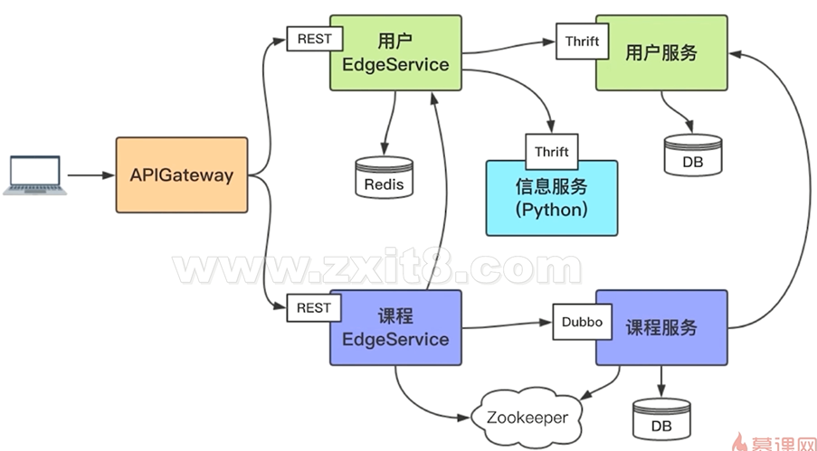
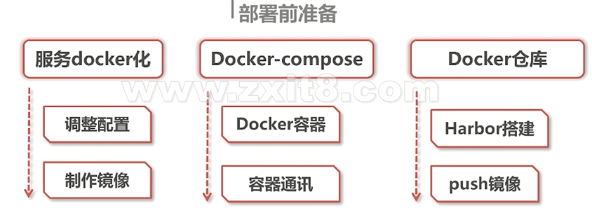
Mesos , Swarm, Kubernetes

### 1-2 软件架构的进化
软件架构： 在软件的内部，经过综合各种因素的考量、权衡，选择特定的技术，将系统划分成不同的部分并使用这些部分相互分工，彼此协作，为用户提供需要的价值。
架构进化涉及到的因素：业务需求，成本，可扩展性，技术栈，组织架构，可维护性。
单体架构： 功能、业务集中在一个发布包里，部署运行在同一个进程中。
单体架构的优点：易于开发，易于部署，易于测试，易于水平伸缩。
单体架构面临的挑战：代码膨胀，难以维护；构建、部署成本大；新人上手困难；创新困难；可扩展性差。
### 1-3 什么是微服务
微服务的特征：单一职责；轻量级通信；隔离性；有自己的数据；技术多样性。
### 1-4 画出微服务架构图
假定业务场景：
```
一个在线教育的网站的部分功能；
用户可以登录注册，获取用户信息；
有发送邮件发送短信的功能；
可以查看课程列表和对课程的基本CRUD；

```
单体服务
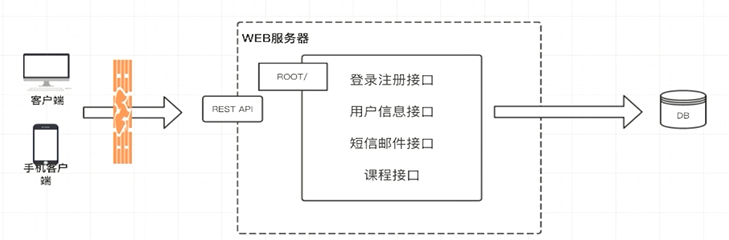
简单的微服务拆分
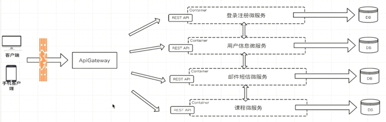
上图的微服务拆分并不是很合理， 不一定每个服务都需要采用rest api通信机制， 各个微服务之间可以采用其他方式通信，有些服务不需要对外。

### 1-5 微服务架构的优势和不足
优势：独立性，敏捷性，技术栈灵活，高效团队。
不足：额外的工作（比如服务的拆分），数据的一致性（微服务都有自己的数据库，如果相互之间存在依赖，可能造成问题），沟通成本。

## 第2章 微服务带来的问题及解决方案分析
通过传统服务与微服务对比的方式去学习，如果使用微服务架构会遇到什么问题，这些问题在业内都有什么解决方案。之后我们插了一段SpringBoot和SpringCloud的内容，主要目的是让大家搞清楚它们跟微服务的关系，跟docker的关系，以及跟服务编排的关系。

### 2-1 微服务架构带来的问题
微服务间如何通讯？
服务如何发现彼此？
微服务怎样部署？更新？扩容？

### 2-2 微服务间如何通讯
#### 从通讯模式角度考虑

| |  一对一 | 一对多 |
| ---- | ---| --- |
| 同步 | 请求响应模式，最常见 |
| 异步 |  通知/请求异步响应 | 发布订阅/发布异步响应|


#### 从通讯协议角度考虑
REST API
RPC: dubbo, dubbox, motan, grpc, thrift
MQ

#### 如何选择RPC框架
**I/O、线程调度模型**--同步/异步，长/短连接，阻塞/非阻塞，单/多线程；
**序列化方式**--可读的（xml,json）/二进制，序列化的效率直接影响通信效率（序列化/反序列化的时间以及数据包的大小）；
**多语言支持**
**服务治理**

###### dubbo
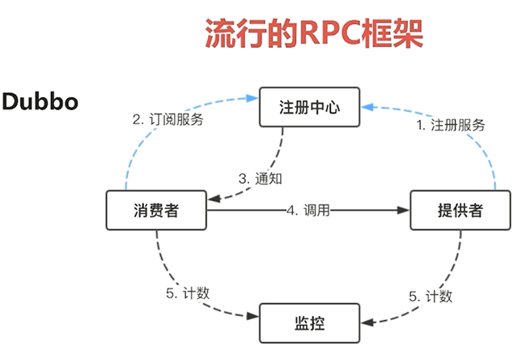
实线表示同步调用，虚线表示异步调用；
仅持支java语言

###### Motan
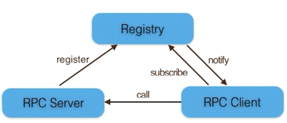

###### Thrift
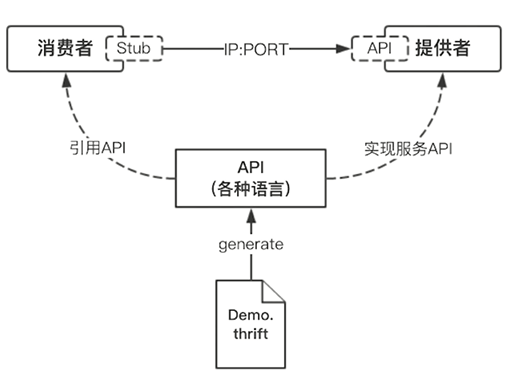

###### GRPC
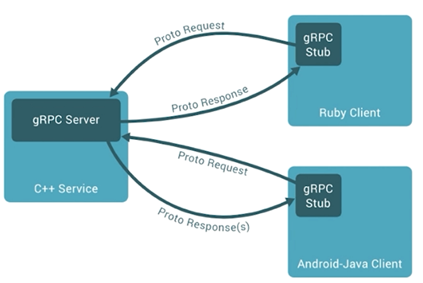

##### 对比
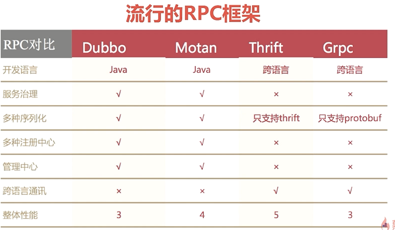

### 2-3 服务发现、部署更新和扩容
#### 服务的发现
传统服务
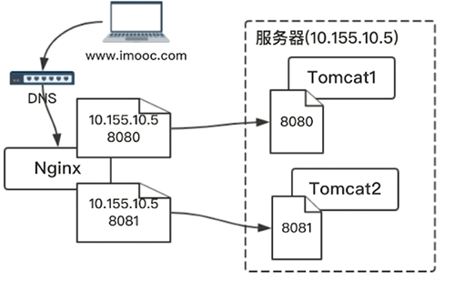

微服务--客户端发现、服务端发现

客户端发现
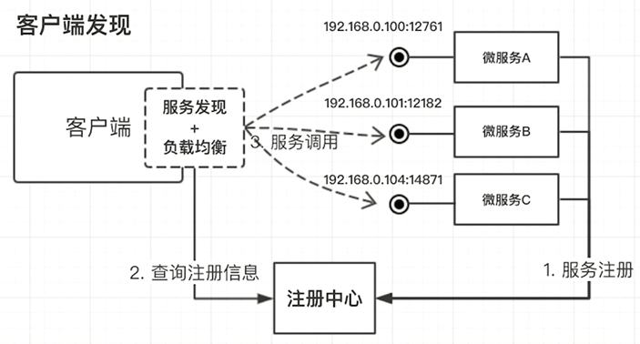
服务端发现
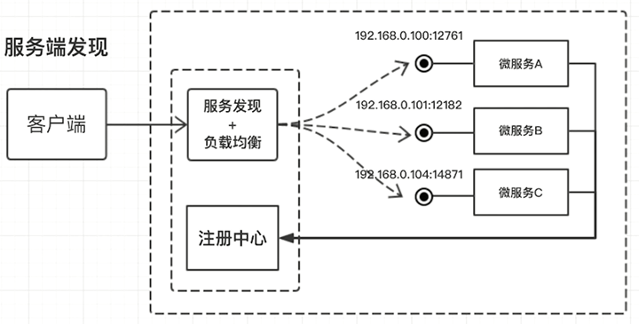

#### 部署更新和扩容
传统服务： 更新对应代码，修改对应配置，替换包
微服务： 服务编排（服务发现、部署、扩容），流行的服务编排工具--Mesos\DockerSwarm\Kubernets

### 2-4 springboot&springcloud
#### Springboot的核心功能
独立运行  java -jar xxx.jar
内嵌web服务器
简化配置
准生产的应用监控

#### Springboot与微服务之间的关系
Java的润滑剂
SpringCloud的使命：简化java的分布式系统

SpringCloud深入理解： 一系列框架； 简化java的分布式系统；springboot封装（简化配置）；

springboot VS springcloud：springboot意在简化，是一种开发、配置风格；springcloud意在简化分布式，是功能的集合，风格统一；

springcloud VS 微服务：Java的微服务；侧重功能，侧重开发；
SpringCloud核心组件：Netflix Eureka（服务发现组件），Netflix Ribbon（客户端负载均衡组件），Netflix Hystrix（断路器），Netflix Zuul（路由网关），SpringCloud Config（配置中心）

Eureka
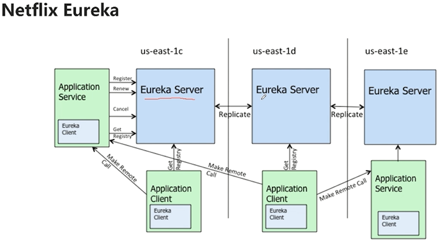  

Ribbon
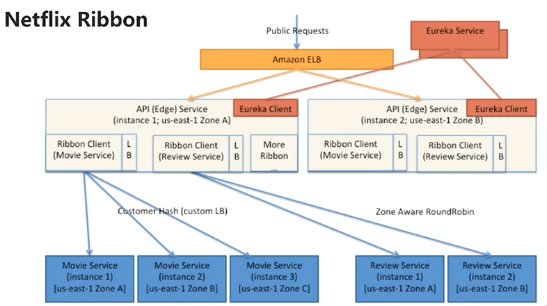

Hystrix
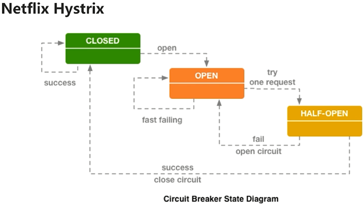

Zuul
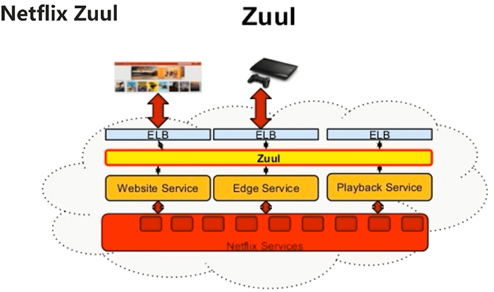

SpringCloud Config
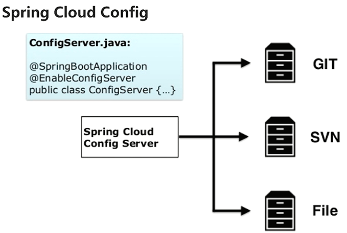


## 第3章 微服务开发
我们首先假定一个业务场景，分析一下微服务的划分、每个微服务完成什么功能、它们之间的依赖关系以及它们之间如何通讯。然后从0开始，一行不落的开发完整的服务。服务的开发过程我们会用到SpringBoot，用到Dubbo，用到Thrift，用到API网关Zuul。
### 3-1 微服务业务分析
#### 业务场景
用户可以注册和登录--单点登录，支持跨域，不记录session；
登录用户可以对课程进行CURD操作；

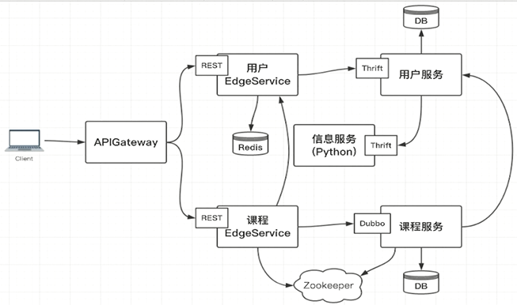
用户登录后，session存在redis中； 访问课程EdgeService时，需要从用户EdgeService获取用户登录信息（单点登录）； 

### 3-2 Thirft安装和验证
windows中安装thrift，下载exe文件`https://thrift.apache.org/download`，配置环境变量
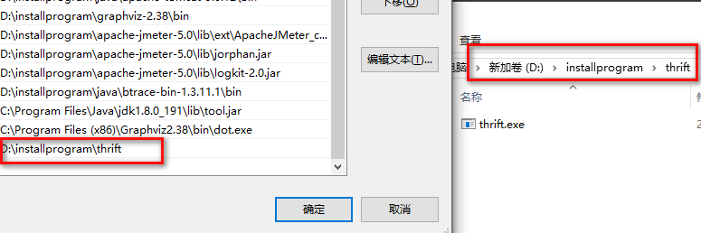
```
C:\Users\admin>thrift -version
Thrift version 0.12.0
```

Ubuntu中安装
```
# sudo apt-get install automake bison flex g++ git libboost-all-dev libevent-dev libssl-dev libtool make pkg-config
#上面安装完成后，显示缺少内容thrift-compiler
# sudo apt install thrift-compiler
#查看安装成功
$ thrift -version
Thrift version 0.9.1
```

### 3-3 Python开发信息服务
### 3-4 开发用户服务（上）
### 3-5 开发用户服务（下）
### 3-6 开发用户EdgeService_A
### 3-7 开发用户EdgeService_B
### 3-8 开发用户EdgeService_C
### 3-9 开发用户EdgeService_D
### 3-10 dubbo入门操练(上)
### 3-11 dubbo入门操练(下)
### 3-12 开发课程服务
### 3-13 开发课程EdgeService
### 3-14 APIGatewayZuul
## 第4章 服务编排前奏
 为服务编排做准备，首先我们把所有微服务进行docker化，然后用原生的docker-compose把它们都运行在容器中，并且保证它们之间在容器中也可以正常通讯。最后我们搭建一个私有仓库，用于存放我们的镜像，使用的是业内主流的 - harbor。
### 4-1 服务docker化（上）
### 4-2 服务docker化（下）
### 4-3 docker下的服务通讯（上）
### 4-4 docker下的服务通讯（下）
### 4-5 镜像仓库
### 4-6 三大平台扬帆起航
### 第5章 服务编排-Mesos
我们从概念到架构设计到调度策略逐步去了解Mesos，然后画出我们要搭建的Mesos集群架构图，之后参照架构图我们一步一步搭建好整个集群环境，最后调整我们的微服务，把他们部署在Mesos集群中。
### 5-1 了解Mesos
### 5-2 画出Mesos集群架构图
### 5-3 集群环境搭建_A
### 5-4 集群环境搭建_B
### 5-5 集群环境搭建_C
### 5-6 调整微服务适应Mesos
### 5-7 微服务部署_A
### 5-8 微服务部署_B
### 5-9 微服务部署_C
### 第6章 服务编排-DockerSwarm
学习的过程跟Mesos类似，也是先从概念入手，了解Swarm的架构设计，了解它的服务发现，服务编排，然后搭建Swarm集群环境，之后调整我们的微服务适应于Swarm，最后把他们部署在Swarm集群中。
### 6-1 了解Swarm
### 6-2 集群环境搭建（上）
### 6-3 集群环境搭建（下）
### 6-4 调整微服务及服务配置
### 6-5 微服务部署
## 第7章 服务编排-Kubernetes
Kubernetes学习的整体的思路也是从概念到集群搭建最后到微服务部署。但由于它在服务编排领域的领导地位和它的高门槛。我们将它剥离成三部分，核心部分、kube-proxy&kube-dns、认证授权。采用循序渐进的方式逐步渗透，不但可以让大家更容易入门，也会对它有更深刻的理解。

### 7-1 了解kubernetes（上）
### 7-2 了解kubernetes（下）
### 7-3 环境搭建前奏
### 7-4 预先准备环境
### 7-5 基础集群部署（上）
### 7-6 基础集群部署（下）
### 7-7 小试牛刀
### 7-8 kube-proxy和kube-dns
### 7-9 理解认证、授权
### 7-10 为集群添加认证授权（上）
### 7-11 为集群添加认证授权（下）
### 7-12 再试牛刀
### 7-13 部署我们的微服务
## 第8章 CICD和DevOps
首先从实践的角度看看为什么要有CICD和DevOps，然后从本质上了解CICD和DevOps的概念。接着分析我们要做的CICD的流程是什么样子的。最后我们搭建Gitlab，Jenkins环境，再结合镜像仓库和Kubernetes集群，构建一个从代码提交到服务更新完全自动化的流程。
### 8-1 了解CICD和DevOps
### 8-2 准备GitLab和Jenkins
### 8-3 CICD实践（上）
### 8-4 CICD实践（下）
## 第9章 课程总结
对前面所学内容的总结。
### 9-1 -课程总结


