# docker前后端分离
### 第1章 课程介绍
展示前后端分离项目部署的成果，介绍学习本门课程需要的硬件环境和软件环境，并利用VMware虚拟机安装CentOS，搭建Docker部署环境。
###  1-1 课程介绍 
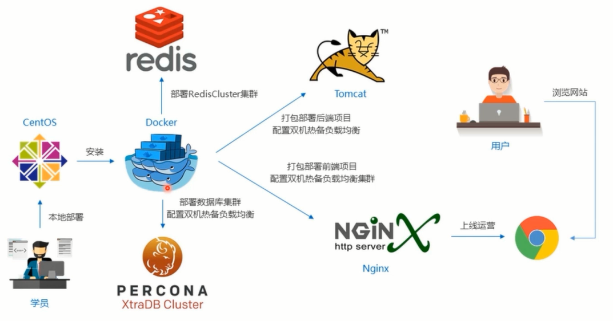
###  1-2 项目演示 
项目来自开源的人人
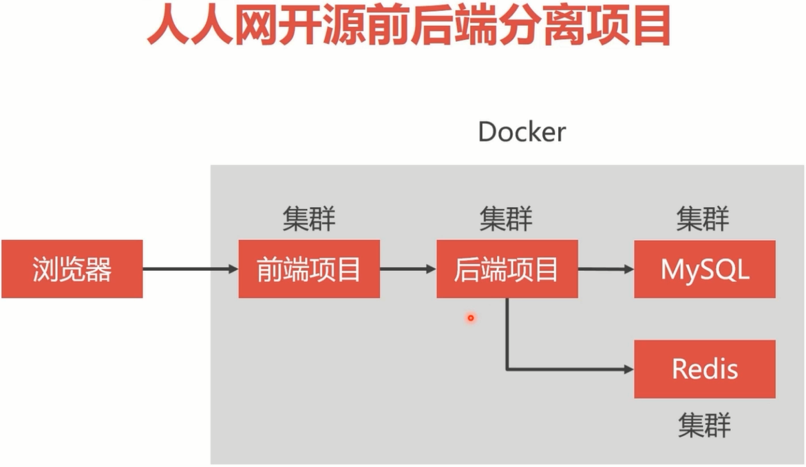 
###  1-3 开发环境要求（上）
* 虚拟机： Vmware(Ubuntu 18)
* Docker 
* JDK、MySQL、Redis、Nginx、Node.js  

###  1-4 开发环境要求（下）
### 第2章 人人开源前后端分离项目下载与配置
本章以renren-fast开源项目为部署案例，详细讲解了这个项目的前端部分和后端部分的安装和配置，在Windows平台上运行调试该项目。

###  2-1 前后端分离框架介绍
项目部署结构图
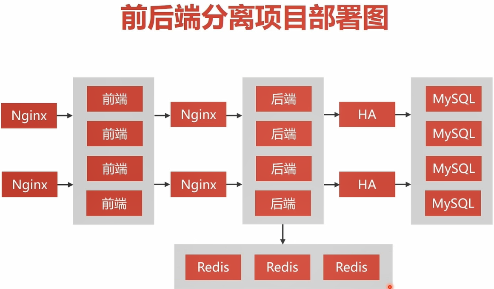
###  2-2 后端项目下载与配置
###  2-3 前台项目的下载与配置
## 第3章 Linux基础知识强化
本章内容是巩固和复习Linux系统基础知识，重点讲解Linux系统中的目录结构和常用指令，以及防火墙等。为在Linux环境中部署前后端分离项目扫清基础知识障碍。而且还会讲解Docker虚拟机的安装。
###  3-1 Linux系统构成和基本操作（上）
Linux系统的优势
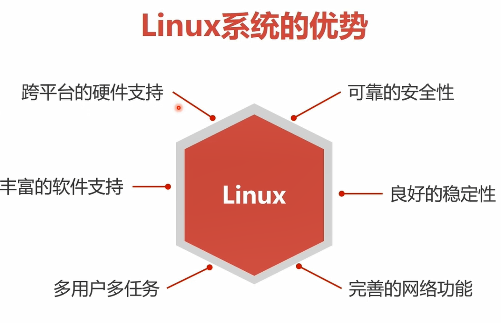  

Linux的目录结构
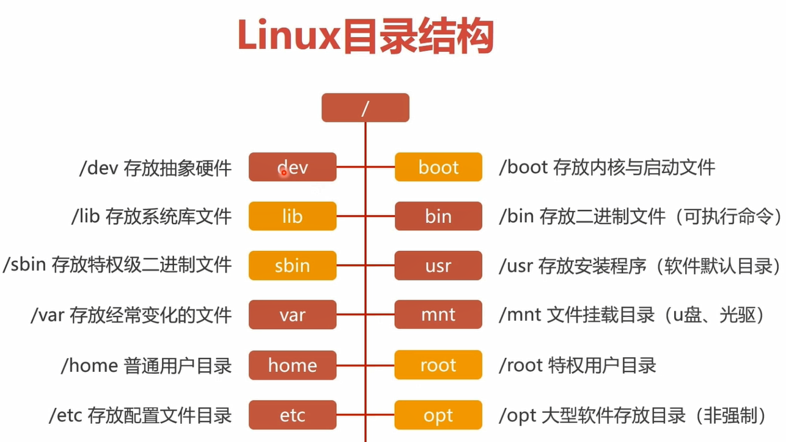  
###  3-2 Linux系统构成和基本操作（下）
###  3-3 防火墙管理
* 查看、启动、关闭、重启防火墙

* 端口管理 


###  3-4 Docker虚拟机（上）

###  3-5 Docker虚拟机（下）
## 第4章 搭建MySQL集群
大型项目的持久层都会选择数据库集群，本门课程选择的是MySQL领域中最成熟可靠的PXC（Percona XtraDB Cluster）集群方案。在本章节，我们会学习在Docker容器中划分网段，创建PXC容器和组建5节点的PXC集群。

###  4-1 MySQL集群方案介绍
#### 单节点数据库的弊病
* 大型互联网程序 用户群体庞大，所以架构必须要特殊设计
* 单节点的数据库无法满足性能上的要求
* 单节点的数据库没有冗余设计，无法满足高可用

单节点MySQL的性能瓶颈
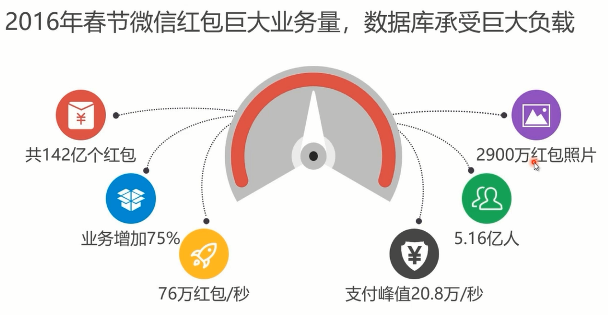  

常见MySQL集群方案
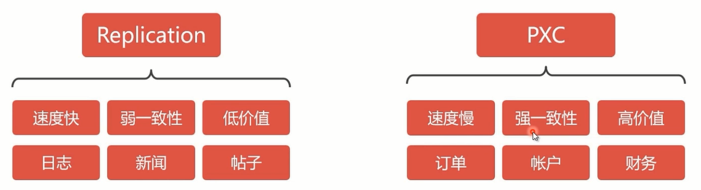

PXC原理
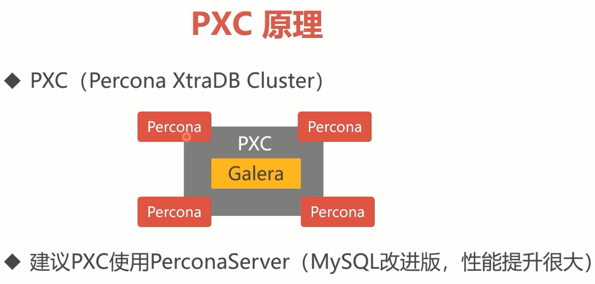

PXC方案与Replication方案的对比
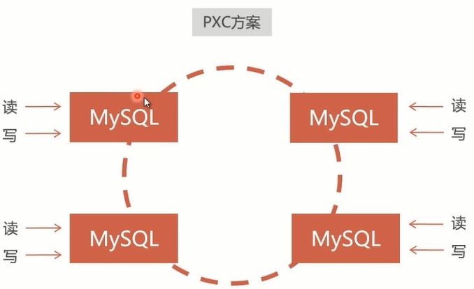

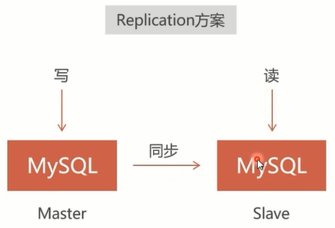

PXC的数据强一致性
* 同步复制，事务在所有集群节点要么同时提交，要么不提交
* Replication采用异步复制，无法保证数据的一直性 

pxc的一致性
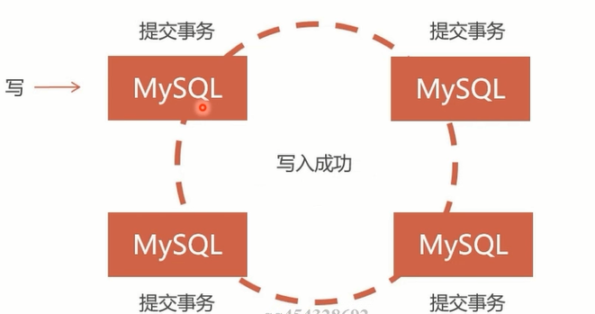
Replication异步
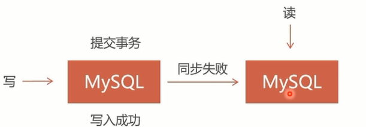

###  4-2 创建MySQL集群
安装PXC镜像
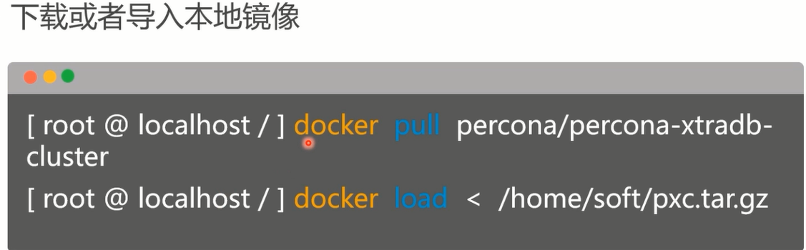

```
root@ubuntu:~# docker search percona
NAME                                          DESCRIPTION                                     STARS               OFFICIAL            AUTOMATED
percona                                       Percona Server is a fork of the MySQL relati…   443                 [OK]                
percona/percona-xtradb-cluster                Percona XtraDB Cluster docker image | https:…   89 

#选择percona/percona-xtradb-cluster安装
root@ubuntu:~# docker pull percona/percona-xtradb-cluster

#查看本机已有镜像
root@ubuntu:~# docker images
REPOSITORY                       TAG                 IMAGE ID            CREATED             SIZE
percona/percona-xtradb-cluster   latest              900034fa0246        2 days ago          685MB

#重命名
root@ubuntu:~# docker tag percona/percona-xtradb-cluster pxc
root@ubuntu:~# docker images
REPOSITORY                       TAG                 IMAGE ID            CREATED             SIZE
pxc                              latest              900034fa0246        2 days ago          685MB
percona/percona-xtradb-cluster   latest              900034fa0246        2 days ago          685MB
openjdk                          latest              e1e07dfba89c        2 weeks ago         470MB

#删除原来的镜像
root@ubuntu:~# docker rmi percona/percona-xtradb-cluster
```

创建内部网络
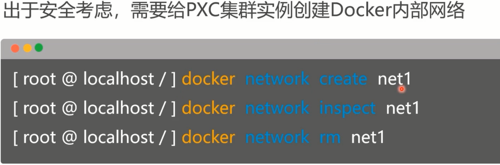

```
#创建内部网络，指定ip地址范围以及网络名称
root@ubuntu:~# docker network create --subnet=172.18.0.0/24 net1
ee5388f7a3c3d03e078905eb86a60526ead00f21e7642eef67bd7c8e05472e86
#查看所有的网络，其中bridge、host、none是docker自带的
root@ubuntu:~# docker network ls
NETWORK ID          NAME                DRIVER              SCOPE
09ee7aca2b49        bridge              bridge              local
76b26c9aa75f        host                host                local
ee5388f7a3c3        net1                bridge              local
77aa5147f4aa        none                null                local

#查看指定网络名称的信息
root@ubuntu:~# docker inspect net1
[
    {
        "Name": "net1",
        "Id": "ee5388f7a3c3d03e078905eb86a60526ead00f21e7642eef67bd7c8e05472e86",
        "Created": "2019-08-24T10:14:36.18098964-07:00",
        "Scope": "local",
        "Driver": "bridge",
        "EnableIPv6": false,
        "IPAM": {
            "Driver": "default",
            "Options": {},
            "Config": [
                {
                    "Subnet": "172.18.0.0/24"
                }
            ]
        },
        "Internal": false,
        "Attachable": false,
        "Ingress": false,
        "ConfigFrom": {
            "Network": ""
        },
        "ConfigOnly": false,
        "Containers": {},
        "Options": {},
        "Labels": {}
    }
]

#删除指定网络
root@ubuntu:~# docker network rm net1
```

创建Docker卷
Docker容器使用原则：一旦创建出容器，尽量不要在容器中保存数据。一般通过目录映射将数据保存在宿主机里面（我们把宿主机的一个目录映射到容器内，然后容器的数据都保存到映射目录，这样就保存到了宿主机，即使容器损坏，宿主机也有数据保存）。但是，PXC技术在使用Docker的时候无法直接使用映射目录，需要另外一种映射技术—Docker卷。


容器中的PXC节点映射数据目录的解决办法

```
root@ubuntu:~# docker volume create v1
v1
root@ubuntu:~# docker volume ls
DRIVER              VOLUME NAME
local               v1
root@ubuntu:~# docker inspect v1
[
    {
        "CreatedAt": "2019-08-24T10:21:55-07:00",
        "Driver": "local",
        "Labels": {},
        "Mountpoint": "/var/lib/docker/volumes/v1/_data",
        "Name": "v1",
        "Options": {},
        "Scope": "local"
    }
]

root@ubuntu:~# docker volume rm v1

```

创建PXC容器
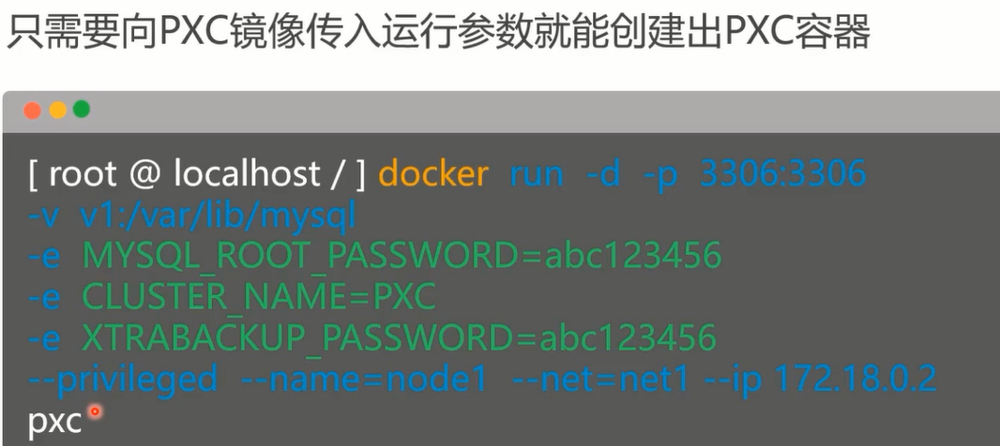

具体执行命令
```
docker run -d -p 3307:3306 -v v1:/var/lib/mysql -e MYSQL_ROOT_PASSWORD=abc123456 -e CLUSTER_NAME=PXC -e XTRABACKUP_PASSWORD=abc123456 --privileged --name=node1 --net=net1 --ip 172.18.0.2 pxc


参数解释：
 
-d：表示后台运行
 
-v：映射Docker卷到容器的mysql数据目录
 
MYSQL_ROOT_PASSWORD：表示创建的数据库密码
 
CLUSTER_NAME： 表示创建出的集群名字
 
XTRABACKUP_PASSWORD：表示集群通信密码
 
--privileged：表示分配最高权限
 
--net：指定网段
 
--ip：指定IP
```
创建集群的命令
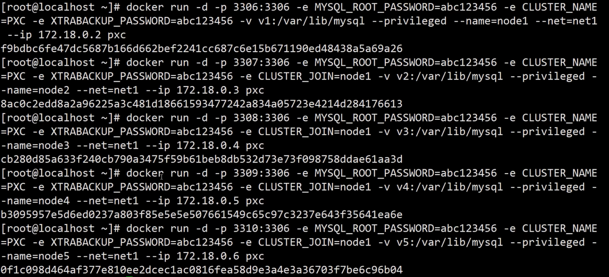

https://blog.csdn.net/attwice/article/details/81434920

创建mysql集群
```
root@ubuntu:~# mkdir /etc/mysql3307
root@ubuntu:~# mkdir /etc/mysql3308
root@ubuntu:~# mkdir /etc/mysql3309
root@ubuntu:~# mkdir /etc/mysql3310
root@ubuntu:~# mkdir /etc/mysql3311
root@ubuntu:~# cp /etc/mysql/my.cnf /etc/mysql3307/
root@ubuntu:~# cp /etc/mysql/my.cnf /etc/mysql3308
root@ubuntu:~# cp /etc/mysql/my.cnf /etc/mysql3309
root@ubuntu:~# cp /etc/mysql/my.cnf /etc/mysql3310
root@ubuntu:~# cp /etc/mysql/my.cnf /etc/mysql3311

#启动mysql容器
docker run -p 3307:3306 --name mysql3307 -v /etc/mysql3307:/etc/mysql/conf.d -e MYSQL_ROOT_PASSWORD=root -d mysql:5.7
docker run -p 3308:3306 --name mysql3308 -v /etc/mysql3308:/etc/mysql/conf.d -e MYSQL_ROOT_PASSWORD=root -d mysql:5.7
docker run -p 3309:3306 --name mysql3309 -v /etc/mysql3309:/etc/mysql/conf.d -e MYSQL_ROOT_PASSWORD=root -d mysql:5.7
docker run -p 3310:3306 --name mysql3310 -v /etc/mysql3310:/etc/mysql/conf.d -e MYSQL_ROOT_PASSWORD=root -d mysql:5.7
docker run -p 3311:3306 --name mysql3311 -v /etc/mysql3311:/etc/mysql/conf.d -e MYSQL_ROOT_PASSWORD=root -d mysql:5.7


#Navicat要连接上数据库，需要进行如下设置

root@ubuntu:/# docker exec -it 容器id
root@0c3ea23dcf71:/# mysql -uroot -p
mysql> use mysql;
mysql> grant all privileges on *.* to root@"%" identified by "password" with grant option;
#这一步很重要
mysql>  set password for "root"@"%"=password("root");
mysql> flush privileges;
```

```
#创建容器卷
docker volume create v1
docker volume create v2
docker volume create v3
docker volume create v4
docker volume create v5

#创建pxc节点，在创建剩余容器的时候需要注意的是网络和端口的映射不同，以及多了-e CLUSTER_JOIN=node1 表示加入node1节点。注意：第一个节点创建时间较长，必须等待两分钟左右再创建剩余节点。

 #node1
docker run -d -p 3307:3306 -v v1:/var/lib/mysql -e MYSQL_ROOT_PASSWORD=root -e CLUSTER_NAME=PXC -e XTRABACKUP_PASSWORD=root --privileged --name=node1 --net=net1 --ip 172.18.0.2 pxc  

 #node2
docker run -d -p 3308:3306 -v v2:/var/lib/mysql -e MYSQL_ROOT_PASSWORD=root -e CLUSTER_NAME=PXC -e XTRABACKUP_PASSWORD=root -e CLUSTER_JOIN=node1 --privileged --name=node2 --net=net1 --ip 172.18.0.3 pxc


 #node3
docker run -d -p 3309:3306 -v v3:/var/lib/mysql -e MYSQL_ROOT_PASSWORD=root -e CLUSTER_NAME=PXC -e XTRABACKUP_PASSWORD=root -e CLUSTER_JOIN=node1 --privileged --name=node3 --net=net1 --ip 172.18.0.4 pxc

 #node4
docker run -d -p 3310:3306 -v v4:/var/lib/mysql -e MYSQL_ROOT_PASSWORD=root -e CLUSTER_NAME=PXC -e XTRABACKUP_PASSWORD=root -e CLUSTER_JOIN=node1 --privileged --name=node4 --net=net1 --ip 172.18.0.5 pxc

 #node5
docker run -d -p 3311:3306 -v v5:/var/lib/mysql -e MYSQL_ROOT_PASSWORD=root -e CLUSTER_NAME=PXC -e XTRABACKUP_PASSWORD=root -e CLUSTER_JOIN=node1 --privileged --name=node5 --net=net1 --ip 172.18.0.6 pxc
```


###  4-3 数据库负载均衡
###  4-4 负载均衡的高可用方案（上）
###  4-5 负载均衡的高可用方案（下）
###  4-6 热备份数据
## 第5章 搭建Redis集群
Redis高速缓存可以减少数据库IO的压力，在秒杀商品、抢红包等业务中频繁用到。这一章我们要学习的是为renren-fast项目搭建6节点的RedisCluster集群。

###  5-1 Redis高速缓存介绍
###  5-2 Redis主从同步
###  5-3 配置RedisCluster集群
## 第6章 部署前后端分离项目
 除了MySQL和Redis要使用集群外，业务的节点的部署也要使用集群方案，才能保证高性能、高负载和高可用。这一章我们将学习打包前端VUE项目和后端SpringBoot项目，以集群的方式部署在Docker容器内。

###  6-1 后端项目后端项目部署与负载均衡
###  6-2 后端项目双机热备负载均衡
###  6-3 前端项目后端项目部署与负载均衡
###  6-4 前端项目双机热备负载均衡 试看
## 第7章 课后作业
 俗话说“鸡蛋不要放在同一个篮子里”，所以要对本地部署方案改造成跨主机的运营平台。我们将创建四个Linux主机，利用Swarm技术组建Docker集群。通过Swarm的共享网络，组建起多主机多容器分布式部署的运营平台。

###  7-1 课后作业（上）
###  7-2 课后作业（中）
###  7-3 课后作业（下）
## 第8章 云平台部署前后端分离
本课程的案例既可以部署在本地，也可以部署在云平台，本章我们将比较阿里云、腾讯云、百度云的特点，以阿里云为例，介绍云主机的购买和使用，以及在阿里云ECS主机上部署本课程的相关程序。

###  8-1 云端部署
## 第9章 课程总结
回顾renren-fast案例的部署架构

###  9-1 课程总结