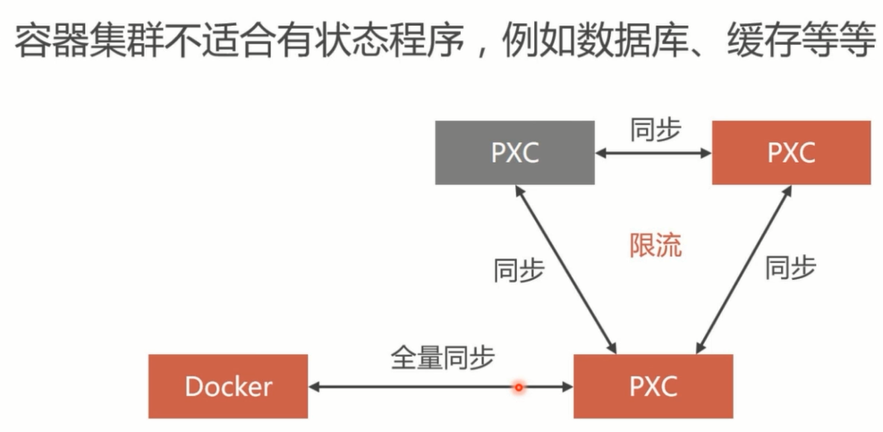

# docker前后端分离
### 第1章 课程介绍
展示前后端分离项目部署的成果，介绍学习本门课程需要的硬件环境和软件环境，并利用VMware虚拟机安装CentOS，搭建Docker部署环境。
###  1-1 课程介绍 

###  1-2 项目演示 
项目来自开源的人人
 
###  1-3 开发环境要求（上）
* 虚拟机： Vmware(Ubuntu 18)
* Docker 
* JDK、MySQL、Redis、Nginx、Node.js  

###  1-4 开发环境要求（下）
### 第2章 人人开源前后端分离项目下载与配置
本章以renren-fast开源项目为部署案例，详细讲解了这个项目的前端部分和后端部分的安装和配置，在Windows平台上运行调试该项目。

###  2-1 前后端分离框架介绍
项目部署结构图

###  2-2 后端项目下载与配置
###  2-3 前台项目的下载与配置
## 第3章 Linux基础知识强化
本章内容是巩固和复习Linux系统基础知识，重点讲解Linux系统中的目录结构和常用指令，以及防火墙等。为在Linux环境中部署前后端分离项目扫清基础知识障碍。而且还会讲解Docker虚拟机的安装。
###  3-1 Linux系统构成和基本操作（上）
Linux系统的优势
  

Linux的目录结构
  
###  3-2 Linux系统构成和基本操作（下）
###  3-3 防火墙管理
* 查看、启动、关闭、重启防火墙

* 端口管理 


###  3-4 Docker虚拟机（上）

###  3-5 Docker虚拟机（下）
## 第4章 搭建MySQL集群
大型项目的持久层都会选择数据库集群，本门课程选择的是MySQL领域中最成熟可靠的PXC（Percona XtraDB Cluster）集群方案。在本章节，我们会学习在Docker容器中划分网段，创建PXC容器和组建5节点的PXC集群。

###  4-1 MySQL集群方案介绍
#### 单节点数据库的弊病
* 大型互联网程序 用户群体庞大，所以架构必须要特殊设计
* 单节点的数据库无法满足性能上的要求
* 单节点的数据库没有冗余设计，无法满足高可用

单节点MySQL的性能瓶颈
  

常见MySQL集群方案


PXC原理


PXC方案与Replication方案的对比


PXC的数据强一致性
* 同步复制，事务在所有集群节点要么同时提交，要么不提交
* Replication采用异步复制，无法保证数据的一直性 

pxc的一致性

Replication异步


###  4-2 创建MySQL集群
安装PXC镜像


```
root@ubuntu:~# docker search percona
NAME                                          DESCRIPTION                                     STARS               OFFICIAL            AUTOMATED
percona                                       Percona Server is a fork of the MySQL relati…   443                 [OK]                
percona/percona-xtradb-cluster                Percona XtraDB Cluster docker image | https:…   89 

#选择percona/percona-xtradb-cluster安装
root@ubuntu:~# docker pull percona/percona-xtradb-cluster

#查看本机已有镜像
root@ubuntu:~# docker images
REPOSITORY                       TAG                 IMAGE ID            CREATED             SIZE
percona/percona-xtradb-cluster   latest              900034fa0246        2 days ago          685MB

#重命名
root@ubuntu:~# docker tag percona/percona-xtradb-cluster pxc
root@ubuntu:~# docker images
REPOSITORY                       TAG                 IMAGE ID            CREATED             SIZE
pxc                              latest              900034fa0246        2 days ago          685MB
percona/percona-xtradb-cluster   latest              900034fa0246        2 days ago          685MB
openjdk                          latest              e1e07dfba89c        2 weeks ago         470MB

#删除原来的镜像
root@ubuntu:~# docker rmi percona/percona-xtradb-cluster
```

创建内部网络


```
#创建内部网络，指定ip地址范围以及网络名称
root@ubuntu:~# docker network create --subnet=172.18.0.0/24 net1
ee5388f7a3c3d03e078905eb86a60526ead00f21e7642eef67bd7c8e05472e86
#查看所有的网络，其中bridge、host、none是docker自带的
root@ubuntu:~# docker network ls
NETWORK ID          NAME                DRIVER              SCOPE
09ee7aca2b49        bridge              bridge              local
76b26c9aa75f        host                host                local
ee5388f7a3c3        net1                bridge              local
77aa5147f4aa        none                null                local

#查看指定网络名称的信息
root@ubuntu:~# docker inspect net1
[
    {
        "Name": "net1",
        "Id": "ee5388f7a3c3d03e078905eb86a60526ead00f21e7642eef67bd7c8e05472e86",
        "Created": "2019-08-24T10:14:36.18098964-07:00",
        "Scope": "local",
        "Driver": "bridge",
        "EnableIPv6": false,
        "IPAM": {
            "Driver": "default",
            "Options": {},
            "Config": [
                {
                    "Subnet": "172.18.0.0/24"
                }
            ]
        },
        "Internal": false,
        "Attachable": false,
        "Ingress": false,
        "ConfigFrom": {
            "Network": ""
        },
        "ConfigOnly": false,
        "Containers": {},
        "Options": {},
        "Labels": {}
    }
]

#删除指定网络
root@ubuntu:~# docker network rm net1
```

创建Docker卷
Docker容器使用原则：一旦创建出容器，尽量不要在容器中保存数据。一般通过目录映射将数据保存在宿主机里面（我们把宿主机的一个目录映射到容器内，然后容器的数据都保存到映射目录，这样就保存到了宿主机，即使容器损坏，宿主机也有数据保存）。但是，PXC技术在使用Docker的时候无法直接使用映射目录，需要另外一种映射技术—Docker卷。


容器中的PXC节点映射数据目录的解决办法

```
root@ubuntu:~# docker volume create v1
v1
root@ubuntu:~# docker volume ls
DRIVER              VOLUME NAME
local               v1
root@ubuntu:~# docker inspect v1
[
    {
        "CreatedAt": "2019-08-24T10:21:55-07:00",
        "Driver": "local",
        "Labels": {},
        "Mountpoint": "/var/lib/docker/volumes/v1/_data",
        "Name": "v1",
        "Options": {},
        "Scope": "local"
    }
]

root@ubuntu:~# docker volume rm v1

```

创建PXC容器


具体执行命令
```
docker run -d -p 3307:3306 -v v1:/var/lib/mysql -e MYSQL_ROOT_PASSWORD=abc123456 -e CLUSTER_NAME=PXC -e XTRABACKUP_PASSWORD=abc123456 --privileged --name=node1 --net=net1 --ip 172.18.0.2 pxc


参数解释：
 
-d：表示后台运行
 
-v：映射Docker卷到容器的mysql数据目录
 
MYSQL_ROOT_PASSWORD：表示创建的数据库密码
 
CLUSTER_NAME： 表示创建出的集群名字
 
XTRABACKUP_PASSWORD：表示集群通信密码
 
--privileged：表示分配最高权限
 
--net：指定网段
 
--ip：指定IP
```
创建集群的命令


https://blog.csdn.net/attwice/article/details/81434920

创建mysql集群
```
root@ubuntu:~# mkdir /etc/mysql3307
root@ubuntu:~# mkdir /etc/mysql3308
root@ubuntu:~# mkdir /etc/mysql3309
root@ubuntu:~# mkdir /etc/mysql3310
root@ubuntu:~# mkdir /etc/mysql3311
root@ubuntu:~# cp /etc/mysql/my.cnf /etc/mysql3307/
root@ubuntu:~# cp /etc/mysql/my.cnf /etc/mysql3308
root@ubuntu:~# cp /etc/mysql/my.cnf /etc/mysql3309
root@ubuntu:~# cp /etc/mysql/my.cnf /etc/mysql3310
root@ubuntu:~# cp /etc/mysql/my.cnf /etc/mysql3311

#启动mysql容器
docker run -p 3307:3306 --name mysql3307 -v /etc/mysql3307:/etc/mysql/conf.d -e MYSQL_ROOT_PASSWORD=root -d mysql:5.7
docker run -p 3308:3306 --name mysql3308 -v /etc/mysql3308:/etc/mysql/conf.d -e MYSQL_ROOT_PASSWORD=root -d mysql:5.7
docker run -p 3309:3306 --name mysql3309 -v /etc/mysql3309:/etc/mysql/conf.d -e MYSQL_ROOT_PASSWORD=root -d mysql:5.7
docker run -p 3310:3306 --name mysql3310 -v /etc/mysql3310:/etc/mysql/conf.d -e MYSQL_ROOT_PASSWORD=root -d mysql:5.7
docker run -p 3311:3306 --name mysql3311 -v /etc/mysql3311:/etc/mysql/conf.d -e MYSQL_ROOT_PASSWORD=root -d mysql:5.7


#Navicat要连接上数据库，需要进行如下设置

root@ubuntu:/# docker exec -it 容器id
root@0c3ea23dcf71:/# mysql -uroot -p
mysql> use mysql;
mysql> grant all privileges on *.* to root@"%" identified by "password" with grant option;
#这一步很重要
mysql>  set password for "root"@"%"=password("root");
mysql> flush privileges;
```

```
#创建容器卷
docker volume create v1
docker volume create v2
docker volume create v3
docker volume create v4
docker volume create v5

#创建pxc节点，在创建剩余容器的时候需要注意的是网络和端口的映射不同，以及多了-e CLUSTER_JOIN=node1 表示加入node1节点。注意：第一个节点创建时间较长，必须等待两分钟左右再创建剩余节点。

 #node1
docker run -d -p 3307:3306 -v v1:/var/lib/mysql -e MYSQL_ROOT_PASSWORD=root -e CLUSTER_NAME=PXC -e XTRABACKUP_PASSWORD=root --privileged --name=node1 --net=net1 --ip 172.18.0.2 pxc  

 #node2
docker run -d -p 3308:3306 -v v2:/var/lib/mysql -e MYSQL_ROOT_PASSWORD=root -e CLUSTER_NAME=PXC -e XTRABACKUP_PASSWORD=root -e CLUSTER_JOIN=node1 --privileged --name=node2 --net=net1 --ip 172.18.0.3 pxc


 #node3
docker run -d -p 3309:3306 -v v3:/var/lib/mysql -e MYSQL_ROOT_PASSWORD=root -e CLUSTER_NAME=PXC -e XTRABACKUP_PASSWORD=root -e CLUSTER_JOIN=node1 --privileged --name=node3 --net=net1 --ip 172.18.0.4 pxc

 #node4
docker run -d -p 3310:3306 -v v4:/var/lib/mysql -e MYSQL_ROOT_PASSWORD=root -e CLUSTER_NAME=PXC -e XTRABACKUP_PASSWORD=root -e CLUSTER_JOIN=node1 --privileged --name=node4 --net=net1 --ip 172.18.0.5 pxc

 #node5
docker run -d -p 3311:3306 -v v5:/var/lib/mysql -e MYSQL_ROOT_PASSWORD=root -e CLUSTER_NAME=PXC -e XTRABACKUP_PASSWORD=root -e CLUSTER_JOIN=node1 --privileged --name=node5 --net=net1 --ip 172.18.0.6 pxc
```

创建pxc集群失败
```
2019-08-25T03:53:28.472939Z 0 [Note] WSREP: (e3e64ae8, 'tcp://0.0.0.0:4567') turning message relay requesting off
        2019-08-25T03:53:37.590506Z WSREP_SST: [ERROR] ******************* FATAL ERROR ********************** 
        2019-08-25T03:53:37.592872Z WSREP_SST: [ERROR] xtrabackup_checkpoints missing. xtrabackup/SST failed on DONOR. Check DONOR log
        2019-08-25T03:53:37.594545Z WSREP_SST: [ERROR] ****************************************************** 
        2019-08-25T03:53:37.596817Z WSREP_SST: [ERROR] Cleanup after exit with status:2
2019-08-25T03:53:37.604026Z 0 [ERROR] WSREP: Process completed with error: wsrep_sst_xtrabackup-v2 --role 'joiner' --address '172.19.0.3' --datadir '/var/lib/mysql/' --defaults-file '/etc/my.cnf' --defaults-group-suffix '' --parent '1' --mysqld-version '5.7.26-29-57'   '' : 2 (No such file or directory)
2019-08-25T03:53:37.604577Z 0 [ERROR] WSREP: Failed to read uuid:seqno from joiner script.
2019-08-25T03:53:37.605266Z 0 [ERROR] WSREP: SST script aborted with error 2 (No such file or directory)
2019-08-25T03:53:37.606324Z 0 [ERROR] WSREP: SST failed: 2 (No such file or directory)
```


###  4-3 数据库负载均衡
###  4-4 负载均衡的高可用方案（上）
###  4-5 负载均衡的高可用方案（下）
###  4-6 热备份数据
## 第5章 搭建Redis集群
Redis高速缓存可以减少数据库IO的压力，在秒杀商品、抢红包等业务中频繁用到。这一章我们要学习的是为renren-fast项目搭建6节点的RedisCluster集群。

###  5-1 Redis高速缓存介绍
* 高速缓存利用内存保存数据，读写速度远超硬盘
* 高速缓存可以减少I/O操作，降低I/O压力

Redis介绍：
* Redis是Wmware开发的开源免费KV型NoSQL缓存产品
* Redis具有良好的性能，最多可以提供10万次/秒的读写
* 目前新浪微博团推组件了世界最大规模的Redis集群

Redis目前的集群方案分为以下几种：
1. RedisCluster：官方退浆，没有中心节点
2. Codis:中间件产品，存在中心节点
3. Twemproxy: 中间件产品，存在中心节点

RedisCluster：
* 无中心节点，客户端与redis节点直连，不需要中间代理层
* 数据可以被分片存储
* 管理方便，后续可自行增加或删除节点


###  5-2 Redis主从同步
* Redis集群中的数据库复制是通过主从同步来实现的
* 主节点(Master)把数据分发给从节点(Slave)
* 主从同步的好处在于高可用，Redis节点有冗余设计

Redis集群高可用：
* Redis集群中应该包含奇数个Master，至少应该有3个Master
* Redis集群中每个Master都应该有Salve
  

###  5-3 配置RedisCluster集群
安装Redis镜像

创建redis内部网络端
```
root@ubuntu:~# docker network create redis-network
#查看网络段，当前是 172.20.0.0/16
root@ubuntu:~# docker network inspect redis-network

```
redis安装
```
#拉取镜像一定是yyyyttttwwww/redis，不要直接拉取redis，教程保持一致
root@ubuntu:~# docker pull yyyyttttwwww/redis
root@ubuntu:~# docker images
REPOSITORY                       TAG                 IMAGE ID            CREATED             SIZE
redis                            latest              f7302e4ab3a8        10 days ago         98.2MB

root@ubuntu:~# docker run -it -d --name redis1 -p 5001:6379 --net redis-network  yyyyttttwwww/redis

root@ubuntu:~# docker exec -it redis1 bash
root@c8baaf807315:/# vim /usr/redis/redis.conf 
```
配置redis节点，注意当前拉取的redis的配置文件在 /usr/redis/redis.conf


修改redis配置完成之后，重启redis
```
root@c8baaf807315:/# cd /usr/redis/src
#指定配置文件，启动redisserver
root@c8baaf807315:/usr/redis/src# ./redis-server  ../redis.conf 

#类型创建另外5个节点，一共6个节点
docker run -it -d --name redis2 -p 5002:6379 --net redis-network yyyyttttwwww/redis
docker run -it -d --name redis3 -p 5003:6379 --net redis-network yyyyttttwwww/redis
docker run -it -d --name redis4 -p 5004:6379 --net redis-network yyyyttttwwww/redis
docker run -it -d --name redis5 -p 5005:6379 --net redis-network yyyyttttwwww/redis
docker run -it -d --name redis6 -p 5006:6379 --net redis-network yyyyttttwwww/redis
```

安装redis-trib.rb
 

创建redis集群

具体的内部ip地址查看自己创建的网络
```
root@ubuntu:~# docker network inspect redis-network
[
    {
        "Name": "redis-network",
        "Id": "d0eb2106a5aa04bfeab6f231449bc8f9e1645868ecc0896e473e018833cfacb5",
        "Created": "2019-08-25T03:49:56.376583318-07:00",
        "Scope": "local",
        "Driver": "bridge",
        "EnableIPv6": false,
        "IPAM": {
            "Driver": "default",
            "Options": {},
            "Config": [
                {
                    "Subnet": "172.20.0.0/16",
                    "Gateway": "172.20.0.1"
                }
            ]
        },
        "Internal": false,
        "Attachable": false,
        "Ingress": false,
        "ConfigFrom": {
            "Network": ""
        },
        "ConfigOnly": false,
        "Containers": {
            "2b30305a8c7967795832549e4ed5612c6493f589d06a31088d53eafdfdc81102": {
                "Name": "redis6",
                "EndpointID": "2dbd30477c470f9248ebbc06b8e4247122899a9c169fcb34db3848122513c0b6",
                "MacAddress": "02:42:ac:14:00:07",
                "IPv4Address": "172.20.0.7/16",
                "IPv6Address": ""
            },
            "334e1882d166823d1ac7ffee402560ab864629b81ea285758e070994fc8f1105": {
                "Name": "redis3",
                "EndpointID": "b3a293a8915693bc2168bc870c6141fb4215cdedbc848f641b8441a62d396238",
                "MacAddress": "02:42:ac:14:00:04",
                "IPv4Address": "172.20.0.4/16",
                "IPv6Address": ""
            },
            "4ae844ff6ce00fe79d84ef2d6174f81d334aba4b282e0ca192ea7eee75ee52bd": {
                "Name": "redis4",
                "EndpointID": "8844451df0cf3552040e183458f7924aed3bf93961a15f0524bf0f70045d2e2b",
                "MacAddress": "02:42:ac:14:00:05",
                "IPv4Address": "172.20.0.5/16",
                "IPv6Address": ""
            },
            "79ca81835a9fd2c2c065d9f08388b9721efc4ad973cb18306eb3a212eb5af7d5": {
                "Name": "redis2",
                "EndpointID": "d04a5590f8a741f6410d3156c43260ad7936ee1888e6a35218fdc92932758277",
                "MacAddress": "02:42:ac:14:00:03",
                "IPv4Address": "172.20.0.3/16",
                "IPv6Address": ""
            },
            "8380fb1aafced920659819a56992a6229ffcf52187aa5f00134e9e58f20b30d6": {
                "Name": "redis5",
                "EndpointID": "dcc5e9ec01ef65ea553b3320b742139287e0e37f77f49909350fcf813f0a0877",
                "MacAddress": "02:42:ac:14:00:06",
                "IPv4Address": "172.20.0.6/16",
                "IPv6Address": ""
            },
            "c8baaf807315771f609cad77703362dc602af79e8fb68b64a4fad97c492c2e25": {
                "Name": "redis1",
                "EndpointID": "c809183a5e5bcc6b052ded1bed6a3ec0dbe71861707032dc7856ba7ff7e2a86e",
                "MacAddress": "02:42:ac:14:00:02",
                "IPv4Address": "172.20.0.2/16",
                "IPv6Address": ""
            }
        },
        "Options": {},
        "Labels": {}
    }
]
```

集群配置
```
root@ubuntu:~# docker exec -it redis1 bash
root@c8baaf807315:/# cd /usr/redis/
root@c8baaf807315:/usr/redis# mkdir cluster
root@c8baaf807315:/usr/redis# cd src/       
root@c8baaf807315:/usr/redis/src# cp redis-trib.rb  ../cluster 
root@c8baaf807315:/usr/redis/src# cd ../cluster/
#
root@c8baaf807315:/usr/redis/cluster# ./redis-trib.rb create --replicas 1 172.20.0.2:6379 172.20.0.3:6379 172.20.0.4:6379 172.20.0.5:6379 172.20.0.6:6379 172.20.0.7:6379

>>> Creating cluster
>>> Performing hash slots allocation on 6 nodes...
Using 3 masters:
172.20.0.2:6379
172.20.0.3:6379
172.20.0.4:6379
Adding replica 172.20.0.5:6379 to 172.20.0.2:6379
Adding replica 172.20.0.6:6379 to 172.20.0.3:6379
Adding replica 172.20.0.7:6379 to 172.20.0.4:6379
M: a7b0bb9d8981df778af120f93715625e46cb3228 172.20.0.2:6379
   slots:0-5460 (5461 slots) master
M: 5964413cde6d1439e59fa735f78ddf21ce3daafe 172.20.0.3:6379
   slots:5461-10922 (5462 slots) master
M: f5a69b0627f9d5ed1af7065a22a6a6cce027ffe2 172.20.0.4:6379
   slots:10923-16383 (5461 slots) master
S: 21f46905babde89ece68d8ed592bffe9b5f9d6d0 172.20.0.5:6379
   replicates a7b0bb9d8981df778af120f93715625e46cb3228
S: a751b4556ab10e011f5716aafa45f41eb0a86680 172.20.0.6:6379
   replicates 5964413cde6d1439e59fa735f78ddf21ce3daafe
S: fbda8b916095bcdc2260e3ac10ec5dc0a75c959e 172.20.0.7:6379
   replicates f5a69b0627f9d5ed1af7065a22a6a6cce027ffe2
Can I set the above configuration? (type 'yes' to accept): yes
>>> Nodes configuration updated
>>> Assign a different config epoch to each node
>>> Sending CLUSTER MEET messages to join the cluster
Waiting for the cluster to join...
>>> Performing Cluster Check (using node 172.20.0.2:6379)
M: a7b0bb9d8981df778af120f93715625e46cb3228 172.20.0.2:6379
   slots:0-5460 (5461 slots) master
M: 5964413cde6d1439e59fa735f78ddf21ce3daafe 172.20.0.3:6379
   slots:5461-10922 (5462 slots) master
M: f5a69b0627f9d5ed1af7065a22a6a6cce027ffe2 172.20.0.4:6379
   slots:10923-16383 (5461 slots) master
M: 21f46905babde89ece68d8ed592bffe9b5f9d6d0 172.20.0.5:6379
   slots: (0 slots) master
   replicates a7b0bb9d8981df778af120f93715625e46cb3228
M: a751b4556ab10e011f5716aafa45f41eb0a86680 172.20.0.6:6379
   slots: (0 slots) master
   replicates 5964413cde6d1439e59fa735f78ddf21ce3daafe
M: fbda8b916095bcdc2260e3ac10ec5dc0a75c959e 172.20.0.7:6379
   slots: (0 slots) master
   replicates f5a69b0627f9d5ed1af7065a22a6a6cce027ffe2
[OK] All nodes agree about slots configuration.
>>> Check for open slots...
>>> Check slots coverage...
[OK] All 16384 slots covered.
#退出当前bash
root@c8baaf807315:/# exit

#任意选择一个节点进入，验证集群
root@ubuntu:~# docker exec -it redis1 bash
root@c8baaf807315:~# /usr/redis/src/redis-cli -c   
127.0.0.1:6379> set a 10
-> Redirected to slot [15495] located at 172.20.0.4:6379
OK
172.20.0.4:6379> get a
"10"
172.20.0.4:6379> exit

#在另一个命令端挂掉redis3（172.20.0.4）
root@ubuntu:~# docker pause redis3


root@c8baaf807315:~# /usr/redis/src/redis-cli -c
127.0.0.1:6379> cluster nodes
a751b4556ab10e011f5716aafa45f41eb0a86680 172.20.0.6:6379 slave 5964413cde6d1439e59fa735f78ddf21ce3daafe 0 1566739624439 5 connected
21f46905babde89ece68d8ed592bffe9b5f9d6d0 172.20.0.5:6379 slave a7b0bb9d8981df778af120f93715625e46cb3228 0 1566739628470 4 connected
a7b0bb9d8981df778af120f93715625e46cb3228 172.20.0.2:6379 myself,master - 0 0 1 connected 0-5460
5964413cde6d1439e59fa735f78ddf21ce3daafe 172.20.0.3:6379 master - 0 1566739626453 2 connected 5461-10922
#slave节点成为master
fbda8b916095bcdc2260e3ac10ec5dc0a75c959e 172.20.0.7:6379 master - 0 1566739627463 7 connected 10923-16383
#master宕机了
f5a69b0627f9d5ed1af7065a22a6a6cce027ffe2 172.20.0.4:6379 master,fail - 1566739572031 1566739567999 3 connected

127.0.0.1:6379> get a
#slave节点成为master节点，继续执行相关操作
-> Redirected to slot [15495] located at 172.20.0.7:6379
"10"
172.20.0.7:6379> 

#另外一个命令端恢复redis3（172.20.0.4）
root@ubuntu:~# docker unpause redis3  

#原来的窗口查看集群节点， redis3节点被降为slave
172.20.0.7:6379> cluster nodes
f5a69b0627f9d5ed1af7065a22a6a6cce027ffe2 172.20.0.4:6379 slave fbda8b916095bcdc2260e3ac10ec5dc0a75c959e 0 1566740083753 7 connected

```

待解决问题：常见的redis镜像（docker pull redis）如何搭建集群呢？

[docker redis+cluster集群搭建](https://www.jianshu.com/p/a147ba796bc5)


## 第6章 部署前后端分离项目
 除了MySQL和Redis要使用集群外，业务的节点的部署也要使用集群方案，才能保证高性能、高负载和高可用。这一章我们将学习打包前端VUE项目和后端SpringBoot项目，以集群的方式部署在Docker容器内。

###  6-1 后端项目后端项目部署与负载均衡
Maven打包命令

运行Java容器部署后台项目


```
#创建renren_fast容器卷，用来存放数据
root@ubuntu:~# docker volume create renren_fast

#复制打包好的jar文件到renren_fast容器卷中
 sudo cp renren-fast.jar /var/lib/docker/volumes/renren_fast/_data
 
#启动一个jdk容器，名字叫renren_fast
root@ubuntu:~# docker run -itd --name renren_fast -v renren_fast:/home/soft --net=host openjdk
149346bb7b5aa82106c1915cc1ee60a85bc63a379305228a7f44a9fda218c30e
#进入jdk容器
root@ubuntu:~# docker exec -it renren_fast bash
bash-4.2# java -version
openjdk version "12.0.2" 2019-07-16
OpenJDK Runtime Environment (build 12.0.2+10)
OpenJDK 64-Bit Server VM (build 12.0.2+10, mixed mode, sharing)

#执行jar包
bash-4.2# nohup java -jar /home/soft/renren-fast.jar 
nohup: ignoring input and appending output to ‘nohup.out’
```
界面上验证项目是否启动成功
http://192.168.91.100:6001/renren-fast/swagger/index.html


另外再创建两个java容器，部署多个应用，一定要注意，端口(6002,6003)要改变，然后再用Nginx负载均衡
当前遇到问题： 同样的启动三个jdk+不同端口jar，通过日志显示都可以启动成功，但是后面三个都挂掉了？？？


容器Nginx
```
# docker pull nginx

#docker run -itd --name nginxl /home/nginxl/nginx.conf:/etc/nginx/nginx.conf --net=host  --privileged nginx

```
启动容器Nginx


nginx.conf
```
http {
#文件扩展名与文件类型映射表。设定mime类型(邮件支持类型),类型由mime.types文件定义
#include /usr/local/etc/nginx/conf/mime.types;
   include mime.types; 
#默认文件类型，默认为text/plain
   default_type application/octet-stream; 

#取消服务访问日志
#access_log off;     
#自定义日志格式
   log_format myFormat '$remote_addr–$remote_user [$time_local] $request $status $body_bytes_sent $http_referer $http_user_agent $http_x_forwarded_for'; 
#设置访问日志路径和格式。"log/"该路径为nginx日志的相对路径，mac下是/usr/local/var/log/。combined为日志格式的默认值
   access_log log/access.log myFormat; 
   rewrite_log on;

#允许sendfile方式传输文件，默认为off，可以在http块，server块，location块。（sendfile系统调用不需要将数据拷贝或者映射到应用程序地址空间中去）
   sendfile on; 
#每个进程每次调用传输数量不能大于设定的值，默认为0，即不设上限。
   sendfile_max_chunk 100k; 

#连接超时时间，默认为75s，可以在http，server，location块。
   keepalive_timeout 65; 

#gzip压缩开关
#gzip on;

   tcp_nodelay on;

	#设定实际的服务器列表
	upstream renren_fast{
		server192.168.91.100:6001;
		server192.168.91.100:6002;
		server192.168.91.100:6003;
	} 

	server{
		listen	6101;
		server_name 192.168.91.100;
		location / {
			proxy_pass http://renren_fast;
			index index.html index.htm;
		}
		
	}
	
	#可以把子配置文件放到/usr/local/etc/nginx/servers/路径下，通过include引入
   #include /usr/local/etc/nginx/servers/*.conf;
}

#同样配置另外一个Nginx，监听端口为6102，做一个双机负载均衡

```
[nginx快速入门之配置篇](https://zhuanlan.zhihu.com/p/31202053)

###  6-2 后端项目双机热备负载均衡

```
#进入nginx1容器
#docker exec -it nginx1 bash  
#容器内安装 keepalived,vim
#apt-get update
#apt-get install keepalived
#apt-get install vim
#容器内编辑keepalived.conf  
#vi /etc/keepalived/keepalived.conf  
#配置文件编辑完成后，启动keepalived
#service keepalived start   
#exit  
```
keepalived.conf 
```
vrrp_instance VI_1{
        state MASTER
        #host网卡
        interface ens33
        virtual_router_id 51
        priority 100
        advert_int 1
        authentication{
			auth_type PASS
			auth_pass root
		}
        virtual_ipaddress{
            192.168.91.151
		}
}
virtual_server 192.168.91.151 6201{
        delay_loop 3
        1b_algo rr
        1b_kind NAT
        persistence_timeout 50
        protocol TCP
        real server 192.168.91.104 6101{
			weight 1
		}
}	
```
如果配置成功，访问如下站点也是可以访问成功的
http://192.168.91.151:6201/renren-fast/swagger/index.html

同理配置nginx2容器，并启动，容器对应的keepalived.conf
```
vrrp_instance VI_1{
        state MASTER
        #host网卡
        interface ens33
        virtual_router_id 51
        priority 100
        advert_int 1
        authentication{
			auth_type PASS
			auth_pass root
		}
        virtual_ipaddress{
            192.168.91.151
		}
}
virtual_server 192.168.91.151 6201{
        delay_loop 3
        1b_algo rr
        1b_kind NAT
        persistence_timeout 50
        protocol TCP
        #向nginx2节点转发
        real server 192.168.91.104 6102{
			weight 1
		}
}
```
如果nginx容器挂了，里面的keepalived要进入到容器中，手动重启


###  6-3 前端项目后端项目部署与负载均衡


###  6-4 前端项目双机热备负载均衡 试看
## 第7章 课后作业
 俗话说“鸡蛋不要放在同一个篮子里”，所以要对本地部署方案改造成跨主机的运营平台。我们将创建四个Linux主机，利用Swarm技术组建Docker集群。通过Swarm的共享网络，组建起多主机多容器分布式部署的运营平台。

###  7-1 课后作业（上）
Swarm/K8S


Docker Swarm可以简单的创建docker集群

去中心化设计


创建Swarm集群

加入Swarm集群


创建Swarm的worker和manager节点

其他的docker虚拟机加入到指定的节点


查看swarm集群节点

容器和容器相互之间通讯，可以通过共享网络


容器集群


容器集群适合场景

退出Swarm集群


删除集群节点

###  7-2 课后作业（中）
###  7-3 课后作业（下）
Portainer管理Docker容器


四台主机之上PXC部署方案


## 第8章 云平台部署前后端分离
本课程的案例既可以部署在本地，也可以部署在云平台，本章我们将比较阿里云、腾讯云、百度云的特点，以阿里云为例，介绍云主机的购买和使用，以及在阿里云ECS主机上部署本课程的相关程序。

###  8-1 云端部署

## 第9章 课程总结
回顾renren-fast案例的部署架构

###  9-1 课程总结