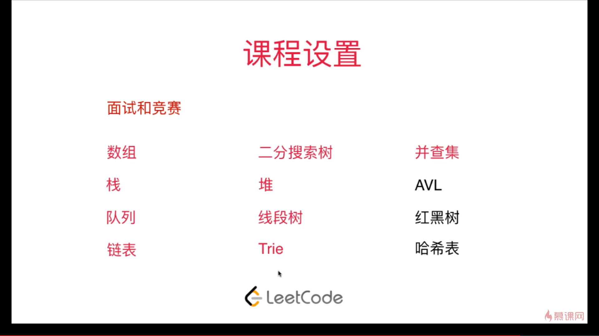

# 玩转数据结构-从入门到进阶  

课程网址`https://coding.imooc.com/class/chapter/207.html#Anchor`   

## 第1章  欢迎学习《玩转数据结构》
欢迎大家学习《玩转数据结构》课程。在这个课程中，我们将从底层实现诸多数据结构，从简单，到复杂，并且探索他们的应用。在这一章，我们将来看一看数据结构的具体作用，学习数据结构的误区，学习这个课程的注意事项，和课程环境的基本搭建：）
... 
### 1-1 欢迎学习《玩转数据结构》  
课程设置   
   

1- 2
学习数据结构（和算法）到底有没有用？
1- 3
关于课程学习的更多注意事项
1- 4
课程编程环境搭建
1- 5
关于课程的其他语言支持：Python，C+ + ，JS

第2章
不要小瞧数组
数组，看似是最简单的数据结构，但是，大多数语言为我们提供的都是静态数组，如何封装一个属于我们自己的动态数组，将是这一章讨论的重点。同时，我们也将探讨泛型，复杂度分析，乃至复杂度的震荡，等相关高级话题

2- 1
使用Java中的数组
2- 2
二次封装属于我们自己的数组
2- 3
向数组中添加元素
2- 4
数组中查询元素和修改元素
2- 5
包含，搜索和删除
2- 6
使用泛型
2- 7
动态数组
2- 8
简单的复杂度分析
2- 9
均摊复杂度和防止复杂度的震荡

第3章
栈和队列
栈和队列都是极其简单的线性数据结构，其中的操作甚至都是数组操作的子集，但却在计算机科学中有着极其重要的应用。在这一章，我们就来探索栈和队列的奥秘。我们将看到使用底层数据结构搭建上层数据结构的过程，同时对于队列，我们也将改进底层结构，完成循环队列的实现。...

3- 1
栈和栈的应用：撤销操作和系统栈
3- 2
栈的基本实现
3- 3
栈的另一个应用：括号匹配
3- 4
关于Leetcode的更多说明
3- 5
数组队列
3- 6
循环队列
3- 7
循环队列的实现
3- 8
数组队列和循环队列的比较

第4章
最基础的动态数据结构：链表
在这一章，我们将接触第一个动态数据结构：链表。我们将通过对链表的底层实现，更深入的理解对引用（或者是指针）的操作。同时，我们也将利用链表，实现栈和队列，并基于不同的底层实现，进行性能的比较。

4- 1
什么是链表
4- 2
在链表中添加元素
4- 3
使用链表的虚拟头结点
4- 4
链表的遍历，查询和修改
4- 5
从链表中删除元素
4- 6
使用链表实现栈
4- 7
带有尾指针的链表：使用链表实现队列

第5章
链表和递归
很多同学都会忽视链表和递归之间千丝万缕的联系。其实，链表也拥有着天然的递归结构。我们在这一章，就将通过链表这种简单的数据结构，一点一点为大家揭开递归，这个在计算机的世界中最为重要的逻辑构成方式的神秘面纱！...

5- 1
Leetcode中和链表相关的问题
5- 2
测试自己的Leetcode链表代码
5- 3
递归基础与递归的宏观语意
5- 4
链表的天然递归结构性质
5- 5
递归运行的机制：递归的微观解读
5- 6
递归算法的调试
5- 7
更多和链表相关的问题

第6章
二分搜索树
二分搜索树将是我们接触的第一个非线性数据结构。在这一章，我们将通过对二分搜索树的底层实现，了解对树结构的基本操作方式。同时，由于树结构天然的递归性质，我们将在这一章，实现诸多递归算法，进一步理解递归的奥妙。...

6- 1
为什么要研究树结构
6- 2
二分搜索树基础
6- 3
向二分搜索树中添加元素
6- 4
改进添加操作：深入理解递归终止条件
6- 5
二分搜索树的查询操作
6- 6
二分搜索树的前序遍历
6- 7
二分搜索树的中序遍历和后序遍历
6- 8
深入理解二分搜索树的前中后序遍历
6- 9
二分搜索树前序遍历的非递归实现
6- 1 0
二分搜索树的层序遍历
6- 1 1
删除二分搜索树的最大元素和最小元素
6- 1 2
删除二分搜索树的任意元素
6- 1 3
更多二分搜索树相关话题

第7章
集合和映射
在这一章，我们将综合之前学习的数组，链表和二分搜索树，探索更加高层的数据结构应用：集合（Set）和映射（Map）。通过这一章的学习，我们将对二分搜索树的复杂度分析，有更加感性的认识，同时看到二分搜索树的巨大优势，以及相应的局限性。...

7- 1
集合基础和基于二分搜索树的集合实现
7- 2
基于链表的集合实现
7- 3
集合类的复杂度分析
7- 4
_Leetcode中的集合问题和更多集合相关问题
7- 5
映射基础
7- 6
基于链表的映射实现
7- 7
基于二分搜索树的映射实现
7- 8
映射的复杂度分析和更多映射相关问题
7- 9
Leetcode上更多集合和映射的问题

第8章
优先队列和堆
在这一章，我们将探索一种特殊的树结构——堆。学习完这一章，同学们将对堆的相关操作有深入的认识，甚至达到白板编程的程度。同时，我们也将拓宽对队列的认识，理解什么是广义队列，什么是优先队列。

8- 1
什么是优先队列
8- 2
堆的基础表示
8- 3
向堆中添加元素和Sift
Up
8- 4
从堆中取出元素和Sift
Down
8- 5
Heapify 和
Replace
8- 6
基于堆的优先队列
8- 7
Leetcode上优先队列相关问题
8- 8
Java中的PriorityQueue
8- 9
和堆相关的更多话题和广义队列

第9章
线段树
线段树是一种特殊的树结构。这种数据结构主要用于解决“线段”或者是“区间”这种特殊的数据，是算法竞赛中的常客。在这一章，我们将从底层实现属于我们自己的线段树，完成线段树的创建，查询，更新三个操作，并且通过实际比较，看到线段树解决“线段”相关问题的巨大优势。
...

9- 1
什么是线段树
9- 2
线段树基础表示
9- 3
创建线段树
9- 4
线段树中的区间查询
9- 5
Leetcode上线段树相关的问题
9- 6
线段树中的更新操作
9- 7
更多线段树相关的话题

第10章
Trie
Trie将是我们学习的第一个，也是唯一一个多叉树结构。Trie用于高效的处理字符串相关的查询问题，我们将看到，使用Trie，对字符串的查询效率，将和字符串的多少无关！这样的效率提升，将绝对震惊你的老板和同事！

10- 1
什么是Trie字典树
10- 2
Trie字典树基础
10- 3
Trie字典树的查询
10- 4
Trie字典树的前缀查询
10- 5
Trie字典树和简单的模式匹配
10- 6
Trie字典树和字符串映射
10- 7
更多和Trie字典树相关的话题
10- 8
基于哈希表或者数组的Trie

第11章
并查集
并查集是一种奇怪的树结构。在并查集中，不是父亲指向孩子，而是孩子指向父亲。这样的一种奇怪结构，却能出奇快的解决集合相关的合并和查询问题。在这一章，我们将连续优化我们的并查集，释放出并查集的最大能量！

11- 1
什么是并查集
11- 2
Quick
Find
11- 3
Quick
Union
11- 4
基于size的优化
11- 5
基于rank的优化
11- 6
路径压缩
11- 7
更多和并查集相关的话题

第12章
AVL
我们在这一章将学习最为经典的平衡二叉树：AVL树。我们将深入理解AVL树中的旋转操作。最后，我们也将看到，使用我们自己实现的AVL树，在极端情况下，相较普通的二分搜索树，性能巨大的提升。

12- 1
平衡树和AVL
12- 2
计算节点的高度和平衡因子
12- 3
检查二分搜索树性质和平衡性
12- 4
旋转操作的基本原理
12- 5
左旋转和右旋转的实现
12- 6
LR 和
RL
12- 7
从AVL树中删除元素
12- 8
基于AVL树的集合和映射

第13章
红黑树
没有红黑树，可能就没有数据库到今天的发展。红黑树更是所有语言中树结构的首选底层实现。在这一章，我们将从2- 3 树
入手，带领大家理解2- 3 树
和红黑树的等价性，进而深入理解红黑树的各项操作。大家将看到，红黑树虽然复杂，但有规律的去理解，也能轻松拿下！...

13- 1
红黑树与2- 3 树
13- 2 2 -3 树
的绝对平衡性
13- 3
红黑树与2- 3 树
的等价性
13- 4
红黑树的基本性质和复杂度分析
13- 5
保持根节点为黑色和左旋转
13- 6
颜色翻转和右旋转
13- 7
红黑树中添加新元素
13- 8
红黑树的性能测试
13- 9
更多和红黑树相关的话题
13- 1 0
对于红黑树，任何不平衡都会在三次旋转内解决？

第14章
哈希表
在数据结构的世界里，哈希表可谓影响深远。哈希的应用早就远远超越了数据存储，在安全领域发挥着重要的作用。就连”区块链“这种魔法黑科技，都离不开哈希的影子。在这一章，我们将具体的看一看，到底什么是哈希表，哈希表比起之前学习的数据结构，到底有怎样的优势。...

14- 1
哈希表基础
14- 2
哈希函数的设计
14- 3
Java中的
hashCode
方法
14- 4
链地址法
Separate
Chaining
14- 5
实现属于我们自己的哈希表
14- 6
哈希表的动态空间处理与复杂度分析。
14- 7
哈希表更复杂的动态空间处理方法
14- 8
更多哈希冲突的处理方法

第15章
结尾语
通过这个课程的学习，同学们已经掌握了相当多的数据结构。可以说是数据结构领域的”小牛“了。希望通过这个课程的学习，大家更掌握了研究数据结构的方法，通过自己的努力，向数据结构领域的”大神“进军。大家加油！
...

15- 1
更广阔的数据结构的世界，大家加油！

 