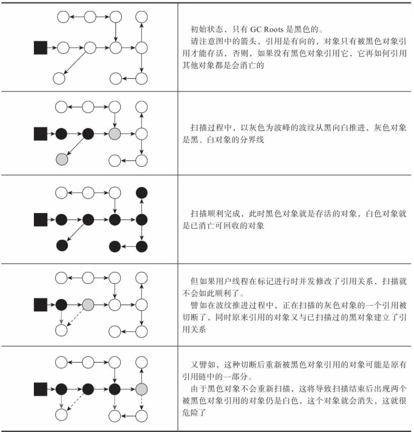

|  GC算法类型  | 算法说明  | 具体的GC |
|  ----  | ----  | ----  |
| 标记-复制  | 内存划分为两半，一半为空，空间浪费 | Serial, ParNew, Parallel Scavenge|
| 标记-整理  | 效率较低 | Serial Old, Parallel Old |
| 标记-清除  | 效率高；碎片多 | CMS, |

垃圾回收类型

|  GC类型  | GC类型说明  | 具体的GC |
|  ----  | ----  | ----  |
| MinorGC/YoungGC  | 年轻代 | Serial, ParNew, Parallel Scavenge|
| MajorGC/OldGC  | 老年代 | Serial Old, CMS, Parallel Old |
| MixedGC  | 整个新生代以及部分老年代 | G1 |
| FullGC  | 收集整个Java堆和方法区的GC | -- |

ParNew VS Parallel Scavenge:   
ParNew（以及大部分的GC）关注点是尽可能缩短垃圾收集时用户线程停顿时间，Parallel Scavenge收集器的目标则是达到一个可控制的吞吐量（Throughput）  
吞吐量 = 运行用户代码时间 /（运行用户代码时间 + 垃圾收集时间），虚拟机总共运行了100分钟，其中垃圾收集花掉1分钟，那吞吐量就是99%

JVM的理解，一定要区分规范和具体实现，不能将二者混淆。

方法区（JVM的一种规范）：
方法区是分代设计的扩展，设计之初的目的是可以用同一个垃圾管理器管理类似Java堆空间一样，避免单独开发一个垃圾管理器
方法区： 这区域的内存回收目标主要是针对常量池的回收和对类型的卸载， 一般来说这个区域的回收效果比较难令人满意， 尤其是类型的卸载， 条件相当苛刻， 但是这部分区域的回收有时又确实是必要的。
jdk8+: 已经把永久代(Permanent Generation)的部分内容放在元数据空间(Meta space)，部分放在堆中。
1.那么方法区还有没有？如果存在，其作用是什么？  2.方法区和元数据空间的关系？ 3.元数据空间如何管理？
解释：1.方法区是一种规范，永久代或者元数据空间是规范的具体实现形式
[Java方法区、永久代、元空间 究竟是什么关系呢？](https://blog.csdn.net/weixin_42740530/article/details/105288701)
## HotSpot虚拟机
### chap2 对象的创建
1.空间分配： 指针碰撞（Bump The Pointer），空闲列表（Free List）  
>空间分配线程安全问题： 每个线程在Java堆中预先分配一小块内存， 称为本地线程分配缓冲（Thread Local Allocation Buffer， TLAB） ， 哪个线程要分配内存， 就在那个线程的本地缓冲区中分配， 只有本地缓冲区用完了， 分配新的缓存区时才需要同步锁定。 虚拟机是否使用TLAB， 可以通过-XX： +/-UseTLAB参数来设定。  

2.对象信息设置，例如对象是哪个类的实例、 如何才能找到类的元数据信息、 对象的哈希码、 对象的GC分代年龄等信息，存在在对象头（Object Header）中   
3.执行class文件的<init>()，至此，对象被构建出来

### 对象的内存布局
在HotSpot虚拟机里， 对象在堆内存中的存储布局可以划分为三个部分： 对象头（Header） 、 实例数据（Instance Data） 和对齐填充（Padding） 。

### 对象的访问定位
主流的访问方式主要有使用句柄和直接指针两种


## chap3 垃圾收集器与内存分配策略
垃圾收集需要完成的三件事情:  
·哪些内存需要回收？
·什么时候回收？
·如何回收

引用计数（Reference Counting）算法
可达性分析（Reachability Analysis）算法


回收方法区
方法区的垃圾收集主要回收两部分内容： 废弃的常量和不再使用的类。   
安全点： 
安全点位置的选取基本上是以“是否具有让程序长时间执行的特征”为标准进行选定的。 <这个特征的具体选定标准是什么？具体实现原理？> 
OopMap只存放安全点位置的指令数据，并不是每条指令都存放  

程序在安全点停顿方案： 抢先式中断（Preemptive Suspension） 和主动式中断（Voluntary Suspension） 

安全区域：   
GC回收时候，不会去处理这一区域的对象，一般正在执行线程任务会进入安全区域
离开安全区域方式： 主动检查根节点枚举是否完成，如果完成，则线程可以离开安全区域继续执行；否则一直等待可以离开的信号。（具体怎么实现，先主动再被动？？？）

记忆集与卡表
记忆集是一种用于记录从非收集区域指向收集区域的指针集合的抽象数据结构。 用于解决减少GC Roots扫描的范围。
HotSpot中记忆集的具体实现是采用卡表（Card Table）来实现：
字节数组CARD_TABLE的每一个元素都对应着其标识的内存区域中一块特定大小的内存块， 这个内存块被称作“卡页”（Card Page） 。
一个卡页的内存中通常包含不止一个对象， 只要卡页内有一个（或更多） 对象的字段存在着跨代指针， 那就将对应卡表的数组元素的值标识为1， 称为这个元素变脏（Dirty） ， 没有则标识为0。
在垃圾收集发生时， 只要筛选出卡表中变脏的元素， 就能轻易得出哪些卡页内存块中包含跨代指针， 把它们加入GC Roots中一并扫描。

写屏障（Write Barrier）： 分为写前屏障（Pre-Write Barrier）和写后屏障（Post-Write Barrier）  
类似AOP功能，用于维护卡表状态，在G1收集器出现之前， 其他收集器都只用到了写后屏障。   

并发的可达性分析：
当前主流编程语言的垃圾收集器基本上都是依靠可达性分析算法来判定对象是否存活的， 可达性分析算法理论上要求全过程都基于一个能保障一致性的快照中才能够进行分析，
这意味着必须全程冻结用户线程的运行。 

* 三色标记

·白色： 表示对象尚未被垃圾收集器访问过。 显然在可达性分析刚刚开始的阶段， 所有的对象都是白色的， 若在分析结束的阶段， 仍然是白色的对象， 即代表不可达。
·黑色： 表示对象已经被垃圾收集器访问过， 且这个对象的所有引用都已经扫描过。 黑色的对象代表已经扫描过， 它是安全存活的， 如果有其他对象引用指向了黑色对象， 无须重新扫描一遍。 黑色对
象不可能直接（不经过灰色对象） 指向某个白色对象。
·灰色： 表示对象已经被垃圾收集器访问过， 但这个对象上至少存在一个引用还没有被扫描过。

并发出现“对象消失”问题的示意


Wilson于1994年在理论上证明了， 当且仅当以下两个条件同时满足时， 会产生“对象消失”的问
题， 即原本应该是黑色的对象被误标为白色：
1.赋值器插入了一条或多条从黑色对象到白色对象的新引用；
2.赋值器删除了全部从灰色对象到该白色对象的直接或间接引用。

我们要解决并发扫描时的对象消失问题， 只需破坏这两个条件的任意一个即可。
解决方案： 增量更新（Incremental Update） 和原始快照（Snapshot At The Beginning，SATB）
>增量更新：破坏第一个条件，新增加的引用记录下来，扫描完成之后，再对记录的数据重新扫描一次
>原始快照：破坏第二个条件，当灰色对象要删除指向白色对象的引用关系时， 就将这个要删除的引用记录下来， 在并发扫描结束之后， 再将这些记录过的引用关系中的灰色对象为根， 重新扫描一次。
>无论是对引用关系记录的插入还是删除， 虚拟机的记录操作都是通过写屏障实现的。 


## chap7 虚拟机类加载机制

类的生命周期： 加载(Loading)-->验证(Verification)-->准备(Preparation)-->解析(Resolution)-->初始化(Initialization)-->使用(Using)-->卸载(Unloading)


图7-1中， 加载、 验证、 准备、 初始化和卸载这五个阶段的顺序是确定的， 类型的加载过程必须按照这种顺序按部就班地开始， 而解析阶段则不一定： 它在某些情况下可以在初始化阶段之后再开始，
这是为了支持Java语言的运行时绑定特性（也称为动态绑定或晚期绑定）。

### 类加载的过程
#### 1.加载
在加载阶段， Java虚拟机需要完成以下三件事情：
1） 通过一个类的全限定名来获取定义此类的二进制字节流。
2） 将这个字节流所代表的静态存储结构转化为方法区的运行时数据结构。
3） 在内存中生成一个代表这个类的java.lang.Class对象， 作为方法区这个类的各种数据的访问入口。
JVM在执行我们写好的代码的过程中，一般在什么情况下会去加载一个类呢？是在你的代码中用到这个类的时候。
#### 2.验证
确保Class文件的字节流中包含的信息符合《Java虚拟机规范》 的全部约束要求
* 文件格式验证
* 元数据验证
* 字节码验证
* 符号引用验证

#### 3.准备
为类中定义的变量（即静态变量， 被static修饰的变量） 分配内存并设置类变量初始值的阶段。
这时候进行内存分配的仅包括类变量， 而不包括实例变量， 实例变量将会在对象实例化时随着对象一起分配在Java堆中。
比如
```
public static int value = 123;

变量value在准备阶段过后的初始值为0而不是123， 因为这时尚未开始执行任何Java方法， 
而把value赋值为123的putstatic指令是程序被编译后， 存放于类构造器<clinit>()方法之中， 
所以把value赋值为123的动作要到类的初始化阶段才会被执行。
```
这个准备工作，其实就是给这个被加载的类分配一定的内存空间，然后给类的静态变量赋默认值（默认值并不是自己指定的值，指定的值是在初始化阶段才进行赋值的）

#### 4.解析
是Java虚拟机将常量池内的符号引用替换为直接引用的过程
1.类或接口的解析
2.字段解析
3.方法解析
4.接口方法解析

#### 5.初始化
准备阶段时， 变量已经赋过一次系统要求的初始零值， 而在初始化阶段， 则会程根据序编码制定的主观计划去初始化类变量和其他资源

### 类加载器

#### 双亲委派模型

启动类加载器（Bootstrap Class Loader） 
>这个类加载器负责加载存放在<JAVA_HOME>\lib目录， 或者被-Xbootclasspath参数所指定的路径中存放的

扩展类加载器（Extension Class Loader） 
>负责加载<JAVA_HOME>\lib\ext目录中， 或者被java.ext.dirs系统变量所指定的路径中所有的类库

应用程序类加载器（Application Class Loader） 
>负责加载用户类路径（ClassPath） 上所有的类库

自定义类加载器

## chap8 虚拟机字节码执行引擎
