# wireshark 基础教程 

软件环境： win10， wireshark 2.6.4   

## 1.为什么要学习wireshark 
wireshark是网络分析人员手中的显微镜    
 
	1.网络通讯的真实内容？ 
	2.网络故障分析？  
	3.程序网络接口分析？ 
	4.木马通讯数据内容？   
	...
1.为后期学习计算机网络通讯协议做准备   
2.后期的所有涉及到网络问题都会使用它   
3.跨平台性，降低学习成本   
4.作为其他抓包工具的后期分析软件     

## 2.如何安装wireshark 

官网下载wireshark对应安装包 `https://www.wireshark.org/download.html`  

WinPcap是一个基于Win32平台的，用于捕获网络数据包并进行分析的开源库，是windows平台的抓包驱动.（不同平台下的有区别，Linux-libcap） 
[WinPcap 中文技术文档4.0.1](http://www.ferrisxu.com/WinPcap/html/index.html)  

wireshark底层是要依赖于winpcap的，两者的版本不会一致可能会产生冲突。 如果电脑没有安装过winpcap，在安装wireshark的时候会提示安装winpcap。  

[安装wireshark ](http://www.hcie.me/146)    

安装完成后打开软件    
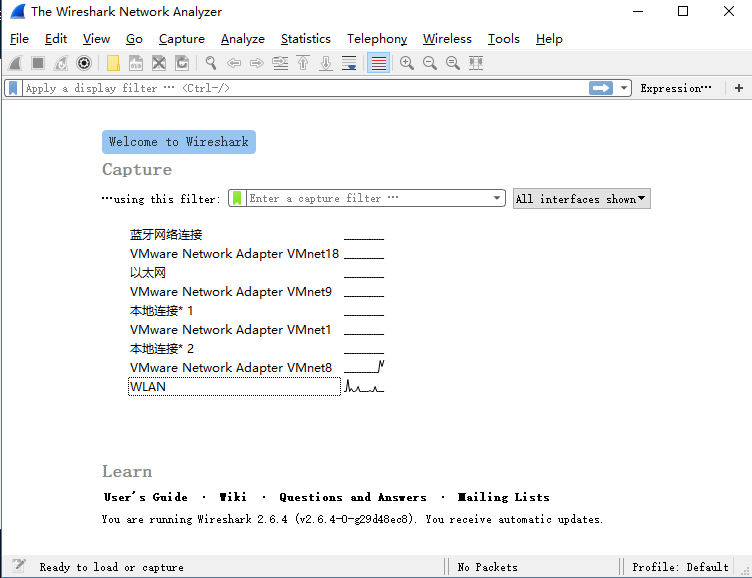  
## 3.快速上手wireshark  

## 4.工作原理和工作模块  
wireshark功能模块    
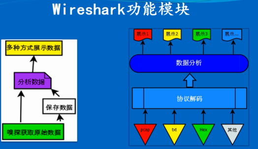   

## 5.如何设置抓包过滤器 

软件中设置过滤 `Capture -->Options-->Capture filter for selected interfaces:输入对应的过滤语法 `  

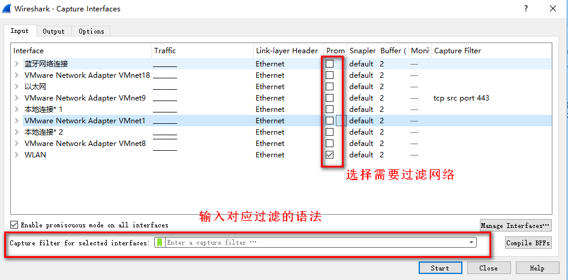      
过滤语法   
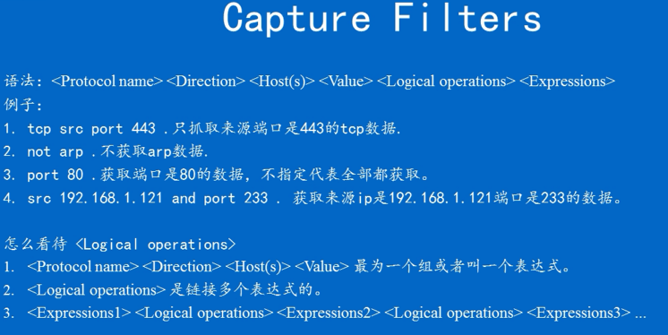    

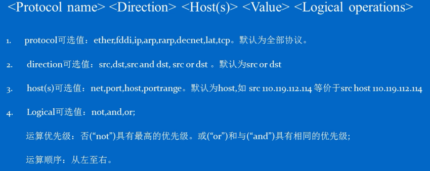   

wireshark支持的协议可以在软件中查看`Analyze-->Enabled Protocols`  

抓包过滤语法只能通过如上语法来过滤数据，如果想要抓取过滤内容的指定值，wireshark是做不到的，需要把其抓取的内容进一步分析才能获取。  

## 6.如何设置展示过滤器  

展示过滤语法  
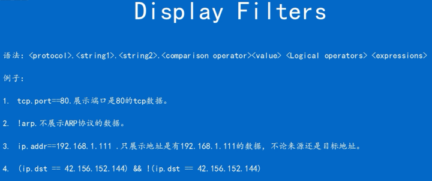     

在过滤栏中输入对应的语法，即可展示只需要的结果    
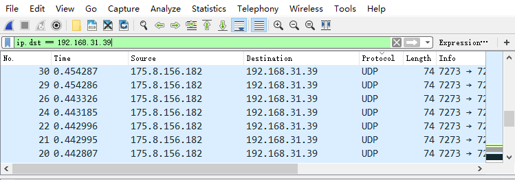  
如果不知道具体的语法，可以`选中需要过滤的对象，鼠标右键-->Prepare a Filter -->selected `， 展示过滤栏中会自动输入对应的语法，再对其修改完善即可。     
比如选中后自动生成的过滤语法是`ip.dst == 192.168.31.39`，但是只希望要TCP数据，则可以把语法修改为`(ip.dst == 192.168.31.39)and(tcp)`    
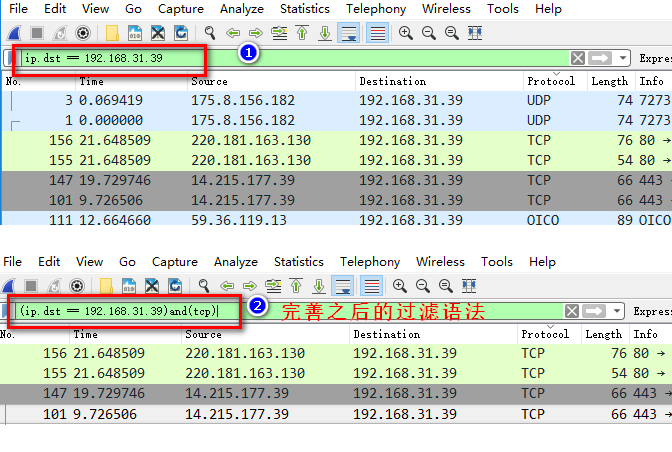   

对于一些具体的语法，可以在`Expressions`选项中去查看，选中自己想要的   
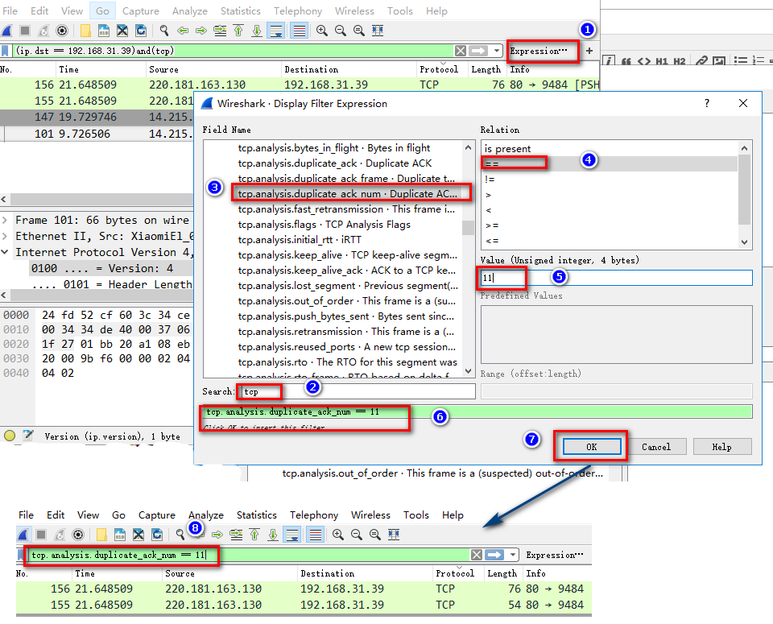   

同时可以对自己写的语法添加标签，下次直接使用  
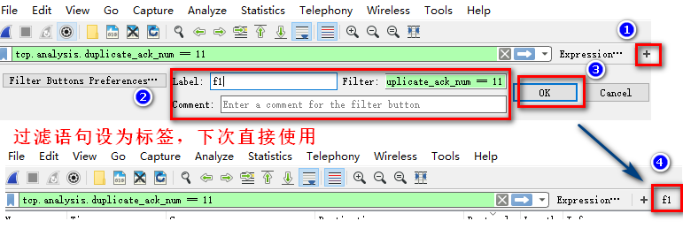     

## 7.抓包的其他设置项  

## 8.如何具体分析每个数据包  

展示内容自定义设置    
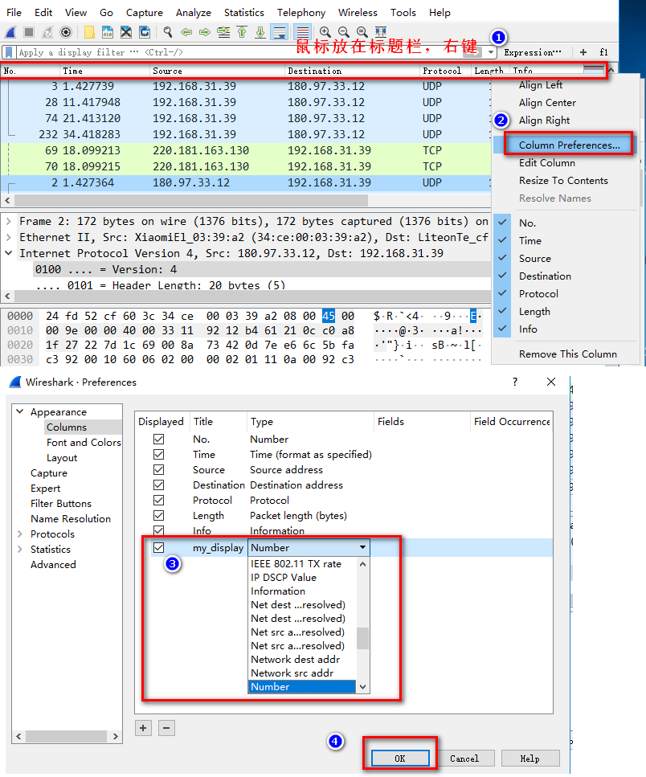

选中某个
## 9.分析时的快捷菜单
 

## 10.其他菜单内容  

## 11统计分析菜单功能  

## 12.wireshark本身的设置  
## 13.wireshark的最后一课  

