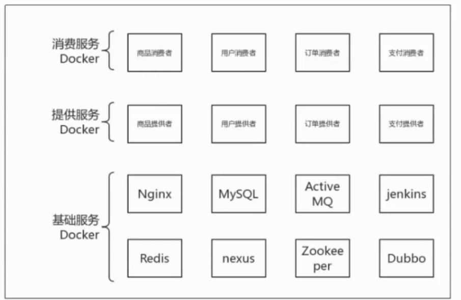

# 电商平台微服Dubbox实战-实现高并发抢购


## 3.Docker环境搭建

抢购网项目


```
root@ubuntu:~# docker pull centos

上传文件
huangxi@ubuntu:~$ cd dokerfiles-master/
huangxi@ubuntu:~/dokerfiles-master$ ls
env10.1  src
huangxi@ubuntu:~/dokerfiles-master$ cd env10.1/
huangxi@ubuntu:~/dokerfiles-master/env10.1$ ls
 im-1.sh               jar          run.sh     
 InitContainers-2.sh   readme.txt   Thumbs.db  
 #修改文件属性
huangxi@ubuntu:~/dokerfiles-master/env10.1$ sudo chmod 777 *.sh 
#
huangxi@ubuntu:~/dokerfiles-master/env10.1$ sudo ./im-1.sh all n
```

