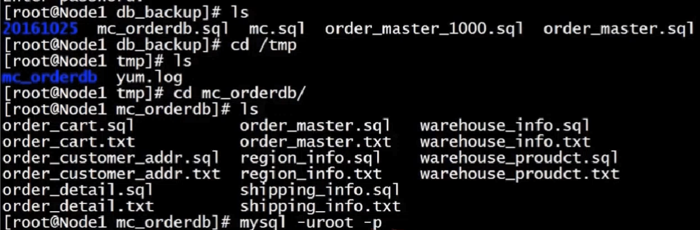

# 高性能可扩展MySQL数据库设计及架构优化

## 导入课程的sql文件

Navicat界面直接运行sql文件会出错，导入不了数据；
解决方法一：将sql文件内容完全复制，粘贴到Navicat的新建查询中，执行即可---速度比较慢
解决方法二： 用mysql的命令导入， `mysql> source D:\hlj\sql\imooc_20160818.sql`, 执行这一条语句的前提是：1.在mysql的配置文件my.ini中添加`secure_file_priv="D:/hlj/sql"`， 一定是`/`，不能是`\`，对于`\`只能有一层目录，不能多级目录； 2.把需要执行的sql文件放入到secure_file_priv指定的文件中； 3.重启mysql服务，保证配置生效，可以用`mysql>  show variables like '%secure%';` 查看配置是否生效。

## 本文档的实验环境
mysql5.7 
win10

## 第1章 数据库开发规范的制定
俗话说：“没有规矩不成方圆”。这一章，我们就先来制定数据库开发的各种规范，包括：数据库命名规范、数据库基本设计规范、数据库索引设计规范、数据库字段设计规范、SQL开发规范以及数据库操作规范。通过这些规范的制定可以指导并规范我们后续的开发工作，为我们以后的工作提供一个良好的基础。

### 1-1 课程说明
本课程主要是涉及到电商常用功能模块的数据库设计；
电商：注册会员-->展示商品-->加入购物车-->生成订单

涉及常见问题的数据库解决方案；
只包含数据库开发部分，不涉及前后端程序开发；

### 1-2 课程准备
MySql实例，推荐mysql5.7版本；
MySQL图形客户端程序，推荐使用SQLyog，本机使用的Navicat；
Linux命令和shell脚本的基础知识--本课程在Linux系统上进行；
### 1-3 电商项目简介
**项目说明**
  


### 1-4 数据库设计规范简介
1.数据结构设计： 逻辑设计 -->物理设计
2.实际工作中：逻辑设计+物理设计
3.物理设计：表名   字段名  字段类型

**数据库设计规范**
数据库命名规范
数据库基本设计规范
数据库索引设计规范
数据库字段设计规范
数据库SQL开发规范
数据库操作规行为范

### 1-5 数据库命名规范
1.所有数据库对应名称必须使用小写字母并用下划线分割； 

  mysql数据库中，对大小写敏感；在Linux系统中，mysql存储的就是一些文件，Linux系统本身对大小写敏感；  

2.所有数据库对象名称禁止使用MySQL保留关键字；

  含有`from`关键字的sql：`select id, username, from, age from tb_user;` ，这将导致mysql执行出现错误。  
  如果原有表中含有关键字字段，在查询的时候需要将关键字加上引号：`select id, username, 'from', age from tb_user;`
  mysql关键字查询网址`https://dev.mysql.com/doc/refman/5.7/en/keywords.html`

3.数据库对象的命名要能做到见名知意，并且最好不要超过32个字符；

4.临时库或表必须以tmp为前缀并且以日期为后缀；
5.备份库或表，必须以bak为前缀并以日期为后缀；
6.所有存储相同数据的列名和列类型必须一致；  
  
  ```
  CREATE TABLE `customer_inf` (
  `customer_inf_id` int(10) unsigned NOT NULL AUTO_INCREMENT COMMENT '自增主键ID',
  `customer_id` int(10) unsigned NOT NULL COMMENT 'customer_login表的自增ID',
  .........,
  PRIMARY KEY (`customer_inf_id`)
) ENGINE=InnoDB DEFAULT CHARSET=utf8 COMMENT='用户信息表';

CREATE TABLE `order_master` (
  `order_id` int(10) unsigned NOT NULL AUTO_INCREMENT COMMENT '订单ID',
  `customer_id` int(10) unsigned NOT NULL COMMENT '下单人ID',
  `shipping_user` varchar(10) NOT NULL COMMENT '收货人姓名',
  .........
  `modified_time` timestamp NOT NULL DEFAULT CURRENT_TIMESTAMP ON UPDATE CURRENT_TIMESTAMP COMMENT '最后修改时间',
  PRIMARY KEY (`order_id`),
  UNIQUE KEY `ux_ordersn` (`order_sn`)
) ENGINE=InnoDB  DEFAULT CHARSET=utf8 COMMENT='订单主表';
  
  ```
  例子中的`customer_id`在两个表中的名字和类型都是一样的，这对于数据的查询性能很重要，通常这种id会相互关联使用，如果两个表关联字段的类型不同，数据库就会进行隐式转换，就会造成列上的索引失效，进而导致查询效率大幅度降低。

### 1-6 数据库基础设计规范
1.一般情况下，所有表必须使用Innodb存储引擎；
```
在mysql5.5以及之前版本默认使用的Myisam存储引擎，5.6以后的版本默认使用Innodb，Innodb支持事务、行级锁、更好的恢复性能、高并发下性能更好；  
```
2.数据库和表的字符集统一使用UTF-8
  统一字符集可以避免由于字符集转换产生乱码， 避免字符转换后可能导致索引失效；
  MySQL中UTF-8字符集汉字占3个字节，ASCII码占用1个字节，比如采用varchar(255)来存储中文字符，实际会占用255*3个字节；

3.所有的表和字段都需要添加注释
  目的是： 在数据库建表时，就维护好数据库字典。
4.尽量控制单表数据量的大小，建议控制在500万以内
  500万并不是MySQL数据库的限制，但是太大对于修改表结构、备份、恢复都会有很大的问题。
  mysql最多可以存储多少条数据呢？MySQL本身没有设置限制，这种限制主要取决于存储设备和文件系统。
  控制单表数据大小的方式：历史数据归档、分库分表等手段来控制数量的大小。

5.谨慎使用MySQL分区表
  分区表在物理上表现为多个文件，在逻辑上表现为一个表
  谨慎选择分区键，跨分区查询效率可能更低
  建议采用物理分表的方式来管理大数据

6.尽量做到冷热数据分离，减小表的宽度
  MySQL限制最多存储4096列，并且每一行的字节数不能超过65535字节的，目的：
​    减少磁盘IO，保证热数据的内存缓存命中率
​    更有效利用缓存，避免读入无用的冷数据
     经常使用的列放在一个表中
     
7.禁止在表中建立预留字段
  预留字段的名字很难做到见名知意
  预留字段无法确定存储的数据类型,所以无法选择合适的类型
  对预留字段类型的修改,会对全表进行锁定,严重影响数据库的并发性

8.禁止在数据库中存储图片,文件等二进制数据
  一般数据库只存储图片、文件等数据在文件服务器中的地址即可
9.禁止在线上做数据库压力测试
10.禁止从开发环境、测试环境直接连生产环境数据库

### 1-7 数据库索引设计规范
1.限制每张表上的索引数量，建议单张表索引不超过5个
  索引并不是越多越好，索引可以提高查询效率同样也可以降低效率
  索引可以增加查询效率，但同样也会降低插入和更新的效率

  MySQL5.6之前查询只会用到一个索引，之后的版本会联合索引查询，但是效率比以前稍微低一些
  Innodb是一种逻辑组织表--即数据存储的逻辑顺序和索引的顺序是相同，Innodb是按照哪个索引的顺序来组织表的呢？答案是：主键。因此要求每个Innodb表必须有一个主键，如果表中没有主键，MySQL会选择第一个非空唯一索引来做主键，如果表中没有非空唯一索引的话，mysql会自动生成36字节的主键，这个自动生成的主键性能并不是最好的，所以在建表一定要给指定一个主键。

  主键的一些建议：
  ```
  不使用更新频繁的列作为主键，不适用多列联合主键（联合索引）；
  不使用UUID、MD5、HASH、字符串列作为主键 --为了保证索引的顺序，后面插入的比前面小，就需要把前面插入大于新值的全部移动到新值的后面，会造成大量的IO和CPU损耗；
  主键建议使用自动id值；
  ```
2.常见索引列建议
  select、update、delete语句的where从句中的列，包含在order by、group by、distinct中的字段，通常在这两种情况下建立联合索引更好；
  多表join的关联列；

3.如何选择索引列的顺序
  索引是从左到右顺序来使用的，因此把区分度最高的列放在联合索引的最左侧（区分度：索引中唯一值的个数除以总行数的值，值越大，区分度越高）；
  在区分度不大的情况下，尽量把字段长度小的列放在联合索引的最左侧；
  以上两点都差多不多的情况下，使用最频繁的列放到联合索引的左侧；

4.避免建立冗余索引和重复索引
  重复索引--primary key(id)、index(id)、unique index(id)， MySQL在主键上会自动创建一个非空唯一索引；
  冗余索引--index(a,b,c)、index(a,b)、 index(a)  

5.对于频繁的查询优先考虑使用覆盖索引
  覆盖索引：包含了所有查询字段的索引
  避免Innodb表进行索引的二次查找
  可以把随机IO变为顺序IO加快查询效率

6.尽量避免使用外键
  不建议使用外键约束，但是一定在表与表之间的关联上建立索引
  外键可用于保证数据的参照完整性，但建议在业务端实现
  外键会影响父表和子表的写操作从而降低性能


### 1-8 数据库字段设计规范
**索引设计规范的总结**：
每个Innodb表都要有一个主键；
限制表上索引的数量，避免建立重复和冗余索引；
注意合理选择复合索引键值的顺序；

**数据库字段设计规范：**
优选选择符合存储需要的最小的数据类型;
```
1.将字符串转换为数字类型存储，比如将IP地址转换成数字存储：  INET_ATON('255.255.255.255')=42949672995；   
INET_NTOA(42949672995)='255.255.255.255' ;

2.对于非负数据采用无符号整型进行存储：
SIGNED INT -2147483648-2147483647
UNSIGNED INT 0-4294967295

3.VARCHAR(N) 中的N代表的是字符数，而不是字节数；
4.使用UTF8存储汉字Varchar(255)=765个字节；
5.过大的长度会消耗更多的内存；
```
避免使用TEXT、BLOB数据类型；
```
text的种类：TinyText，Text，MidumText, LongText;
Text可以存储下64K的数据；
MySQL的 内存表不支持Text或者BLOB这样的大数据类型，如果查询并排序中有这种类型， 排序中就不能使用内存表来进行排序，需要使用磁盘表来排序；
对于这类数据，mysql在读取数据时候，需要进行二次查询，导致sql的性能很差；
建议把BLOB或者是TEXT列分离到单独的扩展表中，并且在查询的时候不能用 select * 查询， 需要什么字段，取对应的字段即可；
TEXT或BLOB类型只能使用前缀索引，并text列上是不能有默认值的；
```

避免使用ENUM数据类型
```
修改ENUM值需要使用ALTER语句；
ENUM类型的ORDER BY操作效率低，需要额外操作；
禁止使用数值作为ENUM的枚举值；枚举本身是由索引控制，？
```
尽可能把所有定义为NOT NULL
```
索引NULL需要额外的空间来保存，所以要占用更多的空间；
进行比较和计算时要对NULL值做特别的处理；

```
使用TIMESTAMP或者DATETIME来存储时间
```
采用字符串存储日期类型的数据（不正确做法）：
缺点1.无法用日期函数进行计算和比较；
缺点2.用字符串存储日期要占用更多的空间；


TIMESTAMP时间范围： 1970-01-01 00:00:01 ~2038-01-19 03:14:07
TIMESTAMP占用4字节和INT相同，但比INT可读性高；
超出TIMESTAMP取值范围的，则使用DATETIME类型；
```
同财务相关的金额类数据，必须使用decimal类型
```
1.非精准浮点类型：float ， double
2.精准数据类型：decimal

Decimal类型为精准浮点数，在计算时不会丢失精度；
占用空间由定义的宽度决定；
用户存储比bigint更大的整数数据；
```


### 1-9 SQL开发规范

1.建议使用预编译语句进行数据库操作

```
预编译语句可以重复的实行sql执行计划，减少sql编译所需要的时间；
预编译语句可以有效的防止动态sql所带来的sql注入的问题；

例子：
mysql>PREPARE stmt1
-> FROM 'SELECT SQRT(POW(?,2)+POW(?,2)) as hypotenuser';
mysql>SET @a=3;
mysql>SET @a=4;
-- 执行
mysql>EXECUTE stmt1 USING @a,@b;
-- 释放
mysql>DEALLOCATE PREPARE stmt1;

优点：
只传参数，比传递sql语句更高效；
相同语句可以一次解析，多次使用，提高处理效率；
可以有效防止sql注入
```
避免数据类型的隐式转换
```
缺点：
隐式转换会导致索引失效，比如参数类型和列类型不一致的时候，就会导致隐式转换；
select name, phone, from customer where id='111'; 
原本id是int类型， 但是传递进了的过字符串类型，就会产生隐式转换

```
充分利用表上已存在的索引
```
合理利用存在索引，而不是盲目增加索引
避免使用双%号的查询条件，比如 a like '%123%', 如果只是后置百分号，查询时候可以利用到索引，但是前置的不行；

一个sql只能利用到复合索引中的一列进行范围查询；
使用left join或 not exists来优化not in操作，not in经常导致索引失效；
```
程序连接不同的数据库使用不同的账号，禁止垮库查询
```
为数据库迁移和分库分表留出余地；
降低业务耦合度；
避免权限过大而产生的安全风险；
```

禁止使用 select * 必须使用 select <字段列表> 查询
```
消耗更多的CPU和IO以及网络宽带资源；
无法使用索引覆盖索引（一个表中，不可能一个索引覆盖所有列）；
可以减少表结构变更带来的影响；
```
禁止使用不含字段列表的INSERT语句
```
错误：insert into values('a',d'','v');
正确： insert into t(c1,c2,c3) values('a','v','c');
可减少表结构的变更对已有的数据带来的影响
```

避免使用子查询，可以把子查询优化为join操作
```
子查询的结果集无法使用索引；
子查询会产生临时操作表，如果子查询数量大则严重影响效率 --消耗过多的CPU以及IO资源；
```
避免使用JOIN关联太多的表
```
每join一个表会多占用一部分内存（join_buffer_size可以设置大小）；
会产生临时操作表，影响查询效率--临时表没有索引，查询速度慢；
mysql最多允许关联61个表，建议不超过5个；
```
减少同数据库的交互次数
```
数据更适合处理批量操作；
合并多个相同的操作到一起，可以提高处理效率；
```
使用 in 代替 or
```
in的值不要超过500个；
in 操作可以有效的利用到索引，而or不行；
```
禁止使用order by rand()进行随机排序
```
会把表中所有符合条件的数据装载到内存中进行排序；
如果数据量大，会消耗大量的CPU和IO以及内存资源；

推荐在程序中获取一个随机值，然后从数据库中获取数据；
```
WHERE从句中禁止对列进行函数转换和计算
```
对列进行函数转换或计算会导致无法使用索引， 比如 where date(createtime)='20190901'；
改为： where createtime>='20190901' and createtime<'20190902';

```
在明显不会有重复值时使用UNION ALL，而不是UNION
```
UNION会把所有的数据放到临时表中后再进行去重操作， 如果表数据量大会消耗大量的CPU、IO、内存，导致性能急剧下降；
UNION ALL 不会再对结果集进行去重操作；

```
拆分复杂的大SQL为多个小SQL
```
目前，MySQL一个SQL只能使用一个CPU进行计算；
SQL拆分后可以通过并行执行来提高执行效率；
```


### 1-10 数据库操作规范

超过100万行的批量写操作，要分批多次进行操作
```
主从环境中： 大批量操作可能会造成严重的主从延迟；
binlog日志为row格式时会产生大量的日志，row格式日志会记录每一行数据的修改，一次修改大批量数据，产生的日志量就会越多，日志传输和恢复的时间就越长，容易造成主从延迟；
避免产生大事务操作，大事务可能造成数据库访问阻塞，导致其他应用无法访问数据库；
```

对于大表的操作使用 pt-online-schema-change修改表结构
```
对大表数据结构的修改一定要谨慎，会造成严重的锁表操作。尤其在生产环境中是不能忍受的
pt-online-schema-change 实现过程： 1.复制和原表一样的表结构， 2.将原表的数据和需要修改的数据在新表中操作，3.新表操作完成，产生一个锁，删除原表，把新表的名字改为原表名

```
禁止为程序使用的账号赋予super权限
```
当达到最大连接数限制时，mysql还允许1个有super权限的用户连接；
super权限只能留个DBA处理问题的账号使用

```
对于程序连接数据库账号，遵循权限最小原则
```
程序使用数据库账号只能在一个DB下使用，不准垮库；
程序使用账号原则上不允许有drop权限；
```


## 第2章 电商实例数据库结构设计
 在数据库开发规范的基础之上，如何更好的利用规范设计出易于维护和伸缩性良好的数据库结构，是我们的学习目的。这一章我们根据常用电商项目需求实例，来进行具体的数据库结构的设计。在这一章中我们可以学到，什么是数据库设计的第三范式，如何对需求中所涉及的各个模块遵循数据库开发规范的要求，进行数据库的物理设计和逻...


#### 第三范式（3NF）
3NF定义： 一个表中的列和其他列之间不包含部分函数依赖关系，也不包含传递函数依赖关系，那么这个表的设计就符合第三范式

### 2-1 电商项目用户模块

```
CREATE TABLE `customer_inf` (
  `customer_inf_id` int(10) unsigned NOT NULL AUTO_INCREMENT COMMENT '自增主键ID',
  `customer_id` int(10) unsigned NOT NULL COMMENT 'customer_login表的自增ID',
  `customer_name` varchar(20) NOT NULL COMMENT '用户真实姓名',
  `identity_card_type` tinyint(4) NOT NULL DEFAULT '1' COMMENT '证件类型：1 身份证,2军官证,3护照',
  `identity_card_no` varchar(20) DEFAULT NULL COMMENT '证件号码',
  `mobile_phone` int(10) unsigned DEFAULT NULL COMMENT '手机号',
  `customer_email` varchar(50) DEFAULT NULL COMMENT '邮箱',
  `gender` char(1) DEFAULT NULL COMMENT '性别',
  `user_point` int(11) NOT NULL DEFAULT '0' COMMENT '用户积分',
  `register_time` timestamp NOT NULL DEFAULT CURRENT_TIMESTAMP ON UPDATE CURRENT_TIMESTAMP COMMENT '注册时间',
  `birthday` datetime DEFAULT NULL COMMENT '会员生日',
  `customer_level` tinyint(4) NOT NULL DEFAULT '1' COMMENT '会员级别:1普通会员,2青铜会员,3白银会员,4黄金会员,5钻石会员',
  `user_money` decimal(8,2) NOT NULL DEFAULT '0.00' COMMENT '用户余额',
  `modified_time` timestamp NOT NULL DEFAULT CURRENT_TIMESTAMP ON UPDATE CURRENT_TIMESTAMP COMMENT '最后修改时间',
  PRIMARY KEY (`customer_inf_id`)
) ENGINE=InnoDB AUTO_INCREMENT=10011 DEFAULT CHARSET=utf8 COMMENT='用户信息表';
```
当前用户表设计不符合第三范式，相互之间存在依赖关系，登录名《--用户级别《---级别积分上限，级别积分下限


通过拆分当前用户表以符合第三范式，以下设计基本符合3NF：


尽量做到冷热数据分离，减小表的宽度：

```
CREATE TABLE `customer_login` (
  `customer_id` int(10) unsigned NOT NULL AUTO_INCREMENT COMMENT '用户ID',
  `login_name` varchar(20) NOT NULL COMMENT '用户登陆名',
  `password` char(32) NOT NULL COMMENT 'md5加密的密码',
  `user_stats` tinyint(4) NOT NULL DEFAULT '1' COMMENT '用户状态',
  `modified_time` timestamp NOT NULL DEFAULT CURRENT_TIMESTAMP ON UPDATE CURRENT_TIMESTAMP COMMENT '最后修改时间',
  PRIMARY KEY (`customer_id`)
) ENGINE=InnoDB AUTO_INCREMENT=10011 DEFAULT CHARSET=utf8 COMMENT='用户登陆表';

CREATE TABLE `customer_inf` (
  `customer_inf_id` int(10) unsigned NOT NULL AUTO_INCREMENT COMMENT '自增主键ID',
  `customer_id` int(10) unsigned NOT NULL COMMENT 'customer_login表的自增ID',
  `customer_name` varchar(20) NOT NULL COMMENT '用户真实姓名',
  `identity_card_type` tinyint(4) NOT NULL DEFAULT '1' COMMENT '证件类型：1 身份证,2军官证,3护照',
  `identity_card_no` varchar(20) DEFAULT NULL COMMENT '证件号码',
  `mobile_phone` int(10) unsigned DEFAULT NULL COMMENT '手机号',
  `customer_email` varchar(50) DEFAULT NULL COMMENT '邮箱',
  `gender` char(1) DEFAULT NULL COMMENT '性别',
  `user_point` int(11) NOT NULL DEFAULT '0' COMMENT '用户积分',
  `register_time` timestamp NOT NULL DEFAULT CURRENT_TIMESTAMP ON UPDATE CURRENT_TIMESTAMP COMMENT '注册时间',
  `birthday` datetime DEFAULT NULL COMMENT '会员生日',
  `customer_level` tinyint(4) NOT NULL DEFAULT '1' COMMENT '会员级别:1普通会员,2青铜会员,3白银会员,4黄金会员,5钻石会员',
  `user_money` decimal(8,2) NOT NULL DEFAULT '0.00' COMMENT '用户余额',
  `modified_time` timestamp NOT NULL DEFAULT CURRENT_TIMESTAMP ON UPDATE CURRENT_TIMESTAMP COMMENT '最后修改时间',
  PRIMARY KEY (`customer_inf_id`)
) ENGINE=InnoDB AUTO_INCREMENT=10011 DEFAULT CHARSET=utf8 COMMENT='用户信息表';


CREATE TABLE `customer_login_log` (
  `login_id` int(10) unsigned NOT NULL AUTO_INCREMENT COMMENT '登录日志ID',
  `customer_id` int(10) unsigned NOT NULL COMMENT '登录用户ID',
  `login_time` timestamp NOT NULL DEFAULT CURRENT_TIMESTAMP ON UPDATE CURRENT_TIMESTAMP COMMENT '用户登录时间',
  `login_ip` int(10) unsigned NOT NULL COMMENT '登录IP',
  `login_type` tinyint(4) NOT NULL COMMENT '登录类型:0未成功 1成功',
  PRIMARY KEY (`login_id`)
) ENGINE=InnoDB DEFAULT CHARSET=utf8 COMMENT='用户登录日志表';
```
用户级别表
  
用户地址表

用户积分日志表
  
用户余额变动表


### MySQL分区表
1.确认MySQL服务器是否支持分区表 

```
C:\Users\admin>mysql -uroot -p
Enter password: ****

mysql> SHOW PLUGINS;
+----------------------------+----------+--------------------+---------+---------+
| Name                       | Status   | Type               | Library | License |
+----------------------------+----------+--------------------+---------+---------+
| binlog                     | ACTIVE   | STORAGE ENGINE     | NULL    | GPL     |
| mysql_native_password      | ACTIVE   | AUTHENTICATION     | NULL    | GPL     |
.........
| PERFORMANCE_SCHEMA         | ACTIVE   | STORAGE ENGINE     | NULL    | GPL     |
| ARCHIVE                    | ACTIVE   | STORAGE ENGINE     | NULL    | GPL     |
| BLACKHOLE                  | ACTIVE   | STORAGE ENGINE     | NULL    | GPL     |
| FEDERATED                  | DISABLED | STORAGE ENGINE     | NULL    | GPL     |
| partition                  | ACTIVE   | STORAGE ENGINE     | NULL    | GPL     |
| ngram                      | ACTIVE   | FTPARSER           | NULL    | GPL     |
+----------------------------+----------+--------------------+---------+---------+

结果中有  
| partition                  | ACTIVE   | STORAGE ENGINE     | NULL    | GPL     |
，说明支持分区表
```
2.MySQL分区表的特点
在逻辑上表现为一个表，在物理上存储在多个文件中
  

### 2-2 Hash分区表
HASH分区的特点：  
	根据MOD(分区键、分区数)的值把数据存储到表的不同分区内；
	数据可以平均的分布在各个分区中；

如何建立HASH分区表：
	表的字段中整型数据可以直接用于hash，非整型数据需要转换成整型数据类型后再hash

数据库中支持用于支持hash取整的函数也是有限的，主要有如下函数：
  

### 2-3 Range分区
RANGE分区特点：
	根据分区键值的范围把数据行存储到表的不同分区中；
	多个分区的范围要连续，但是不能重叠；
	默认情况下使用VALUES LESS THAN属性，即每个分区不包括指定的那个值；
	
如何建立范围分区：


RANGE分区的适用场景：
	分区键为日期或者时间类型；
	所有查询中都包括分区键；
	定期按分区范围清理历史数据；

### 2-4 List分区
LIST分区特点：
	按分区键取值的列表进行分区；
	同范围分区一样，各分区的列表值不能重复；
	每一行数据必须能找到对应的分区列表，否则数据插入失败；
	
如何建立LIST分区：


**mysql还有其他形式的分区，但是不常用**

### 2-5 项目分区表演示
**如何为customer_login_log表分区**
业务场景：
	用户每次登陆都会记录customer_login_log日志；
	用户登录日志保存一年，一年后可以删除；
根据业务场景，采用RANGE分区比较适合，并以login_time为分区键


归档之后的数据占用空间小，只能进行查询操作，不能进行写操作；

使用分区表注意事项:
	结合业务场景选择分区键，避免夸分区查询；
	对分区表进行查询最好在WHERE从句中包含分区键；
	具有主键或唯一索引的表，主键或唯一索引必须是分区键的一部分；
	

### 2-6 商品模块

商品实体信息

```
CREATE TABLE `product_brand_info` (
  `brand_id` smallint(5) unsigned NOT NULL AUTO_INCREMENT COMMENT '品牌ID',
  `brand_name` varchar(50) NOT NULL COMMENT '品牌名称',
  `telephone` varchar(50) NOT NULL COMMENT '联系电话',
  `brand_web` varchar(100) DEFAULT NULL COMMENT '品牌网站',
  `brand_logo` varchar(100) DEFAULT NULL COMMENT '品牌logo URL',
  `brand_desc` varchar(150) DEFAULT NULL COMMENT '品牌描述',
  `brand_status` tinyint(4) NOT NULL DEFAULT '0' COMMENT '品牌状态,0禁用,1启用',
  `brand_order` tinyint(4) NOT NULL DEFAULT '0' COMMENT '排序',
  `modified_time` timestamp NOT NULL DEFAULT CURRENT_TIMESTAMP ON UPDATE CURRENT_TIMESTAMP COMMENT '最后修改时间',
  PRIMARY KEY (`brand_id`)
) ENGINE=InnoDB AUTO_INCREMENT=18 DEFAULT CHARSET=utf8 COMMENT='品牌信息表';

CREATE TABLE `product_category` (
  `category_id` smallint(5) unsigned NOT NULL AUTO_INCREMENT COMMENT '分类ID',
  `category_name` varchar(10) NOT NULL COMMENT '分类名称',
  `category_code` varchar(10) NOT NULL COMMENT '分类编码',
  `parent_id` smallint(5) unsigned NOT NULL DEFAULT '0' COMMENT '父分类ID',
  `category_level` tinyint(4) NOT NULL DEFAULT '1' COMMENT '分类层级',
  `category_status` tinyint(4) NOT NULL DEFAULT '1' COMMENT '分类状态',
  `modified_time` timestamp NOT NULL DEFAULT CURRENT_TIMESTAMP ON UPDATE CURRENT_TIMESTAMP COMMENT '最后修改时间',
  PRIMARY KEY (`category_id`)
) ENGINE=InnoDB AUTO_INCREMENT=73 DEFAULT CHARSET=utf8 COMMENT='商品分类表';

CREATE TABLE `product_supplier_info` (
  `supplier_id` int(10) unsigned NOT NULL AUTO_INCREMENT COMMENT '供应商ID',
  `supplier_code` char(8) NOT NULL COMMENT '供应商编码',
  `supplier_name` char(50) NOT NULL COMMENT '供应商名称',
  `supplier_type` tinyint(4) NOT NULL COMMENT '供应商类型:1.自营,2.平台',
  `link_man` varchar(10) NOT NULL COMMENT '供应商联系人',
  `phone_number` varchar(50) NOT NULL COMMENT '联系电话',
  `bank_name` varchar(50) NOT NULL COMMENT '供应商开户银行名称',
  `bank_account` varchar(50) NOT NULL COMMENT '银行账号',
  `address` varchar(200) NOT NULL COMMENT '供应商地址',
  `supplier_status` tinyint(4) NOT NULL DEFAULT '0' COMMENT '状态:0禁用,1启用',
  `modified_time` timestamp NOT NULL DEFAULT CURRENT_TIMESTAMP ON UPDATE CURRENT_TIMESTAMP COMMENT '最后修改时间',
  PRIMARY KEY (`supplier_id`)
) ENGINE=InnoDB AUTO_INCREMENT=4 DEFAULT CHARSET=utf8 COMMENT='供应商信息表';

CREATE TABLE `product_info` (
  `product_id` int(10) unsigned NOT NULL AUTO_INCREMENT COMMENT '商品ID',
  `product_code` char(16) NOT NULL COMMENT '商品编码',
  `product_name` varchar(50) NOT NULL COMMENT '商品名称',
  `bar_code` varchar(50) NOT NULL COMMENT '国条码',
  `brand_id` int(10) unsigned NOT NULL COMMENT '品牌表的ID',
  `one_category_id` smallint(5) unsigned NOT NULL COMMENT '一级分类ID',
  `two_category_id` smallint(5) unsigned NOT NULL COMMENT '二级分类ID',
  `three_category_id` smallint(5) unsigned NOT NULL COMMENT '三级分类ID',
  `supplier_id` int(10) unsigned NOT NULL COMMENT '商品的供应商id',
  `price` decimal(8,2) NOT NULL COMMENT '商品销售价格',
  `average_cost` decimal(18,2) NOT NULL COMMENT '商品加权平均成本',
  `publish_status` tinyint(4) NOT NULL DEFAULT '0' COMMENT '上下架状态:0下架1上架',
  `audit_status` tinyint(4) NOT NULL DEFAULT '0' COMMENT '审核状态:0未审核,1已审核',
  `weight` float DEFAULT NULL COMMENT '商品重量',
  `length` float DEFAULT NULL COMMENT '商品长度',
  `heigh` float DEFAULT NULL COMMENT '商品高度',
  `width` float DEFAULT NULL COMMENT '商品宽度',
  `color_type` enum('红','黄','蓝','黒') DEFAULT NULL,
  `production_date` datetime NOT NULL COMMENT '生产日期',
  `shelf_life` int(11) NOT NULL COMMENT '商品有效期',
  `descript` text NOT NULL COMMENT '商品描述',
  `indate` timestamp NOT NULL DEFAULT CURRENT_TIMESTAMP COMMENT '商品录入时间',
  `modified_time` timestamp NOT NULL DEFAULT CURRENT_TIMESTAMP ON UPDATE CURRENT_TIMESTAMP COMMENT '最后修改时间',
  PRIMARY KEY (`product_id`)
) ENGINE=InnoDB AUTO_INCREMENT=247271 DEFAULT CHARSET=utf8 COMMENT='商品信息表';

-- 一个商品可能含有多个图片
CREATE TABLE `product_pic_info` (
  `product_pic_id` int(10) unsigned NOT NULL AUTO_INCREMENT COMMENT '商品图片ID',
  `product_id` int(10) unsigned NOT NULL COMMENT '商品ID',
  `pic_desc` varchar(50) DEFAULT NULL COMMENT '图片描述',
  `pic_url` varchar(200) NOT NULL COMMENT '图片URL',
  `is_master` tinyint(4) NOT NULL DEFAULT '0' COMMENT '是否主图:0.非主图1.主图',
  `pic_order` tinyint(4) NOT NULL DEFAULT '0' COMMENT '图片排序',
  `pic_status` tinyint(4) NOT NULL DEFAULT '1' COMMENT '图片是否有效:0无效 1有效',
  `modified_time` timestamp NOT NULL DEFAULT CURRENT_TIMESTAMP ON UPDATE CURRENT_TIMESTAMP COMMENT '最后修改时间',
  PRIMARY KEY (`product_pic_id`)
) ENGINE=InnoDB DEFAULT CHARSET=utf8 COMMENT='商品图片信息表';

CREATE TABLE `product_comment` (
  `comment_id` int(10) unsigned NOT NULL AUTO_INCREMENT COMMENT '评论ID',
  `product_id` int(10) unsigned NOT NULL COMMENT '商品ID',
  `order_id` bigint(20) unsigned NOT NULL COMMENT '订单ID',
  `customer_id` int(10) unsigned NOT NULL COMMENT '用户ID',
  `title` varchar(50) NOT NULL COMMENT '评论标题',
  `content` varchar(300) NOT NULL COMMENT '评论内容',
  `audit_status` tinyint(4) NOT NULL COMMENT '审核状态:0未审核1已审核',
  `audit_time` timestamp NOT NULL DEFAULT CURRENT_TIMESTAMP ON UPDATE CURRENT_TIMESTAMP COMMENT '评论时间',
  `modified_time` timestamp NOT NULL DEFAULT CURRENT_TIMESTAMP ON UPDATE CURRENT_TIMESTAMP COMMENT '最后修改时间',
  PRIMARY KEY (`comment_id`)
) ENGINE=InnoDB DEFAULT CHARSET=utf8 COMMENT='商品评论表';
```

### 2-7 订单模块

订单实体信息

```
CREATE TABLE `order_master` (
  `order_id` int(10) unsigned NOT NULL AUTO_INCREMENT COMMENT '订单ID',
  `order_sn` bigint(20) unsigned NOT NULL COMMENT '订单编号 yyyymmddnnnnnnnn',
  `customer_id` int(10) unsigned NOT NULL COMMENT '下单人ID',
  `shipping_user` varchar(10) NOT NULL COMMENT '收货人姓名',
  `province` smallint(6) NOT NULL COMMENT '收货人所在省',
  `city` smallint(6) NOT NULL COMMENT '收货人所在市',
  `district` smallint(6) NOT NULL COMMENT '收货人所在区',
  `address` varchar(100) NOT NULL COMMENT '收货人详细地址',
  `payment_method` tinyint(4) NOT NULL COMMENT '支付方式:1现金,2余额,3网银,4支付宝,5微信',
  `order_money` decimal(8,2) NOT NULL COMMENT '订单金额',
  `district_money` decimal(8,2) NOT NULL DEFAULT '0.00' COMMENT '优惠金额',
  `shipping_money` decimal(8,2) NOT NULL DEFAULT '0.00' COMMENT '运费金额',
  `payment_money` decimal(8,2) NOT NULL DEFAULT '0.00' COMMENT '支付金额',
  `shipping_comp_name` varchar(10) DEFAULT NULL COMMENT '快递公司名称',
  `shipping_sn` varchar(50) DEFAULT NULL COMMENT '快递单号',
  `create_time` timestamp NOT NULL DEFAULT CURRENT_TIMESTAMP COMMENT '下单时间',
  `shipping_time` datetime DEFAULT NULL COMMENT '发货时间',
  `pay_time` datetime DEFAULT NULL COMMENT '支付时间',
  `receive_time` datetime DEFAULT NULL COMMENT '收货时间',
  `order_status` tinyint(4) NOT NULL DEFAULT '0' COMMENT '订单状态',
  `order_point` int(10) unsigned NOT NULL DEFAULT '0' COMMENT '订单积分',
  `invoice_title` varchar(100) DEFAULT NULL COMMENT '发票抬头',
  `modified_time` timestamp NOT NULL DEFAULT CURRENT_TIMESTAMP ON UPDATE CURRENT_TIMESTAMP COMMENT '最后修改时间',
  PRIMARY KEY (`order_id`),
  UNIQUE KEY `ux_ordersn` (`order_sn`)
) ENGINE=InnoDB AUTO_INCREMENT=10011 DEFAULT CHARSET=utf8 COMMENT='订单主表';

CREATE TABLE `order_detail` (
  `order_detail_id` int(10) unsigned NOT NULL AUTO_INCREMENT COMMENT '自增主键ID,订单详情表ID',
  `order_id` int(10) unsigned NOT NULL COMMENT '订单表ID',
  `product_id` int(10) unsigned NOT NULL COMMENT '订单商品ID',
  `product_name` varchar(50) NOT NULL COMMENT '商品名称',
  `product_cnt` int(11) NOT NULL DEFAULT '1' COMMENT '购买商品数量',
  `product_price` decimal(8,2) NOT NULL COMMENT '购买商品单价',
  `average_cost` decimal(8,2) NOT NULL DEFAULT '0.00' COMMENT '平均成本价格',
  `weight` float DEFAULT NULL COMMENT '商品重量',
  `fee_money` decimal(8,2) NOT NULL DEFAULT '0.00' COMMENT '优惠分摊金额',
  `w_id` int(10) unsigned NOT NULL COMMENT '仓库ID',
  `modified_time` timestamp NOT NULL DEFAULT CURRENT_TIMESTAMP ON UPDATE CURRENT_TIMESTAMP COMMENT '最后修改时间',
  PRIMARY KEY (`order_detail_id`)
) ENGINE=InnoDB AUTO_INCREMENT=29698 DEFAULT CHARSET=utf8 COMMENT='订单详情表';

CREATE TABLE `order_cart` (
  `cart_id` int(10) unsigned NOT NULL AUTO_INCREMENT COMMENT '购物车ID',
  `customer_id` int(10) unsigned NOT NULL COMMENT '用户ID',
  `product_id` int(10) unsigned NOT NULL COMMENT '商品ID',
  `product_amount` int(11) NOT NULL COMMENT '加入购物车商品数量',
  `price` decimal(8,2) NOT NULL COMMENT '商品价格',
  `add_time` timestamp NOT NULL DEFAULT CURRENT_TIMESTAMP COMMENT '加入购物车时间',
  `modified_time` timestamp NOT NULL DEFAULT CURRENT_TIMESTAMP ON UPDATE CURRENT_TIMESTAMP COMMENT '最后修改时间',
  PRIMARY KEY (`cart_id`)
) ENGINE=InnoDB DEFAULT CHARSET=utf8 COMMENT='购物车表';

CREATE TABLE `warehouse_info` (
  `w_id` smallint(5) unsigned NOT NULL AUTO_INCREMENT COMMENT '仓库ID',
  `warehouse_sn` char(5) NOT NULL COMMENT '仓库编码',
  `warehouse_name` varchar(10) NOT NULL COMMENT '仓库名称',
  `warehouse_phone` varchar(20) NOT NULL COMMENT '仓库电话',
  `contact` varchar(10) NOT NULL COMMENT '仓库联系人',
  `province` smallint(6) NOT NULL COMMENT '省',
  `city` smallint(6) NOT NULL COMMENT '市',
  `district` smallint(6) NOT NULL COMMENT '区',
  `address` varchar(100) NOT NULL COMMENT '仓库地址',
  `warehouse_status` tinyint(4) NOT NULL DEFAULT '1' COMMENT '仓库状态:0禁用,1启用',
  `modified_time` timestamp NOT NULL DEFAULT CURRENT_TIMESTAMP ON UPDATE CURRENT_TIMESTAMP COMMENT '最后修改时间',
  PRIMARY KEY (`w_id`)
) ENGINE=InnoDB AUTO_INCREMENT=4 DEFAULT CHARSET=utf8 COMMENT='仓库信息表';

CREATE TABLE `warehouse_proudct` (
  `wp_id` int(10) unsigned NOT NULL AUTO_INCREMENT COMMENT '商品库存ID',
  `product_id` int(10) unsigned NOT NULL COMMENT '商品id',
  `w_id` smallint(5) unsigned NOT NULL COMMENT '仓库ID',
  `currnet_cnt` int(10) unsigned NOT NULL DEFAULT '0' COMMENT '当前商品数量',
  `lock_cnt` int(10) unsigned NOT NULL DEFAULT '0' COMMENT '当前占用数据',
  `in_transit_cnt` int(10) unsigned NOT NULL DEFAULT '0' COMMENT '在途数据',
  `average_cost` decimal(8,2) NOT NULL DEFAULT '0.00' COMMENT '移动加权成本',
  `modified_time` timestamp NOT NULL DEFAULT CURRENT_TIMESTAMP ON UPDATE CURRENT_TIMESTAMP COMMENT '最后修改时间',
  PRIMARY KEY (`wp_id`)
) ENGINE=InnoDB DEFAULT CHARSET=utf8 COMMENT='商品库存表';

CREATE TABLE `shipping_info` (
  `ship_id` tinyint(3) unsigned NOT NULL AUTO_INCREMENT COMMENT '主键id',
  `ship_name` varchar(20) NOT NULL COMMENT '物流公司名称',
  `ship_contact` varchar(20) NOT NULL COMMENT '物流公司联系人',
  `telphone` varchar(20) NOT NULL COMMENT '物流公司联系电话',
  `price` decimal(8,2) NOT NULL DEFAULT '0.00' COMMENT '配送价格',
  `modified_time` timestamp NOT NULL DEFAULT CURRENT_TIMESTAMP ON UPDATE CURRENT_TIMESTAMP COMMENT '最后修改时间',
  PRIMARY KEY (`ship_id`)
) ENGINE=InnoDB DEFAULT CHARSET=utf8 COMMENT='物流公司信息表';
```

### 2-8 DB规划
基本思路：
	为以后数据库迁移提供方便；
	避免垮库操作，把经常一起关联查询的表放到一个DB中；
	为了方便识别表所在的DB，在表名前增加库名前缀；
	
当前课程中，分库分表如下：
用户数据库（mc_customerdb）

商品数据库(mc_productdb)

订单数据库(mc_orderdb)


## 第3章 MySQL执行计划（explain）分析
MySQL执行计划可以告诉我们MySQL如何处理我们所提交的查询，通过对执行计划的分析，我们可以了解到MySQL如何使用表中的索引，如何从存储引擎中获取数据等。在这一章里我们会详细的学习MySQL执行计划的具体内容，通过对这一章的学习，相信大家可以更好完成对查询的优化。...
### 3-1 常见业务处理

#### 如何对评论进行分页展示
```
SELECT
	customer_id,title,content 
FROM product_comment 
WHERE audit_status = 1 AND product_id = 199726 LIMIT 0,5;
```
### 3-2 执行计划分析
查看一条SQL语句是否利用到索引以及具体的执行方式，可以在SQL语句前加上`EXPLAIN`， 目前该关键词只支持`select, update, insert, replace, delete`关键字

执行计划能告诉我们什么？
	SQL如何使用索引
	关联查询的执行顺序
	查询扫描的数据行数

```
EXPLAIN
SELECT
	customer_id,title,content 
FROM product_comment 
WHERE audit_status = 1 AND product_id = 199726 LIMIT 0,5;
```


**ID列**：
	ID列中的数据为一组数字，表示执行select语句的顺序；
	ID值相同时，执行顺序由上至下；
	ID值越大优先级越高，越先被执行；
	

```
EXPLAIN
SELECT c.category_name, a.product_name, b.title
FROM product_info a 
JOIN product_comment b ON a.product_id = b.product_id
JOIN product_category c ON c.category_id = a.one_category_id;
```


```
EXPLAIN
SELECT title FROM product_comment WHERE product_id IN(
	SELECT MAX(product_id) FROM product_info WHERE one_category_id IN(SELECT MIN(category_id) FROM product_category)
);
```


**SELECT_TYPE列**：
|值|含义|
|----|---|
|SIMPLE|不包含子查询或是UNION操作的查询|
|PRIMARY|查询中如果包含任何子查询，那么最外层的查询则被标记为PRIMARY|
|SUBQUERY|SELECT列表中的子查询|
|DEPENDENT SUBQUERY|依赖外部结果的子查询|
|UNION|Union操作的第二个或是之后的查询的值为UNION|
|DEPENDENT UNION|当UNION作为子查询时，第二个或是第二个后的查询的select_type值|
|UNION RESULT|UNION产生的结果集|
|DERIVED|出现在FROM子句中的子查询|


 

**TABLE列**：
输出数据行所在的表的名称；
<unionM, N>由ID为M，N查询union产生的结果集；
<derivedN>/<subqueryN> 由ID为N的查询产生的结果集；

***PARTITIONS列*：
对于分区表，显示查询的分区ID；
对于非分区表，显示为NULL；

**TYPE列**：


**EXTRA列**:
|值|含义|
|---|---|
|Distinct|优化distinct操作，在找到第一匹配的远元组后即停止找同样值的动作|
|Not Exists|使用not exists来优化查询|
|Using filesort|使用额外操作进行排序，通常会在order by或group by查询中|
|Using index|使用了覆盖索引进行查询|
|Using temporary|MySQL需要使用临时表来处理查询，常见于排序，子查询，和分组查询|
|Using where|需要在MySQL服务器层使用where条件来过滤数据|
|select tables optimized away|直接通过索引来获得数据，不用访问表|
**POSSIBLE_KEYS列**:
指出MySQL能使用那些索引来优化查询；
查询列所涉及到的列上的索引都会被列出，但不一定会被使用；
**KEY列**:
查询优惠期优化查询实际所使用的索引；
如果没有可用的索引，则显示为NULL；
如查询使用了覆盖索引，则该索引仅出现在key列中；

**KEY_LEN列**:
表示索引字段的最大可能长度；
Key_len的长度由字段定义计算而来，并非数据的实际长度；

**REF列**:
表示那些列或常量被用于查找索引列上的值；

**ROWS列**:
表示mysql通过索引统计信息，估算的所需读取的行数；
Rows值的大小是个统计抽样结果，并不是十分准确；

**FILTERED列**:
表示返回结果的行数占需要读取行数的百分比；
filtered列的值越大越好；
filtered列的值依赖于统计信息，并不是十分准确；

#### 执行计划的限制
无法展示存储过程，触发器，UDF对查询的影响；
无法使用EXPLAIN对存储过程进行分析；
早期版本的MySQL只支持对select语句进行分析；

### 3-3 如何优化分页查询示例


创建索引之后的查询


进一步优化评论分页查询，这样优化后尽量保持每次分页的查询效率是一致的


### 3-4 如何删除重复数据示例
**业务需求**：删除评论表中对同一订单统一商品的重复评论，只保留最早的一条
具体操作步骤：
	1.查看是否存在对于一订单同一商品的重复评论
	2.备份product_comment表
	3.删除同一订单的重复评论

示例：
查看是否有重复评论

备份原来的表

删除重复数据


### 3-5 如何进行分区间数据统计示例
示例：

```
SELECT
COUNT(CASE WHEN IFNULL(total_money,0)>=1000 THEN a.customer_id END) as '大于1000'
,COUNT(CASE WHEN IFNULL(total_money,0)>=800 AND IFNULL(total_money,0)<1000 THEN a.customer_id END) as '800-1000'
,COUNT(CASE WHEN IFNULL(total_money,0)>=500 AND IFNULL(total_money,0)<8000 THEN a.customer_id END) as '500-8000'
,COUNT(CASE WHEN IFNULL(total_money,0)<500 THEN a.customer_id END) as '小于500'
FROM mc_userdb.customer_login a
LEFT JOIN
(SELECT customer_id, SUM(order_money) as total_money FROM mc_orderdb.order_master GROUP BY customer_id) b 
ON a.customer_id=b.customer_id;
```


### 3-6 捕获有问题的SQL-慢查日志
**捕获有问题的SQL**
启动MySQL慢查询日志：

慢查询日志内容：


```
参考：https://www.cnblogs.com/luyucheng/p/6265594.html
二、参数说明
slow_query_log 慢查询开启状态
slow_query_log_file 慢查询日志存放的位置（这个目录需要MySQL的运行帐号的可写权限，一般设置为MySQL的数据存放目录）
long_query_time 查询超过多少秒才记录

三、设置步骤
1.查看慢查询相关参数

复制代码
mysql> show variables like 'slow_query%';
+---------------------------+----------------------------------+
| Variable_name             | Value                            |
+---------------------------+----------------------------------+
| slow_query_log            | OFF                              |
| slow_query_log_file       | /mysql/data/localhost-slow.log   |
+---------------------------+----------------------------------+

mysql> show variables like 'long_query_time';
+-----------------+-----------+
| Variable_name   | Value     |
+-----------------+-----------+
| long_query_time | 10.000000 |
+-----------------+-----------+
复制代码
2.设置方法
方法一：全局变量设置
将 slow_query_log 全局变量设置为“ON”状态

mysql> set global slow_query_log='ON'; 
设置慢查询日志存放的位置

mysql> set global slow_query_log_file='/usr/local/mysql/data/slow.log';
查询超过1秒就记录

mysql> set global long_query_time=1;
方法二：配置文件设置
修改配置文件my.cnf，在[mysqld]下的下方加入

[mysqld]
slow_query_log = ON
slow_query_log_file = /usr/local/mysql/data/slow.log
long_query_time = 1
3.重启MySQL服务

service mysqld restart
4.查看设置后的参数

复制代码
mysql> show variables like 'slow_query%';
+---------------------+--------------------------------+
| Variable_name       | Value                          |
+---------------------+--------------------------------+
| slow_query_log      | ON                             |
| slow_query_log_file | /usr/local/mysql/data/slow.log |
+---------------------+--------------------------------+

mysql> show variables like 'long_query_time';
+-----------------+----------+
| Variable_name   | Value    |
+-----------------+----------+
| long_query_time | 1.000000 |
+-----------------+----------+
复制代码
四、测试
1.执行一条慢查询SQL语句

mysql> select sleep(2);
2.查看是否生成慢查询日志

ls /usr/local/mysql/data/slow.log
如果日志存在，MySQL开启慢查询设置成功！
```
#### 如何分析慢查询日志
直接查看慢查询日志，效率不高，慢查询日志中有很多重复的mysql执行语句，采用mysql自带的工具来分析


## 第4章 MySQL数据库备份和恢复
对于任何数据库来说，数据库备份和恢复是最为重要的内容，可以说数据库备份决定了数据库的安全。所以在这一章中咱们就来看看常用的MySQL数据库的备份和恢复方式，包括如何使用mysqldump进行数据库的全备和部分备份，如何使用xtrabackup对数据库进行全备和增量备份，以及相应的恢复方法，如何使用binlog对数据库进行时间点的...

### 4-1 数据库备份
#### 逻辑备份和物理备份
	逻辑备份的结果为SQL语句，适合于所有存储引擎(逻辑备份恢复数据效率比较低，有的数据形式需要转换)；
	物理备份是对数据库目录的拷贝，对于内存表只备份结构（对于memory形式的数据无法备份--memory数据存在内存中，没有具体形式的数据文件）；
	物理备份需要借助于第三方工具，常用的是Percona XtraBackup;

#### 全量备份和增量备份
	全量备份是对整个数据库的一个完整备份；
	增量备份是在上次全量或者增量备份的基础上，对于更改数据进行的备份；
	MySQL官方提供的MySQLDump并不支持增量备份，如果要使用mysqldump来备份的话，可以通过mysql的二进制日志来备份； 一般采用第三方备份工具进行增量备份，XtraBackup已经提供了增量备份功能； 无论是采用mysqldump还是XtraBackup备份，要基于时间点进行恢复数据时，都需要借助于mysql的二进制日志，因此通常情况下也需要对mysql的二进制日志进行备份；


### 4-2 mysqldump全备介绍
#### 常用语法
	-- 表备份，备份多个表，表名之间用空格
	mysqldump [OPTIONS] database [tables]
	-- 指定数据库备份，多个数据库之间用空格
	mysqldump [OPTIONS] --databases [OPTIONS] DB1 [DB2..]
	-- 备份所有数据库
	mysqldump [OPTIONS] --all-databases [OPTIONS]

#### 常用参数（cmd>mysqldump --help）


```
##获取事务的一致性, 只对Innodb引擎有效，对隔离级别有要求
--single-transaction
##对于非事务性数据备份(MYISAM),该参数会锁表，只能进行读操作，和--single-transaction参数是互斥的，针对的数据引擎不一样；如果备份数据库中既有MYISAM也有Innodb,只能用该方式备份数据；该方式只能锁住某个表，并不能保证当前实例下所有表的数据具有一致性
-l, --lock-tables
##会对一个实例下的所有表加锁，保证所有备份数据和实例是一致的，但是备份过程中数据只能读
-x, --lock-all-tables

--master-data=[1/2]

##备份存储过程需要的参数
-R, --routines
##备份数据库中的触发器
--triggers
##备份数据中的调度事件
-E, --events
##将对INARY, VARBINARY, BLOB数据转换成十六进制保存， mysql备份导出的文件是文本文件，这些格式的数据部分在文本形式中是不可见的
--hex-blob
##指定该路径后，mysqldump会在指定路径下生生成两个文件，一个文件用户存储表结构，另一个文件用于存储表中的数据
--tab=path
##where只支持单表数据条件导出
-W, --where='过滤条件'

```

### 4-3 mysqldump全备单库实例
```
##创建一个备份账号，只能在本地操作(localhost)
mysql>create user 'backup'@'localhost' identified by '123456';
##授权
mysql>grant select, reload, lock tables, replication client, show view, event, process on *.*  to 'backup'@'localhost';
mysql>exit


cd /data/db_backup/
##备份数据整个数据库
mysqldump -ubackup -p --master-data=2 --signle-transaction --rotuines --triggers --events mc_orderdb > mc_orderdb.sql

##备份单个表
mysqldump -ubackup -p --master-data=2 --signle-transaction --rotuines --triggers --events mc_orderdb order_master > mc_ordermaster.sql

##查看备份文件
more mc_ordermaster.sql
grep "指定查看内容" mc_ordermaster.sql

```
### 4-4 mysqldump全备所有库和所有表实例
```
##备份所有数据库
mysqldump  -ubackup -p --master-data=2 --signle-transaction --rotuines --triggers --events --all -databases > mc.sql

##过滤查看mc.sql文件中备份的数据库
grep "Current Database" mc.sql

##创建一个临时备份文件用于测试, /tmp文件默认对所有用户都有读写权限
mkdir -p /tmp/mc_orderdb

##在mysql中给backup用户授予写数据的权限
mysql> grant file on *.* to 'backup'@'localhost';

##指定路径下备份数据
mysqldump  -ubackup -p --master-data=2 --signle-transaction --rotuines --triggers --events --table="/tmp/mc_orderdb"  mc_orderdb

```


查看备份数据，其中sql文件是表结构， txt文件是表的数据


### 4-5 mysqldump全备Where及脚本备份
```
##where参数备份数据
mysqldump  -ubackup -p --master-data=2 --signle-transaction -where "order_id>1000 and order_id<1050" mc_orderdb ordermaster > order_master_1000.sql
##查看备份数据
more  order_master_1000.sql
```
#### 脚本备份
backup.sh 脚本内容
```
#!/bin/bash
###############Basic parameters##########################
DAY=`date +%Y%m%d`
Environment=$(/sbin/ifconfig | grep "inet addr" | head -1 |grep -v "127.0.0.1" | awk '{print $2;}' | awk -F':' '{print $2;}')
USER="backup"
PASSWD="123456"
HostPort="3306"
MYSQLBASE="/home/mysql/"
DATADIR="/home/db_backup/${DAY}"
MYSQL=`/usr/bin/which mysql`
MYSQLDUMP=`/usr/bin/which mysqldump`
mkdir -p ${DATADIR}

Dump(){
 ${MYSQLDUMP} --master-data=2 --single-transaction  --routines --triggers --events -u${USER} -p${PASSWD} -P${HostPort} ${database}  > ${DATADIR}/${Environment}-${database}.sql
 cd ${DATADIR}
 gzip ${Environment}-${database}.sql
}

for db in `echo "SELECT schema_name FROM information_schema.schemata where schema_name not in ('information_schema','sys','performance_schema')" | ${MYSQL} -u${USER} -p${PASSWD} --skip-column-names`
do
   database=${db}
   Dump
done

```
执行脚本： `bash backup.sh` 并查看备份结果


在实际生产中，可以通过Linux脚本定时调用该脚本，实现自动备份

### 4-6 mysqldump恢复

备份数据恢复
```
mysql -u -p dbname < backup.sql
mysql> source /tmp/backup.sql
```


### 4-7 mysqldump恢复实例
### 4-8 mysqldump恢复单表实例

建立数据表结构


导入表的数据


如果全备份后的数据，只想恢复部分表的数据，备份时候采用 `--table`命令更高效

### 4-9 指定时点的恢复
**先决条件**：
	具有指定时间点前的一个全备；
	具有自上次全备后到指定时间点的所有二进制日志；
	
**恢复步骤**：
	
1.新建一个表，用于插入数据测试（插入数据来源是已经备份过的数据）

2.插入成功后，并删除100条数据

3.先进行全量数据库备份恢复，查看备份恢复节点对应的日志名（mysql-bin.000011）以及数据备份的时间节点(84882)，需要恢复当前备份的时间节点(84882)到数据删除操作时间点之间的数据


4.需要查看最后操作日志内容（mysql-bin.000011），找到相应（这里是删除操作）操作的时间点

要恢复的数据内容是上一次备份时间点84882到删除数据的时间点169348之间的数据

5.恢复数据--导入差异数据到SQL文件中，然后再将这个SQL文件导入

6.核对数据是否正确导入


### 4-10 指定时点的Binlog恢复


### 4-11 实时binlog备份

创建一个备份用户、备份文件夹

后台实时备份
  

### 4-12 xtrabackup备份和恢复
Xtrabackup用于在线备份innodb存储引擎的表，是一个开源的在线热备份工具；
备份过程中，不会影响表的读写操作；
只会备份数据文件，不会备份表的结构；
innobackupex是对xtrabackup的封装并提供MyISAM表的备份功能（innobackupex是xtrabackup的插件，支持Mysiam备份，但也会锁表）；

#### 安装xtrabackup
具体详见官网教程

全量备份： innobackupex --user=root --password=pwd --parallel=2 /home/db_backup/
增量备份： innobackupex --user=root --password=pwd --incremental /home/db_backup/  --increamental-basedir=/home/db_backup/back_dir

`--increamental-basedir=/home/db_backup/back_dir`中的`/home/db_backup/back_dir`是上一次备份的目录

#### 利用innobackupex进行全备份的恢复
备份还原： innobackupex --apply-log /path/to/BACKUP-DIR

增量备份恢复


### 4-13 Mysql备份计划
本项目备份计划：
每天凌晨对数据进行一次全备；
实时对二进制日志进行远程备份；

（在Linux系统中添加一个全备脚本，指定Crontab定时任务即可）

## 第5章 高性能高可用MySQL架构变迁
告别数据库的裸奔时代，对架构进行步步升级。这是我们本章要学习的重点内容。我们首先会从实例学习MySQL主从复制架构，详解主从分离的多种解决方案。通过keepalived+LVS完美组合，一步步打造高性能可扩展的数据库架构；通过数据库中间件MaxScale学习，讲解另类解决高可用的读负载均衡的问题
### 5-1 mysql主从复制配置
### 5-2 mysql主从复制演示
### 5-3 基于GTID的复制链路
### 5-4 高可用keepalived实例
### 5-5 Mysql数据库读写分离
### 5-6 使用LVS解决读负载均衡
### 5-7 使用maxscale数据库中间件解决读负载均衡
### 5-8 使用DB业务拆分解决写压力大问题
### 5-9 课程总结和思考
