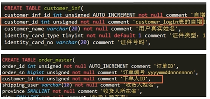

# 高性能可扩展MySQL数据库设计及架构优化

## 导入课程的sql文件

Navicat界面直接运行sql文件会出错，导入不了数据；
解决方法一：将sql文件内容完全复制，粘贴到Navicat的新建查询中，执行即可---速度比较慢
解决方法二： 用mysql的命令导入， `mysql> source D:\hlj\sql\imooc_20160818.sql`, 执行这一条语句的前提是：1.在mysql的配置文件my.ini中添加`secure_file_priv="D:/hlj/sql"`， 一定是`/`，不能是`\`，对于`\`只能有一层目录，不能多级目录； 2.把需要执行的sql文件放入到secure_file_priv指定的文件中； 3.重启mysql服务，保证配置生效，可以用`mysql>  show variables like '%secure%';` 查看配置是否生效。

## 本文档的实验环境
mysql5.7 
win10

## 第1章 数据库开发规范的制定
俗话说：“没有规矩不成方圆”。这一章，我们就先来制定数据库开发的各种规范，包括：数据库命名规范、数据库基本设计规范、数据库索引设计规范、数据库字段设计规范、SQL开发规范以及数据库操作规范。通过这些规范的制定可以指导并规范我们后续的开发工作，为我们以后的工作提供一个良好的基础。

### 1-1 课程说明
本课程主要是涉及到电商常用功能模块的数据库设计；
电商：注册会员-->展示商品-->加入购物车-->生成订单

涉及常见问题的数据库解决方案；
只包含数据库开发部分，不涉及前后端程序开发；

### 1-2 课程准备
MySql实例，推荐mysql5.7版本；
MySQL图形客户端程序，推荐使用SQLyog，本机使用的Navicat；
Linux命令和shell脚本的基础知识--本课程在Linux系统上进行；
### 1-3 电商项目简介
**项目说明**
  


### 1-4 数据库设计规范简介
1.数据结构设计： 逻辑设计 -->物理设计
2.实际工作中：逻辑设计+物理设计
3.物理设计：表名   字段名  字段类型

**数据库设计规范**
数据库命名规范
数据库基本设计规范
数据库索引设计规范
数据库字段设计规范
数据库SQL开发规范
数据库操作规行为范

### 1-5 数据库命名规范
1.所有数据库对应名称必须使用小写字母并用下划线分割； 

  mysql数据库中，对大小写敏感；在Linux系统中，mysql存储的就是一些文件，Linux系统本身对大小写敏感；  

2.所有数据库对象名称禁止使用MySQL保留关键字；

  含有`from`关键字的sql：`select id, username, from, age from tb_user;` ，这将导致mysql执行出现错误。  
  如果原有表中含有关键字字段，在查询的时候需要将关键字加上引号：`select id, username, 'from', age from tb_user;`
  mysql关键字查询网址`https://dev.mysql.com/doc/refman/5.7/en/keywords.html`

3.数据库对象的命名要能做到见名知意，并且最好不要超过32个字符；

4.临时库或表必须以tmp为前缀并且以日期为后缀；
5.备份库或表，必须以bak为前缀并以日期为后缀；
6.所有存储相同数据的列名和列类型必须一致；  
  
  ```
  CREATE TABLE `customer_inf` (
  `customer_inf_id` int(10) unsigned NOT NULL AUTO_INCREMENT COMMENT '自增主键ID',
  `customer_id` int(10) unsigned NOT NULL COMMENT 'customer_login表的自增ID',
  .........,
  PRIMARY KEY (`customer_inf_id`)
) ENGINE=InnoDB DEFAULT CHARSET=utf8 COMMENT='用户信息表';

CREATE TABLE `order_master` (
  `order_id` int(10) unsigned NOT NULL AUTO_INCREMENT COMMENT '订单ID',
  `customer_id` int(10) unsigned NOT NULL COMMENT '下单人ID',
  `shipping_user` varchar(10) NOT NULL COMMENT '收货人姓名',
  .........
  `modified_time` timestamp NOT NULL DEFAULT CURRENT_TIMESTAMP ON UPDATE CURRENT_TIMESTAMP COMMENT '最后修改时间',
  PRIMARY KEY (`order_id`),
  UNIQUE KEY `ux_ordersn` (`order_sn`)
) ENGINE=InnoDB  DEFAULT CHARSET=utf8 COMMENT='订单主表';
  
  ```
  例子中的`customer_id`在两个表中的名字和类型都是一样的，这对于数据的查询性能很重要，通常这种id会相互关联使用，如果两个表关联字段的类型不同，数据库就会进行隐式转换，就会造成列上的索引失效，进而导致查询效率大幅度降低。

### 1-6 数据库基础设计规范
1.一般情况下，所有表必须使用Innodb存储引擎；
```
在mysql5.5以及之前版本默认使用的Myisam存储引擎，5.6以后的版本默认使用Innodb，Innodb支持事务、行级锁、更好的恢复性能、高并发下性能更好；  
```
2.数据库和表的字符集统一使用UTF-8
  统一字符集可以避免由于字符集转换产生乱码， 避免字符转换后可能导致索引失效；
  MySQL中UTF-8字符集汉字占3个字节，ASCII码占用1个字节，比如采用varchar(255)来存储中文字符，实际会占用255*3个字节；

3.所有的表和字段都需要添加注释
  目的是： 在数据库建表时，就维护好数据库字典。
4.尽量控制单表数据量的大小，建议控制在500万以内
  500万并不是MySQL数据库的限制，但是太大对于修改表结构、备份、恢复都会有很大的问题。
  mysql最多可以存储多少条数据呢？MySQL本身没有设置限制，这种限制主要取决于存储设备和文件系统。
  控制单表数据大小的方式：历史数据归档、分库分表等手段来控制数量的大小。

5.谨慎使用MySQL分区表
  分区表在物理上表现为多个文件，在逻辑上表现为一个表
  谨慎选择分区键，跨分区查询效率可能更低
  建议采用物理分表的方式来管理大数据

6.尽量做到冷热数据分离，减小表的宽度
  MySQL限制最多存储4096列，并且每一行的字节数不能超过65535字节的，目的：
​    减少磁盘IO，保证热数据的内存缓存命中率
​    更有效利用缓存，避免读入无用的冷数据
     经常使用的列放在一个表中
     
7.禁止在表中建立预留字段
  预留字段的名字很难做到见名知意
  预留字段无法确定存储的数据类型,所以无法选择合适的类型
  对预留字段类型的修改,会对全表进行锁定,严重影响数据库的并发性
  
8.禁止在数据库中存储图片,文件等二进制数据
  一般数据库只存储图片、文件等数据在文件服务器中的地址即可
9.禁止在线上做数据库压力测试
10.禁止从开发环境、测试环境直接连生产环境数据库
  
### 1-7 数据库索引设计规范
1.限制每张表上的索引数量，建议单张表索引不超过5个
  索引并不是越多越好，索引可以提高查询效率同样也可以降低效率
  索引可以增加查询效率，但同样也会降低插入和更新的效率
  
  MySQL5.6之前查询只会用到一个索引，之后的版本会联合索引查询，但是效率比以前稍微低一些
  Innodb是一种逻辑组织表--即数据存储的逻辑顺序和索引的顺序是相同，Innodb是按照哪个索引的顺序来组织表的呢？答案是：主键。因此要求每个Innodb表必须有一个主键，如果表中没有主键，MySQL会选择第一个非空唯一索引来做主键，如果表中没有非空唯一索引的话，mysql会自动生成36字节的主键，这个自动生成的主键性能并不是最好的，所以在建表一定要给指定一个主键。
  
  主键的一些建议：
  ```
  不使用更新频繁的列作为主键，不适用多列联合主键（联合索引）；
  不使用UUID、MD5、HASH、字符串列作为主键 --为了保证索引的顺序，后面插入的比前面小，就需要把前面插入大于新值的全部移动到新值的后面，会造成大量的IO和CPU损耗；
  主键建议使用自动id值；
  ```
2.常见索引列建议
  select、update、delete语句的where从句中的列，包含在order by、group by、distinct中的字段，通常在这两种情况下建立联合索引更好；
  多表join的关联列；
  
3.如何选择索引列的顺序
  索引是从左到右顺序来使用的，因此把区分度最高的列放在联合索引的最左侧（区分度：索引中唯一值的个数除以总行数的值，值越大，区分度越高）；
  在区分度不大的情况下，尽量把字段长度小的列放在联合索引的最左侧；
  以上两点都差多不多的情况下，使用最频繁的列放到联合索引的左侧；
  
4.避免建立冗余索引和重复索引
  重复索引--primary key(id)、index(id)、unique index(id)， MySQL在主键上会自动创建一个非空唯一索引；
  冗余索引--index(a,b,c)、index(a,b)、 index(a)  

5.对于频繁的查询优先考虑使用覆盖索引
  覆盖索引：包含了所有查询字段的索引
  避免Innodb表进行索引的二次查找
  可以把随机IO变为顺序IO加快查询效率

6.尽量避免使用外键
  不建议使用外键约束，但是一定在表与表之间的关联上建立索引
  外键可用于保证数据的参照完整性，但建议在业务端实现
  外键会影响父表和子表的写操作从而降低性能
  


### 1-8 数据库字段设计规范

### 1-9 SQL开发规范
### 1-10 数据库操作规范

### 第2章 电商实例数据库结构设计
 在数据库开发规范的基础之上，如何更好的利用规范设计出易于维护和伸缩性良好的数据库结构，是我们的学习目的。这一章我们根据常用电商项目需求实例，来进行具体的数据库结构的设计。在这一章中我们可以学到，什么是数据库设计的第三范式，如何对需求中所涉及的各个模块遵循数据库开发规范的要求，进行数据库的物理设计和逻...
### 2-1 电商项目用户模块
### 2-2 Hash分区表
### 2-3 Range分区
### 2-4 List分区
### 2-5 项目分区表演示
### 2-6 商品模块
### 2-7 订单模块
### 2-8 DB规划

### 第3章 MySQL执行计划（explain）分析
MySQL执行计划可以告诉我们MySQL如何处理我们所提交的查询，通过对执行计划的分析，我们可以了解到MySQL如何使用表中的索引，如何从存储引擎中获取数据等。在这一章里我们会详细的学习MySQL执行计划的具体内容，通过对这一章的学习，相信大家可以更好完成对查询的优化。...
### 3-1 常见业务处理
### 3-2 执行计划分析
### 3-3 如何优化分页查询示例
### 3-4 如何删除重复数据示例
### 3-5 如何进行分区间数据统计示例
### 3-6 捕获有问题的SQL-慢查日志
### 第4章 MySQL数据库备份和恢复
对于任何数据库来说，数据库备份和恢复是最为重要的内容，可以说数据库备份决定了数据库的安全。所以在这一章中咱们就来看看常用的MySQL数据库的备份和恢复方式，包括如何使用mysqldump进行数据库的全备和部分备份，如何使用xtrabackup对数据库进行全备和增量备份，以及相应的恢复方法，如何使用binlog对数据库进行时间点的...
### 4-1 数据库备份
### 4-2 mysqldump全备介绍
### 4-3 mysqldump全备单库实例
### 4-4 mysqldump全备所有库和所有表实例
### 4-5 mysqldump全备Where及脚本备份
### 4-6 mysqldump恢复
### 4-7 mysqldump恢复实例
### 4-8 mysqldump恢复单表实例
### 4-9 指定时点的恢复
### 4-10 指定时点的Binlog恢复
### 4-11 实时binlog备份
### 4-12 xtrabackup备份和恢复
### 4-13 Mysql备份计划

### 第5章 高性能高可用MySQL架构变迁
告别数据库的裸奔时代，对架构进行步步升级。这是我们本章要学习的重点内容。我们首先会从实例学习MySQL主从复制架构，详解主从分离的多种解决方案。通过keepalived+LVS完美组合，一步步打造高性能可扩展的数据库架构；通过数据库中间件MaxScale学习，讲解另类解决高可用的读负载均衡的问题
### 5-1 mysql主从复制配置
### 5-2 mysql主从复制演示
### 5-3 基于GTID的复制链路
### 5-4 高可用keepalived实例
### 5-5 Mysql数据库读写分离
### 5-6 使用LVS解决读负载均衡
### 5-7 使用maxscale数据库中间件解决读负载均衡
### 5-8 使用DB业务拆分解决写压力大问题
### 5-9 课程总结和思考
